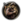

# Table of contents

- [Quick checklist](#quick-checklist)
- [Tag](#tag)
- [Country file](#country-file)
- [History](#history)
  - [Order of battle](#order-of-battle)
  - [Effects](#effects)
    - [Diplomacy-related effects](#diplomacy-related-effects)
    - [Politics-related effects](#politics-related-effects)
    - [Variants](#variants)
  - [Date-dependent history](#date-dependent-history)
    - [Useful effects](#useful-effects)
  - [Full file example](#full-file-example)
- [Flag](#flag)
- [Name](#name)
  - [Other localisation](#other-localisation)
- [Starting characters](#starting-characters)
- [Order of battle](#order-of-battle)
  - [Division template](#division-template)
  - [Division placement](#division-placement)
  - [Equipment production](#equipment-production)
- [Character names](#character-names)
- [Character portraits](#character-portraits)
- [Adding the country to the game](#adding-the-country-to-the-game)
- [Notes and references](#notes-and-references)


---

The guide below presumes that you understand the basics of how to create a mod. This page should also help modders understand how to change some more specific aspects of a country.

## Quick checklist

- Define a unique 3-character country tag in any <yourmod>/common/country\_tags/\*.txt file.
- Create a file in the <yourmod>/common/countries folder with the same name as the one that's linked in the country tag definition.
- Define the country leader and optionally advisors and unit leaders in <yourmod>/common/characters
- Create a .txt file in the <yourmod>/history/countries folder, with the first three letters of the filename being the country's tag, and fill it with the starting historical information.
- Create an OOB file in <yourmod>/history/units and load it within the previous country history file. **Buildings will not be assigned to the country properly otherwise.**
- Add the country's name to any <yourmod>/localisation/english/\*\_l\_english.yml file that uses the UTF-8-BOM encoding.
- Add a large, medium and small flag for each ideology to the <yourmod>/gfx/flags folder.
- Optionally add the country to the game by assigning it states within the <yourmod>/history/states/\*.txt files.

## Tag

Countries need a 3-character country tag. This is how a country is referred to in all of the game's script. All country tags must be unique. A country must not share a tag with any other country.

To create a tag, add a new file to <yourmod>/common/country\_tags (or edit an existing file, though creating a new one is preferable due to making the mod easier to make compatible to newer game versions) and add a line similar to `SCO = "countries/Scotland.txt"`, where `countries/Scotland.txt` is the address of the country file that will be created/edited, located in <yourmod>/common/countries. There is no need for this file to be unique: multiple countries may use the exact same common/countries/ file in its definition.

There are some country tags that must be avoided, as they will cause in-game confusion whether something is meant to be a reference to a country or not. Their mere existence can cause other code to break. A list of them is the following:

- **NOT**
  - Reason to avoid:
    ```text
    Used as a
    flow control tool
    that comes up as true when any of the triggers within is false.
    ```

- **AND**
  - Reason to avoid:
    ```text
    Used as a
    flow control tool
    that comes up as true when all of the triggers within are true.
    ```

- **TAG**
  - Reason to avoid:
    ```text
    Used as a
    trigger
    that checks the country being chosen.
    ```

- **OOB**
  - Reason to avoid: Used within country history files as an argument deciding the loaded order of battle file, deciding the amount of divisions and where they are located.

- **LOG**
  - Reason to avoid:
    ```text
    Used as an
    effect
    or a
    trigger
    that writes the specified argument within the
    user directory
    's
    /Hearts of Iron IV/logs/game.log
    file or in console if it is open.
    ```

- **NUM**
  - Reason to avoid:
    ```text
    Used for
    arrays
    in order to count the amount of elements within them. This will break the resistance system as the
    scripted trigger
    responsible for deciding when resistance must be enabled utilises this.
    ```

- **RED**
  - Reason to avoid: Used within custom map modes as a temporary variable deciding how red the state should be. This will make every custom map mode always have 0 as the red value.

- **Numbers**
  - Reason to avoid:
    ```text
    Numbers meaning an entirely numeric country tag such as
    123
    , although the game prevents tags from
    beginning
    with numbers. While numbers can be used within country tags (such as
    D01
    ), if it's entirely numeric there might be confusion whether, for example,
    123
    would refer to a state ID or a country tag.
    ```

A file can have `dynamic_tags = yes` within of itself, which marks every country defined in that file afterwards to be marked as a dynamic country. A dynamic country is one that doesn't have explicit data defined, but instead copies it on the fly from an original country that it branches off. This is most commonly used within civil wars, with [the effect to start one](<Effect - Hearts of Iron 4 Wiki.md#start-civil-war>) auto-generating one. **If the mod doesn't have enough dynamic countries defined, the game will crash** if there is a sufficient amount of non-dynamic countries, with [the last read file being marked as map/cities.txt or a savegame](<Troubleshooting - Hearts of Iron 4 Wiki.md#crash-data-log>) (Though that crash is not necessarily caused by the lack of dynamic countries).

## Country file

The country tag list refers to a file in the <yourmod>/common/countries/ folder. The file sets the graphical culture and the default colour which may be overwritten by a `colors.txt` entry. An example of a file is as such:

```text
graphical_culture = commonwealth_gfx
graphical_culture_2d = commonwealth_2d
color = rgb { 2  10  222 }
```

Graphical culture defines the set of graphics used for units, while the 2D graphical culture defines portraits used for aces and generic advisors. A list can be found in /Hearts of Iron IV/common/graphicalculturetype.txt. For Scotland this would be the following:

```text
graphical_culture = commonwealth_gfx
graphical_culture_2d = commonwealth_2d
```

`color = rgb { 2 10 222 }` is the country's default colour on the political map mode (overridden by a colors.txt entry if one exists. **This requires specifying a colour model, such as rgb or hsv, to work.**). The [RGB colour model](http://en.wikipedia.org/wiki/RGB_colour_model) uses numbers on the scale from 0 to 255 or 0 to 1 (using exactly 1 is considered to be on the second scale), while the [HSV colour model](http://en.wikipedia.org/wiki/HSV_colour_model) uses numbers on the scale from 0 to 1.

Additionally, an entry can be made in <yourmod>/common/countries/colors.txt in order to specify more country colours. The file **has to be called colors.txt**, and so it will overwrite the base game file if the entry is added. An entry in the file is formatted as the following:

```text
SCO = {
    color = rgb { 2  10  222 }
    color_ui = rgb { 255 255 155 }
}
```

`color` will overwrite the country's colour on the political map, while `color_ui` will be used externally, such as in the map generated with the `^Ctrl` + `F10` hotkey or the history viewer tool in /Hearts of Iron IV/tools/history\_viewer/. Colours may also be specified in the [HSV color model](http://en.wikipedia.org/wiki/HSL_and_HSV), in which case `rgb` will need to be replaced with `hsv`. The `color_ui` is also used in order to colour in the background of the country's division counter, if the option is set to be country-specific. If a country doesn't have a color\_ui entry, it defaults to a grey colour.
In HSV, hue, saturation, and value are each on the scale from 0 to 1, using decimals to show the value.

After reading the colour from the file, the saturation and value of the colour will be multiplied by 0.6 and 0.8 respectively by default. This means the colour appearing in-game will be slightly darker and less saturated (closer to a shade of grey) than defined in the file. In order to have a country colour in HSV have a higher saturation or value than 0.6 or 0.8 respectively, a value larger than 1 can be used as long as it'll end up between 0 and 1 after the application of modifiers. For example, a pure red country colour can be simulated in HSV with `color = hsv { 0 1.66 1.25 }`. After applying the offsets, this will result in a saturation of 0.996 and a value of 1, being as close to pure red as possible.
For RGB, this calculation is harder: "Saturation" defines the difference between the colour with the largest value and the others (changing it does not change the largest colour's value), while "Value" manifests in multiplying every colour's value by that. For replicating a desired value, let `V_M` represent the maximum value of colour. As such, each colour's value, originally `V`, by default should be `{\\displaystyle {\\frac {5}{12}}\\left(5V-2V_M\\right)}`. With arbitrary Value/Saturation modifiers (represented with `M_V` and `M_S`), it's `{\\displaystyle {\\frac {1}{M_V}}\\left({\\frac {V}{M_S}}+V_M*{\\frac {M_S-1}{M_S}}\\right)}`. For example, pure green (i.e. what `rgb { 0 255 0 }` intends), would be represented well with `rgb { -107 425 -107 }` plugging numbers into that formula. Indeed, entering this value into the game, the result is exactly pure green, far closer to it than `rgb { 0 255 0 }` or `rgb { 0 425 0 }` are.
These modifiers do not get applied when using the `tag_color` console command.

## History

Create a file in the <yourmod>/history/countries folder. Alternatively, copy, rename, and edit a similar file. The filename typically follows the format of `TAG - country name.txt`, e.g. "SCO - Scotland.txt". The important aspect is that the **first three letters of the filename must be the same as the country's tag** in order to be loaded, without taking capitalisation into account. Everything after the tag is purely a comment and can be made into anything: "SCO - Bahrain.txt" will work just as well for SCO as would "SCO\_qatar.txt".
This file contains information about the starting attributes of the country for each scenario, such as the capital and the ruling party. They serve as an effect block, so most effects can be used within of them. **These files get executed in the order of the countries in the country\_tags file,** which may come into play for subjects, as puppeting changes party popularity.

A country may have more than one history file, in which case each one will be used.
As a note, **any unnecessary closing bracket will stop the execution of the file prematurely**, leading anything afterwards to not be read. If nothing in the history file after a certain point applies, this is likely the cause.

`capital = 121` defines the capital state. The province with the most victory points within that state will get used as the capital. In case of overlap, the lowest province ID out of the possible choices gets chosen. In this case, 121 is the state Lothian, which contains Edinburgh as the largest victory point. To reiterate, **this must be a state ID, not a province ID.**

### Order of battle

*See also: [Division modding](<Division modding - Hearts of Iron 4 Wiki.md>)*

Orders of battle are used for the starting military information: templates, divisions that use them, as well as the starting navy and airforce. Traditionally, the starting equipment production is put there within instant\_effect while equipment variants are within country history, however instant\_effect in orders of battle is an effect block, similarly to country history, so it's not necessary to divide them in this manner. As a byproduct of how the engine works, **countries with no order of battle will have broken buildings**: any building [constructed via an effect](<Effect - Hearts of Iron 4 Wiki.md#add-building-construction>) will not apply to the country immediately, rendering them impossible to use until the consumer goods percentage changes or a savefile gets reloaded. Orders of battle can also contain information on what national focus the country is *currently* doing, however any already-completed focuses must be in country history.

There are several arguments/effects that can be used in country history. Each one is constructed in the manner of `oob = "filename"`, which would link to the <yourmod>/history/units/filename.txt file. The .txt extension is omitted from the filename necessary to be put in. **The filename of the order of battle is irrelevant as long as it matches up with the one loaded within the country history file.** These are what can be used:

- `oob = "SCO_1936"` is the traditional way to load a land order of battle, assigning it to the country to be loaded before the game's start. However, *this is not an effect but an argument in country history*, meaning that it can't be used within other effect blocks (e.g. if statements).
- `set_oob = "SCO_1936"` is identical to the prior way: assigning a land order of battle to the country to be loaded before the game's start. However, *this is an effect*, meaning it can indeed be used in if statements. This is required to use within if statements, such as if different orders of battle are used depending on the DLC, however this can be used outside of if statements.
- `set_naval_oob = "SCO_1936_naval_legacy"` and `set_air_oob = "SCO_1936_air_bba"` are similar to the previous one, however are instead used for the specified branches of the military. These will overwrite any other previously-defined order of battle of the same type.
- `load_oob = "my_template_shared"` is an effect and **is not recommended to be used in history**. It, instead, loads the order of battle *immediately*, which can lead to errors if it's put before technologies necessary to load the order and can lead to crashes if the order contains any divisions. However, this can be used to load orders of battle *after* the first-defined orders. This can be used for compatibility reasons as to not overwrite any unnecessary files or to re-use the same file containing templates, starting effects, or starting focus information across different countries to be loaded after the base order of battle.

Naval and air units are divided into two separate orders of battle. This is because Man the Guns changes the naval system and By Blood Alone changes the air system enough that any orders of battle created for the base game will not be compatible with the DLC or vise-versa. At times, the land order of battle can also be divided into multiple, most commonly if there are any references to tank equipment within `force_equipment_variants` or starting equipment production. For each one of these, the same [if statements are used](<Effect - Hearts of Iron 4 Wiki.md#if-statements>):

```text
if = {
    limit = { has_dlc = "Man the Guns" }
    set_naval_oob = "SCO_1936_naval_mtg"
}
if = {
    limit = { NOT = { has_dlc = "Man the Guns" } }
    set_naval_oob = "SCO_1936_naval_legacy"
}
if = {
    limit = { has_dlc = "By Blood Alone" }
    set_air_oob = "SCO_1936_air_bba"
}
if = {
    limit = { NOT = { has_dlc = "By Blood Alone" } }
    set_air_oob = "SCO_1936_air_legacy"
}
```

Note that `else` only works in its nested form in history files.

### Effects

*Main article: Effects*

These are effects which are traditionally put in history files of the country to be executed on startup, meaning that they can be used elsewhere as well. **Any other [effect within the list](<Effect - Hearts of Iron 4 Wiki.md>) can be used as well.**

`set_research_slots = 3` defines the amount of research slots a country has access to at the start. Normally, major powers have 4 slots, minor countries in North America and Europe have 3, and minor countries in the rest of the world have 2. Defaults to 2 slots if not specified.

`set_stability = 0.7` defines the Stability that a country will have at the start of the game, defined on the scale from 0 to 1. The prior example of 0.7 will lead to the country starting with 70% stability.

`set_war_support = 0.5` defines the War support that a country will have at the start of the game. Similar to stability, it is defined on the scale from 0 to 1, the prior example of 0.5 being 50%.

```text
add_ideas = {
    henschel
    GER_autarky_idea
    #laws #Remember that the sharp sign is used to mark comments.
    war_economy
    extensive_conscription
}
```

This is the list of ideas that the country starts with in the game, including national spirits, design companies, and laws. Ideas are defined in /Hearts of Iron IV/common/ideas. If starting laws aren't defined, then the country will start with the laws of Volunteer Only, Export Focus, and Civilian Economy.

```text
set_technology = {
    infantry_weapons = 1
    infantry_weapons1 = 1
    gw_artillery = 1
    interwar_antiair = 1
    fuel_silos = 1
    basic_train = 1
}
```

This defines the starting technologies of the country. A list of technologies can be found in /Hearts of Iron IV/common/technologies/. It is notable that, similarly to orders of battle, several technologies depend on DLC, such as the Man the Guns naval tech and No Step Back tank tech. In that case, an if statement needs to be used in order to set only the technologies that the country has access to, such as, using it in a conjunction with the prior naval oob:

```text
if = {
    limit = { has_dlc = "Man the Guns" }
    set_technology = {
        basic_naval_mines = 1
        submarine_mine_laying = 1
        early_ship_hull_light = 1
        early_ship_hull_submarine = 1
        basic_ship_hull_submarine = 1
        basic_battery = 1
        basic_torpedo = 1
        basic_depth_charges = 1
    }
    set_naval_oob = "SCO_1936_naval_mtg"
}
if = {
    limit = { NOT = { has_dlc = "Man the Guns" } }
    set_technology = {
        early_submarine = 1
        early_destroyer = 1
    }
    set_naval_oob = "SCO_1936_naval_legacy"
}
```

`recruit_character = TAG_character_name` is used to recruit [the specified character](#starting-characters). This includes country leaders, commanders, admirals, and advisors. Country leaders that are recruited *after* setting political information can fail to appear, so it's recommended to recruit them before setting any political information. If multiple country leaders fall under the same political party, the game will place the first-recruited one as its leader. The recruitment will fail if the effect is placed as the last line in the file: there must be at least one line after the recruitment, even if it's empty.

#### Diplomacy-related effects

In order to make the country start as a subject, the following can be put in the history file:

```text
ENG = {
    if = {
        limit = {
            has_dlc = "Together for Victory"
        }
        set_autonomy = {
            target = SCO
            autonomous_state = autonomy_integrated_puppet
        }
        else = {
            puppet = SCO
        }
    }
}
```

**Since the history files get loaded in a specific order, it is preferable to put it in the subject's history file, as to avoid the case where the overlord's file gets loaded after the subject's, which'll make the puppeting reset the politics of the subject. For this reason, `set_autonomy` must also be set before the political party and popularities of the subject.** The if statement is there to ensure that the integrated puppet is only there with Together for Victory, as that autonomous state is not available otherwise. A list of autonomous states can be found in /Hearts of Iron IV/common/autonomous\_states/\*.txt files.

A faction can be created with `create_faction = localisation_key`. The localisation key will be used to define the name of the faction, defined in any <yourmod>/localisation/english/\*\_l\_english.yml file.
Members are added to the faction with `add_to_faction = IRE` within the faction leader's history file. Although puppets usually get added to the faction automatically, it is recommended to add them manually as well.

In order to use technology sharing groups, `add_to_tech_sharing_group = my_tech_group` can be used in each country's history file. This requires the Together for Victory DLC check (always positive) in order to work properly. Technology groups are defined in /Hearts of Iron IV/common/technology\_sharing/\*.txt files. [Additional details on the technology groups can be found on the dedicated article](<Technology modding - Hearts of Iron 4 Wiki.md#technology-sharing-groups>).

#### Politics-related effects

```text
set_popularities = {
    democratic = 80
    communism = 10
    fascism = 10
}
```

This defines the starting party popularities, on the scale from 0 to 100. If an ideology is left out, then it will be assumed to have 0% popularity. **If it doesn't add up to 100, then the popularities will fail to be set.**

```text
set_politics = {
    ruling_party = neutrality
    last_election = "1932.11.8"
    election_frequency = 48 # Every 4 years
    elections_allowed = yes
}
```

This defines the starting political situation of the country, with the ruling party and details on elections. Notably, the election frequency is defined in months.

#### Variants

Special variants on equipment available for this country from the start can be put in, defining the starting equipment upgrades or modules. Since this can depend on DLC, for ships, tanks, and airplanes, a DLC check can be used as the following:

```text
if = {
    limit = { has_dlc = "Man the Guns" }
    create_equipment_variant = {
        name = "Celtic Series"
        type = ship_hull_submarine_1                            # See list in common/units/equipment
        name_group = SCO_SS_HISTORICAL                          # Defines names used for ships of this variant, defined in common/units/names_ships/
        modules = {
            fixed_ship_torpedo_slot = ship_torpedo_sub_1        # Module slots for equipment types are defined in common/units/equipment
            fixed_ship_engine_slot = sub_ship_engine_1          # While modules themselves are defined in common/units/equipment/modules
            rear_1_custom_slot = empty
        }
        obsolete = yes                                          # Marks as obsolete, changing the UI.
    }
}
if = {
    limit = { NOT = { has_dlc = "Man the Guns" } }
    create_equipment_variant = {
        name = "Celtic Series"
        type = submarine_1                                      # Note different equipment type due to no MtG.
        upgrades = {
            ship_reliability_upgrade = 1                        # See list in common/units/equipment/upgrades
            sub_engine_upgrade = 1
            sub_stealth_upgrade = 1
            sub_torpedo_upgrade = 1
        }
        obsolete = yes
    }
}
```

### Date-dependent history

In order to assign a part of the history file to only apply on start dates later than a certain date, a date block is used. It's formatted in the manner of `YYYY.MM.DD = { ... }` and accepts the same attributes and effects that may be used elsewhere in the file:

```text
1939.1.1 = {
    oob = "SCO_1939"
    set_technology = {
        atomic_research = 1
        nuclear_reactor = 1
        nukes = 1
    }
}
```

In particular, this would *replace* the used order of battle with /Hearts of Iron IV/history/units/SCO\_1939.txt and *add* atomic\_research, nuclear\_reactor, and nukes technologies to the ones the country already has researched.
This will only apply on the start dates that are **strictly** later than the defined timestamp.

#### Useful effects

While any [effects](#effects) can be used, same as in regular history, the following are specifically useful for later start dates:

In order to simulate completion of the national focus tree, the two effects are used: [unlock\_national\_focus = focus\_name](<Effect - Hearts of Iron 4 Wiki.md#unlock-national-focus>), which bypasses the focus without granting effects, and [complete\_national\_focus = focus\_name](<Effect - Hearts of Iron 4 Wiki.md#complete-national-focus>), which fully completes the focus, granting the effects.

The [diplomatic\_relation effect](<Effect - Hearts of Iron 4 Wiki.md#diplomatic-relation>) can be used in order to cancel previously applied diplomatic relations, such as guarantees or military access. Ideas would be removed with the [remove\_ideas effect](<Effect - Hearts of Iron 4 Wiki.md#remove-ideas>), applied in the exact same manner as `add_ideas`

In order to replace the country leader, the [promote\_character effect](<Effect - Hearts of Iron 4 Wiki.md#promote-character>) can be used as `promote_character = TAG_character_name`. However, make sure that the character is recruited beforehand and has a country leader role within their definition. Recruitment is allowed within a date-block.

### Full file example

## Flag

The flags representing a country are stored in /Hearts of Iron IV/gfx/flags and its subfolders. Each country needs at least 3 flags. Each flag is commonly used in the UI, most notably the regular flag is used when viewing the country in the diplomacy menu or in the top-left corner of the screen, while the medium and small flags are used for divisions and in [localisation](<Localisation - Hearts of Iron 4 Wiki.md#getflag>); the flags get automatically assigned to countries based on the flag's filename.
Each flag needs to be a [TGA-file](http://en.wikipedia.org/wiki/Truevision_TGA) with the name of the country tag and, optionally, the ideology group that the flag is assigned to. **The flag file format is uncompressed 32-bit ARGB.** In this case, "32-bit", "32 bits per pixel (bpp)", and "32 bitdepth" have the exact same meaning. In some editors where the bitdepth isn't settable when exporting but rather static without allowing the user to draw anything that the bitdepth doesn't allow, 32-bit means the RGB image mode alongside an alpha channel used for transparency present within the image. If it is 24-bit (meaning there is no alpha channel), the file will load but throw an error stating that it'll slow down the game and that it's recommended to use 32bpp.
If the origin point is set to top left rather than bottom left, the image will appear flipped upside down. This can be common within online converters. Instead, it's better to use a more configurable image editor in order to convert files to TGA, such as [Paint.net](https://getpaint.net/), [GIMP](https://gimp.org/), or [Photoshop](https://adobe.com/products/photoshop.html).

There are two ways to name a flag:

- Ideology group-specific, such as `SCO_neutrality.tga`. These will have the highest priority as the starting flags (Assuming no [cosmetic tags](<Cosmetic tag modding - Hearts of Iron 4 Wiki.md>) are set).
- Non-specific, such as `SCO.tga`. If there's an ideology group-specific flag for the party ruling over the country, that one will be chosen, and this one is used as a backup in case it's not present.

Either one is optional, however it's recommended for a country to have some sort of a flag regardless which ideology group it has (Meaning either that there's a non-specific flag optionally alongside some ideology group-specific ones or that each ideology group in the mod has a specific flag for this country)

- **Standard**
  - Size requirement: 82x52 pixels
  - Resulting filesize: 16.6 or 17.1 KiB

- **Medium**
  - Size requirement: 41x26 pixels
  - Resulting filesize: 4.2 or 4.69 KiB

- **Small**
  - Size requirement: 10x7 pixels
  - Resulting filesize: 324 or 819 bytes

For the purpose of this mode, place them in <yourmod>/gfx/flags, each flag size into the corresponding folder.

For medium and small flags to be generated, the game requires there to be a sufficient amount of [dynamic country tags](#country-tag), ~10 for medium flags to work and ~20 for small flags to work. If the requirement isn't met, the medium and small flags will appear as transparent for every single country even if they're saved properly, without anything related in logs/error.log.

## Name

*See also: [Localisation](<Localisation - Hearts of Iron 4 Wiki.md>)*

Localisation, such as the country name, is defined in the <yourmod>/localisation/english/ folder for English. It is preferable to use a new file in the folder, as to not overwrite any base game files. The newly-created file will have to end with `_l_english.yml` in its filename (**This is a lowercase L, not an uppercase i**) for it to be loaded properly. Additionally, **it has to use the UTF-8-BOM text encoding**. Exact details on how to change the encoding depend on the text editor used.

Within the file, localisation can be added accordingly:

```text
l_english:
SCO: "Scotland"
#Non-ideology name, primarily used for collaboration governments and as a fallback if an ideology group-specific one doesn't exist.
SCO_DEF: "Scotland"
SCO_ADJ: "Scottish"
SCO_democratic: "Republic of Scotland"
SCO_democratic_DEF: "the Republic of Scotland"
SCO_democratic_ADJ: "Scottish"
<...>
```

The localisation key follows the formatting of `TAG_ideology`, where TAG is to be replaced with the country's tag and ideology is to be replaced with the ideology group.
The \_DEF and \_ADJ suffixes may be added. The suffixes serve the following purpose:

- No suffix: The primary name for the country. Shows up on the world map and with the [TAG.GetName] [localisation command](<Localisation - Hearts of Iron 4 Wiki.md#namespaces>)
- \_ADJ: The adjective form for the country. Used with the [TAG.GetAdjective] localisation command.
- \_DEF: The definition form for the country. Used with the [TAG.GetNameDef] localisation command and when hovering over the state on the world map as the owner/controller. In base game, it's most commonly the same as the country's regular name but with "the " (Beginning with a lowercase letter as [TAG.GetNameDefCap] exists for otherwise) inserted in the beginning *if needed*. Due to widespread use of this localisation command within generic events and decisions, this is essentially mandatory to define.

By changing each instance of English to the corresponding language, including the filename, the folder, and the first line of the file, it is also possible to make the name for different languages, including and limited to Brazilian Portuguese (l\_braz\_por instead of l\_english), French, German, Polish, Russian, Spanish, and Japanese.
Additionally, there are other cosmetic versions of the country's name that can apply automatically that can be mixed together:

```text
l_english:
SCO_liberalism: "Federal Republic of Scotland"
# Applies when the country has a specific ideology type, commonly called sub-ideologies in community jargon.
SCO_subject: "$OVERLORDADJ$ Scotland"
# Applies when the country is a subject of any other country.
SCO_IRE_subject: "Alba"
# Applies when the country is a subject of a specific another country.
SCO_autonomy_dominion: "Dominion of Scotland"
# Applies when the country has the specified autonomy type with any other country as overlord.
SCO_IRE_democratic_autonomy_integrated_puppet: "Most Northern Ireland"
# Example of mixing these together. Must be in the country-ideology-autonomy order.
COUNTRY_SCO_autonomy_dominion: "Comhairle nan $NONIDEOLOGY$"
# The first tag can be replaced with COUNTRY to apply to a generic country.
```

IDs of autonomous states can be found within /Hearts of Iron IV/common/autonomous\_states/\*.txt files, while the names of ideology types can be found in /Hearts of Iron IV/common/ideologies/\*.txt files.
The country names are applied with the following priority:

- Autonomous state with a specific country as overlord
- Autonomous state
- Subject of a specific country
- Subject
- Ideology type
- Ideology group
- TAG
- COUNTRY

For example, `COUNTRY_SCO_autonomy_dominion`, due to being on the top of the list, will apply towards *every* country that's a dominion of Scotland, unless a more specific mix of a Scottish-controlled dominion applies (e.g. `ENG_SCO_autonomy_dominion` or `COUNTRY_SCO_democratic_autonomy_dominion`).

Inside of subject names, [nested strings can be used](<Localisation - Hearts of Iron 4 Wiki.md#nesting-strings>) that correspond to the overlord's name and the country's non-ideology name. Despite the fact that the latter doesn't seem to be subject-related, it cannot be used in names of independent countries.
These include:

- `$NONIDEOLOGY$`, `$NONIDEOLOGYADJ$`, and `$NONIDEOLOGYDEF$` for the non-ideology name.
- `$OVERLORD$`, `$OVERLORDADJ$`, and `$OVERLORDNAMEDEF$` (Note the NAME) for the overlord's name.

This can *only* be used in country names, regardless if it's an automatically-applying name or a [cosmetic tag](<Cosmetic tag modding - Hearts of Iron 4 Wiki.md>).

These localisation keys may unintentionally make the country name be something unexpected. For example, the base game  Turkish national spirit `TUR_liberalism` gets used as the country's name when it gets a leader with the `liberalism` ideology type, making it have the name of "Liberalism". To find such instances, [most text editors have capacity to search entire folders](<Modding - Hearts of Iron 4 Wiki.md#searching-multiple-files>). By searching for the country's unintended name surrounded by quotes (in this case, `"Liberalism"`) in all of the loaded localisation files (usually the mod and the base game), the file with the root cause can be found to know the localisation key. From this key, every instance of the database entry with the overlapping name can be found and edited with another folder search, with the localisation key either deleted by copying over the entire file if necessary or [replaced without copying the file](<Localisation - Hearts of Iron 4 Wiki.md#replacing>).

### Other localisation

Other than the country name, there are certain other aspects of localisation that are commonly used to provide country-specific flair. Same as the name, this can go into any /Hearts of Iron IV/localisation/english/\*\_l\_english.yml file with the UTF-8-BOM encoding:

- Party names. More strictly, parties are country-specific names for ideology group that show up near the pie chart in the politics and diplomacy menus, whose names can also be accessed elsewhere with [localisation namespaces](<Localisation - Hearts of Iron 4 Wiki.md#namespaces>). A party uses up to 2 localisation keys: the regular name that appears in the piechart and the optional long name, which appears when hovering over the party name. If the long name is undefined, it will re-use the regular name.

A localisation key for the regular name follows the `TAG_ideology_party` format, while the long name uses the `TAG_ideology_party_long` format.

- Equipment: In order to rename an equipment type for a country, the localisation key used for it needs to be prefixed with the country's tag (separated with an underscore), such as `TAG_infantry_equipment_1`. Equipment may also have an optional short name, by appending `_short` to the key. Equipment is defined in /Hearts of Iron IV/common/units/equipment/\*.txt files, where the IDs can be obtained. The same also works for equipment modules.

Some other localisation keys that support similar country prefixing, such as division experience titles or idea/advisor names. Example localisation file with party/equipment renaming:

```text
l_english:
SCO_communism_party: "SCP"
SCO_communism_party_long: "Scottish Communist Party"
SCO_neutrality_party: "True Scotsman"
# The long name will re-use this
SCO_artillery_equipment: "Armata 75mm wz. 31 St."
SCO_artillery_equipment_short: "75mm wz. 31"
```

## Starting characters

*Main article: Character modding*

Characters are defined in any file in the /Hearts of Iron IV/common/characters/ folder. An example of a file within that folder, with just a country leader, is the following:

```text
characters = {
    SCO_ronald_mcdonald = {
        name = SCO_ronald_mcdonald
        portraits = {
            civilian = {
                large = GFX_SCO_ronald_mcdonald
            }
        }
        country_leader = {
            ideology = socialism
            traits = { scary_clown }
        }
    }
}
```

The `ideology` defined for the country leader must be an ideology type, rather than an ideology group such as democratic. A list of ideology types across groups, alongside more information, can be found on the dedicated character modding article.

The picture used is a spriteType, defined in any /Hearts of Iron IV/interface/\*.gfx file. It is recommended to use a new file for this purpose instead of overwriting the base game files. An example of how a new file can look like is the following:

```text
spriteTypes = {
    spriteType = {
        name = GFX_SCO_ronald_mcdonald
        texturefile = gfx/leaders/SCO/ronald_mcdonald.dds
    }
}
```

The name picked for the character depending on the language set when launching the game is defined within /Hearts of Iron IV/localisation/. In particular, for English, this would be in any /Hearts of Iron IV/localisation/english/\*\_l\_english.yml file as this: `SCO_ronald_mcdonald:0 "Ronald McDonald"`. The description when hovering over the character can be added by appending `_desc` to the character's name, as `SCO_ronald_mcdonald_desc:0 "Insert description here"`.

In order to appear, a character **must** be recruited in the history file of the country. This is done with the `recruit_character` effect, as the following:

```text
recruit_character = SCO_ronald_mcdonald
```

If multiple country leaders fall under the same political party, the game will place the first-recruited one as its leader. Since `set_politics = { ... }` forces a leader of the specified ideology group to come to power, any characters recruited after a `set_politics` block will not immediately become country leader since the country already has one: **recruitment of the intended country leader must be before setting politics**.
Corps commanders, field marshals, admirals, and advisors are also regarded as characters in the in-game code, and are added similarly: defined in the characters file and then recruited in /Hearts of Iron IV/history/countries/TAG\*.txt

## Order of battle

*Parts of this section are transcluded from [Division modding](<Division modding - Hearts of Iron 4 Wiki.md>)*

If the country will exist at the start, an order of battle is necessary for the country to have an army. Orders of battle are used for establishing the starting military of the country, and they are generally separated into land, naval, and air branches, since enabling the Man the Guns and By Blood Alone DLCs requires separate definitions for the navy and the air force respectively that are not compatible with the DLC being disabled.

**[Each order of battle must be loaded, usually in country history,](#order-of-battle) in order for the units to show up.** The filename is irrelevant, as long as it matches up with the one given in the country history file.

The internal names for sub-units can be found in /Hearts of Iron IV/common/units/\*.txt files, [localisation can be checked as well](<Modding - Hearts of Iron 4 Wiki.md#searching-multiple-files>). For the sake of briefness, naval and air branches will be covered in the main article of [Division modding](<Division modding - Hearts of Iron 4 Wiki.md>) instead.

### Division template

*See also: [Effect § division\_template](<Effect - Hearts of Iron 4 Wiki.md#division-template>)*

Land units require a template of some sort, which assigns the necessary information. The template definition is equivalent to the `division_template` effect internally. A simple template can be defined as such:

```text
division_template = {
    name = "Blueskirt Division"
    regiments = {
        infantry = { x = 0 y = 0 }
        infantry = { x = 0 y = 1 }
        artillery_brigade = { x = 1 y = 0 }
        artillery_brigade = { x = 1 y = 1 }
    }
    support = {
        artillery = { x = 0 y = 0 }
    }
}
```

- `name = ""` is the name of the division template as it shows up in the template selection. This will also get used for creating or modifying units.
- `regiments = { ... }` and `support = { ... }` decide the sub-units of the template, meaning combat battalions and support companies respectively. In particular:
  - `subunit = { x = 0 y = 0 }` decides the placement of the specified sub-unit. The coordinates represent the [Cartesian coordinate system](http://en.wikipedia.org/wiki/Cartesian_coordinate_system), where (0,0) is the top-left corner, x goes left-to-right, and y goes up-to-down. For a unit to be placed as a support company, it must have `group = support` in its definition, and to be placed in combat battalions, it must have a different group. The group cannot change in a single y column.

:   By default, the combat battalions have 5 columns and 5 rows, while the support companies have 1 column and 5 rows. The max index is one less than the total amount.

There are other arguments that can be used in a division template, as outlined in [Division modding](<Division modding - Hearts of Iron 4 Wiki.md>). The most common one to include is `division_names_group = USA_INF_01`: this forcefully changes the name group used for new divisions, defined in /Hearts of Iron IV/common/units/names\_divisions/\*.txt files. This is used to automatically generate names and numeration for new divisions, such as a division newly created by the player being named "1st 'Big Red One' Division". If not set, the template automatically picks the name group based on the sub-units.

### Division placement

The `units = { ... }` block is used for positioning land and naval divisions. In particular, a land division placement is done via `division = { ... }`:

```text
units = {
    division= {
        name = "1st Blueskirt Division"
        location = 9392 # Edinburgh
        division_template = "Blueskirt Division"
        start_experience_factor = 0.2
        start_equipment_factor = 0.3
    }
    division= {
        division_name = {
            is_name_ordered = yes
            name_order = 35
        }
        location = 6488
        division_template = "Infanterie-Division"
        force_equipment_variants = { infantry_equipment_0 = { owner = "SCO" } }
        officer = {
            name = SCO_officer_1
            portraits = {
                army = {
                    large = GFX_SCO_officer_1
                    small = GFX_SCO_officer_generic_small
                }
            }
        }
    }
}
```

For the division naming, there are two mutually-exclusive ways to do so:

- `name = "Unit's name"` directly changes the name of the division to the given string.
- `division_name = { ... }` instead uses the name group assigned to the division template:
  - `is_name_ordered = yes` is mandatory to include.
  - `name_order = 35` sets the number that gets used for the numeration. If the name group's `ordered = { ... }` includes this number, that entry gets used. Otherwise, the `fallback_name` is used.

There are these mandatory arguments in addition to the name:

- `location = 1234` is the province where the unit should be positioned.
- `division_template` is the name of the template that the unit should use. Generally best to limit to the one that's defined in the same file.

There are also optional arguments:

- `start_experience_factor = 0.2` sets the experience level of the division (from Greens to Veterans) in the range from 0 to 1. If unset, defaults to 0. The experience level boundaries in the base game are `{ 0.1, 0.3, 0.75, 0.9 }`.
- `start_equipment_factor = 0.5` decides the starting equipment level of the division, not deciding on the manpower. The equipment is not subtracted from the reserves of the country. If unset, defaults to 1.
- `start_manpower_factor = 0.3` decides the starting manpower level of the division. If unset, then it's automatically subtracted from the reserves of the country until the highest possible level.
- `force_equipment_variants = { ... }` is a set of equipment types that the division should use, replacing the default. Each entry in there is `equipment_type = { ... }`, which may include:
  - `owner = TAG` is the owner of the equipment that should be used. This should be the same as the country which gets the order of battle.
  - `creator = TAG` is the original creator of the equipment that should be used. This is used to determine the variants, and it defaults to the owner if not specified.
  - `amount = 14` is how much of the equipment should be there. The rest of required equipment within the archetype will remain ungiven.
  - `version_name = "Variant's name"` is the name of the equipment variant that should be used. If the equipment type requires a variant to use, such as tanks in No Step Back, this is mandatory. Otherwise, this is optional.
- `officer = { ... }` is a character definition that will be used for the divisional commander if promoted to a commander or the officer corps system is used. In particular, these attributes are common inside:
  - `name = loc_key` is the [localisation](<Localisation - Hearts of Iron 4 Wiki.md>) key to be used as the division commander's name.
  - `portraits = { army = { large = "GFX_portrait_SCO_character" small = "GFX_idea_SCO_character" } }` is the portrait that the division commander must use. The large portrait will be used for the corps commander promotion and the small portrait will be used for the officer corps system. If both are unset, [randomly generates a portrait](#character-portraits). If the large is set, the small portrait will default to the name of large portrait with \_small appended to the end.

### Equipment production

*Main article: [Effect § add\_equipment\_production](<Effect - Hearts of Iron 4 Wiki.md#add-equipment-production>)*

The equipment production is simulated using the `instant_effect = { ... }` block. This is a regular [effect](<Effect - Hearts of Iron 4 Wiki.md>) block, any effect can be used here. Usually, the production is added in this manner:

```text
instant_effect = {
    add_equipment_production = {
        equipment = {
        type = infantry_equipment_0
        creator = "ARG"
    }
    requested_factories = 1
    progress = 0.19
    efficiency = 100
    }
}
```

The `add_equipment_production = { ... }` has these attributes:

- `equipment = { ... }` decides on which equipment specifically should be made, in particular:
  - `creator = TAG` is the creator of the equipment. Usually it's the same person who makes the equipment, but it may be different for lend-leases.
  - `type = infantry_equipment_0` is the exact equipment type that should be produced. The technology to unlock it, if needed, must be researched by the creator. Equipment can be found in /Hearts of Iron IV/common/units/equipment/\*.txt files.
  - `version_name = "Variant name"` is the variant that should be used for equipment, [usually defined in country history](#variants). This is mandatory if the equipment requires a variant to produce, such as ships in Man the Guns or airplanes in By Blood Alone. Otherwise, it's optional.
- `requested_factories = 1` is the amount of military factories or dockyards that should be dedicated towards producing this equipment type. If unfulfilled, the factories will be assigned into the queue.
- `progress = 0.2` is used to assign the current amount of progress towards a single piece of equipment being finished. This is usually changed for expensive equipment, such as battleships.
- `efficiency = 100` is, with 0 as 0% and 100 as 100%, the production efficiency which the factories should have immediately.

## Character names

*See also: [Namelist modding](<Namelist modding - Hearts of Iron 4 Wiki.md>)*

Character names are used for randomly-generated characters. This includes but is not limited to generic advisors, division commanders, newly-created unit leaders, or generic country leaders. Any /Hearts of Iron IV/common/names/\*.txt file can be used as the file, and each country's entry is marked by being a block with the name of the country's tag (with `default` or a cosmetic tag also being possible). An example entry looks like this:

```text
TAG = {
    male = {
        names = {
            Name "Name with multiple words"
        }
    }
    female = {
        names = {
            Name "Name with multiple words"
        }
    }
    surnames = {
        Surname "Surname with multiple words"
    }
    callsigns = {
        Callsign "Callsign with multiple words"
    }
}
```

This will assign these names to TAG. In particular:

- `names = { ... }` is used to assign the first names of the characters. For aces, this is used for [the GetName localisation namespace](<Localisation - Hearts of Iron 4 Wiki.md#getname>). For other characters or pseudo-characters, it's used as the word or the combination of words that are placed in the beginning of the name.
- `surnames = { ... }` is used to assign the last names of the characters. For aces, this is used for [the GetSurname localisation namespace](<Localisation - Hearts of Iron 4 Wiki.md#getsurname>). For other characters or pseudo-characters, it's used as the word or the combination of words that are placed in the end of the name.
- `male = { ... }` and `female = { ... }` are used to assign a name or a surname to be specific to a particular gender. `names` and `surnames` may be used either inside or outside of the gendered blocks, in case of unisex names or gendered surnames.
- `callsigns = { ... }` is used to assign a callsign to newly-generated operatives.

[Quotation marks may be used in order to include whitespaces inside of a single token](<Modding - Hearts of Iron 4 Wiki.md#code-structure>), as names are traditionally unlocalised.

## Character portraits

*Main article: [Portrait modding](<Portrait modding - Hearts of Iron 4 Wiki.md>)*

When the game automatically generates a country or a unit leader, a portrait is randomly chosen from a pool that depends on country or continent, if there's not a country-specific one. This pool is located in any /Hearts of Iron IV/portraits/\*.txt file. An example entry looks like

```text
TAG = {
    navy = {
        male = {
            "GFX_navy_portrait_male_1"
        }
        female = {
            "GFX_navy_portrait_female_1"
        }
    }
    army = {
        male = {
            "GFX_army_portrait_male_1"
        }
        female = {
            "GFX_army_portrait_female_1"
        }
    }
    operative = {
        male = {
            "GFX_operative_portrait_male_1"
        }
        female = {
            "GFX_operative_portrait_female_1"
        }
    }
    political = {
        neutrality = { # Each ideology group should be present individually.
            male = {
                "GFX_neutrality_portrait_male_1"
            }
            female = {
                "GFX_neutrality_portrait_female_1"
            }
        }
    }
}
```

This assigns these particular spriteTypes to the newly-created character. In particular, it is important for army portraits to also have a small equivalent, created as a new spriteType where the `name` attribute is the same as the large one, but with `_small` to the end (e.g. `GFX_army_portrait_male_1_small` would be a small male portrait in the example). This is used for the Officer corps system.

## Adding the country to the game

The country will exist as long as an entry in /Hearts of Iron IV/common/country\_tags/\*.txt exists. However, it will not exist on the map at first.

If it should appear on the game's start, whether fully owning the states or just having them as cores, [the states themselves need to be edited](<State modding - Hearts of Iron 4 Wiki.md>) to be owned by the country at the game's start, stored in /Hearts of Iron IV/history/states/\*.txt files.

If the country is only to appear in the middle of the game, effects can be used within any effect block, such as a focus reward or an event option. In particular, [add\_state\_core](<Effect - Hearts of Iron 4 Wiki.md#add-state-core>) and [transfer\_state](<Effect - Hearts of Iron 4 Wiki.md#transfer-state>), [within that country's scope](<Scopes - Hearts of Iron 4 Wiki.md>) can be used to, respectively, core the specified states and change their owner and controller to the needed country.

## Notes and references

**[^](#ref-a)** **a:** A similar process applies for other languages that the game supports, with the filename ending with the internal name of the language. The exact folder path is actually irrelevant, as long as the file is contained within the localisation folder or any of its subfolders at any depth level.
**[^](#ref-b)** **b:** If the correct settings of 32 bitdepth/bits per pixel and no RLE encoding are used, saving the flag should result in a consistent filesize each time. Paint.net, however, adds an approximately 500 byte large watermark to the end of the file if it is used to save the flag, which is not present when GIMP or Photoshop are used instead. The filesize is as shown in the Windows File Explorer and may differ in rounding if viewed elsewhere, such as the image editor's export menu.

1. [↑](#cite-ref-1) `NDefines.NGraphics.COUNTRY_COLOR_SATURATION_MODIFIER = 0.6` and `NDefines.NGraphics.COUNTRY_COLOR_BRIGHTNESS_MODIFIER = 0.8` in [Defines](<Defines - Hearts of Iron 4 Wiki.md>)
2. [↑](#cite-ref-2) `NDefines.NGraphics.COUNTRY_FLAG_TEX_WIDTH = 82`, `NDefines.NGraphics.COUNTRY_FLAG_TEX_HEIGHT = 52`, `NDefines.NGraphics.COUNTRY_FLAG_MEDIUM_TEX_WIDTH = 41`, `NDefines.NGraphics.COUNTRY_FLAG_MEDIUM_TEX_HEIGHT = 26`, `NDefines.NGraphics.COUNTRY_FLAG_SMALL_TEX_WIDTH = 10`, and `NDefines.NGraphics.COUNTRY_FLAG_SMALL_TEX_HEIGHT = 7` in [Defines](<Defines - Hearts of Iron 4 Wiki.md>)
3. [↑](#cite-ref-3) `NDefines.NMilitary.MAX_DIVISION_BRIGADE_WIDTH = 5`, `NDefines.NMilitary.MAX_DIVISION_BRIGADE_HEIGHT = 5`, `NDefines.NMilitary.MAX_DIVISION_SUPPORT_WIDTH = 1`, and `NDefines.NMilitary.MAX_DIVISION_SUPPORT_HEIGHT = 5` in [Defines](<Defines - Hearts of Iron 4 Wiki.md>)
4. [↑](#cite-ref-4) `NDefines.NMilitary.UNIT_EXP_LEVELS = { 0.1, 0.3, 0.75, 0.9 }` in [Defines](<Defines - Hearts of Iron 4 Wiki.md>).

**[Modding](<Modding - Hearts of Iron 4 Wiki.md>)**
