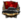
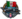

# Table of contents

- [Land units](#land-units)
  - [Division template](#division-template)
  - [Division placement](#division-placement)
- [Equipment production](#equipment-production)
- [Adding Air Wings](#adding-air-wings)
- [Adding Navies](#adding-navies)
  - [Man the Guns](#man-the-guns)
  - [Non-Man The Guns](#non-man-the-guns)
- [List of Units](#list-of-units)
  - [Regiments](#regiments)
  - [Support Companies](#support-companies)
  - [Aircraft](#aircraft)
  - [Ship Categories](#ship-categories)
  - [MTG Ship Equipment](#mtg-ship-equipment)
  - [Non-MTG Ship Equipment](#non-mtg-ship-equipment)
- [References](#references)


---

*This article is for creating divisions as part of a country's military. For sub-units making up the construction of division templates, see [Unit modding](<Unit modding - Hearts of Iron 4 Wiki.md>).*

Units are the foundations of Hearts of Iron, and can be broken down into air wings, divisions and naval task forces. The definitions are located within /Hearts of Iron IV/history/units/\*.txt files and can be loaded by using the [load\_oob effect](<Effect - Hearts of Iron 4 Wiki.md#load-oob>) or [various attributes inside of country history](<Country creation - Hearts of Iron 4 Wiki.md#order-of-battle>). The filename is irrelevant for interpretation, but it must match up with the effect or the attribute used to load it.

The game uses orders of battle to define the state of the country's military. Traditionally, the starting equipment production is defined in them, using an [effect](<Effect - Hearts of Iron 4 Wiki.md>) block. Optionally, the current focus progress may be included.
**Each order of battle must be loaded in order for the units to show up.** For the starting state of the country's military, [this is done in country history](<Country creation - Hearts of Iron 4 Wiki.md#order-of-battle>). [The load\_oob effect](<Effect - Hearts of Iron 4 Wiki.md#load-oob>) can be used to load one mid-game, which will add the information in the order of battle to the current information of the country, creating division templates and units and executing the effects.

The internal names for sub-units can be found in /Hearts of Iron IV/common/units/\*.txt files, [localisation can be checked as well](<Modding - Hearts of Iron 4 Wiki.md#searching-multiple-files>).

## Land units

The land unit order of battle is usually the one that's loaded with `oob` or `set_oob` in country history. Most commonly, one is used since most definitions don't differ by DLC. However, if tank equipment types are referenced, such as when a unit is forced to use a certain tank equipment type or starting equipment production includes tanks, this is split into 2 files divided by the No Step Back DLC, with an if statement in the place that loads it deciding whether one should be loaded, such as the following in a country history file:

```text
if = {
    limit = { has_dlc = "No Step Back" }
    set_oob = "TAG_1936_nsb"
    else = { set_oob = "TAG_1936_legacy" }
}
```

### Division template

*See also: [Effect § division\_template](<Effect - Hearts of Iron 4 Wiki.md#division-template>)*

Land units require a template of some sort, which assigns the necessary information. The template definition is equivalent to the `division_template` effect internally. A simple template can be defined as such:

```text
division_template = {
    name = "Blueskirt Division"
    regiments = {
        infantry = { x = 0 y = 0 }
        infantry = { x = 0 y = 1 }
        artillery_brigade = { x = 1 y = 0 }
        artillery_brigade = { x = 1 y = 1 }
    }
    support = {
        artillery = { x = 0 y = 0 }
    }
}
```

- `name = ""` is the name of the division template as it shows up in the template selection. This will also get used for creating or modifying units.
- `regiments = { ... }` and `support = { ... }` decide the sub-units of the template, meaning combat battalions and support companies respectively. In particular:
  - `subunit = { x = 0 y = 0 }` decides the placement of the specified sub-unit. The coordinates represent the [Cartesian coordinate system](http://en.wikipedia.org/wiki/Cartesian_coordinate_system), where (0,0) is the top-left corner, x goes left-to-right, and y goes up-to-down. For a unit to be placed as a support company, it must have `group = support` in its definition, and to be placed in combat battalions, it must have a different group. The group cannot change in a single y column.

:   By default, the combat battalions have 5 columns and 5 rows, while the support companies have 1 column and 5 rows. The max index is one less than the total amount.

There are also optional arguments:

- `division_names_group = USA_INF_01` forcefully changes the name group used for new divisions, defined in /Hearts of Iron IV/common/units/names\_divisions/\*.txt files. This is used to automatically generate names and numeration for new divisions, such as a division newly created by the player being named "1st 'Big Red One' Division". If not set, the template automatically picks the name group based on the sub-units.
- `is_locked = yes` will make the division locked, preventing the player from changing any of its information and creating/deleting/editing units with it. Defaults to no if unset.
- `force_allow_recruiting = yes` will allow recruiting new divisions from the template even if it locked. Has no effect on non-locked templates. Default to no if unset.
- `division_cap = 12` is the maximum amount of divisions that may be recruited with this template. The template has to be locked. Defaults to no cap if unset.
- `priority = 0` is the supply receiving priority. The options are 0 for "Reserves", 1 for default, and 2 for "Elite". Default to 1 if unset.
- `template_counter = 10` is used to override the default icon used for the position. The particular example with 10 will make sure that the sprites with the name of `GFX_div_templ_10_large` and `GFX_div_templ_10_small` will get used.
- `override_model = GER_infantry_entity` is used to change the [entity](<Entity modding - Hearts of Iron 4 Wiki.md>) that is used by divisions made from this template. Defaults to automatically determining based on the sub-units if unset.

### Division placement

The `units = { ... }` block is used for positioning land and naval divisions. In particular, a land division placement is done via `division = { ... }`:

```text
units = {
    division= {
        name = "1st Blueskirt Division"
        location = 9392 # Edinburgh
        division_template = "Blueskirt Division"
        start_experience_factor = 0.2
        start_equipment_factor = 0.3
    }
    division= {
        division_name = {
            is_name_ordered = yes
            name_order = 35
        }
        location = 6488
        division_template = "Infanterie-Division"
        force_equipment_variants = { infantry_equipment_0 = { owner = "SCO" } }
        officer = {
            name = SCO_officer_1
            portraits = {
                army = {
                    large = GFX_SCO_officer_1
                    small = GFX_SCO_officer_generic_small
                }
            }
        }
    }
}
```

For the division naming, there are two mutually-exclusive ways to do so:

- `name = "Unit's name"` directly changes the name of the division to the given string.
- `division_name = { ... }` instead uses the name group assigned to the division template:
  - `is_name_ordered = yes` is mandatory to include.
  - `name_order = 35` sets the number that gets used for the numeration. If the name group's `ordered = { ... }` includes this number, that entry gets used. Otherwise, the `fallback_name` is used.

There are these mandatory arguments in addition to the name:

- `location = 1234` is the province where the unit should be positioned.
- `division_template` is the name of the template that the unit should use. Generally best to limit to the one that's defined in the same file.

There are also optional arguments:

- `start_experience_factor = 0.2` sets the experience level of the division (from Greens to Veterans) in the range from 0 to 1. If unset, defaults to 0. The experience level boundaries in the base game are `{ 0.1, 0.3, 0.75, 0.9 }`.
- `start_equipment_factor = 0.5` decides the starting equipment level of the division, not deciding on the manpower. The equipment is not subtracted from the reserves of the country. If unset, defaults to 1.
- `start_manpower_factor = 0.3` decides the starting manpower level of the division. If unset, then it's automatically subtracted from the reserves of the country until the highest possible level.
- `force_equipment_variants = { ... }` is a set of equipment types that the division should use, replacing the default. Each entry in there is `equipment_type = { ... }`, which may include:
  - `owner = TAG` is the owner of the equipment that should be used. This should be the same as the country which gets the order of battle.
  - `creator = TAG` is the original creator of the equipment that should be used. This is used to determine the variants, and it defaults to the owner if not specified.
  - `amount = 14` is how much of the equipment should be there. The rest of required equipment within the archetype will remain ungiven.
  - `version_name = "Variant's name"` is the name of the equipment variant that should be used. If the equipment type requires a variant to use, such as tanks in No Step Back, this is mandatory. Otherwise, this is optional.
- `officer = { ... }` is a character definition that will be used for the divisional commander if promoted to a commander or the officer corps system is used. In particular, these attributes are common inside:
  - `name = loc_key` is the [localisation](<Localisation - Hearts of Iron 4 Wiki.md>) key to be used as the division commander's name.
  - `portraits = { army = { large = "GFX_portrait_SCO_character" small = "GFX_idea_SCO_character" } }` is the portrait that the division commander must use. The large portrait will be used for the corps commander promotion and the small portrait will be used for the officer corps system. If both are unset, [randomly generates a portrait](<Country creation - Hearts of Iron 4 Wiki.md#character-portraits>). If the large is set, the small portrait will default to the name of large portrait with \_small appended to the end.

## Equipment production

*Main article: [Effect § add\_equipment\_production](<Effect - Hearts of Iron 4 Wiki.md#add-equipment-production>)*

The equipment production is simulated using the `instant_effect = { ... }` block. This is a regular [effect](<Effect - Hearts of Iron 4 Wiki.md>) block, any effect can be used here. Usually, the production is added in this manner:

```text
instant_effect = {
    add_equipment_production = {
        equipment = {
        type = infantry_equipment_0
        creator = "ARG"
    }
    requested_factories = 1
    progress = 0.19
    efficiency = 100
    }
}
```

The `add_equipment_production = { ... }` has these attributes:

- `equipment = { ... }` decides on which equipment specifically should be made, in particular:
  - `creator = TAG` is the creator of the equipment. Usually it's the same person who makes the equipment, but it may be different for lend-leases.
  - `type = infantry_equipment_0` is the exact equipment type that should be produced. The technology to unlock it, if needed, must be researched by the creator. Equipment can be found in /Hearts of Iron IV/common/units/equipment/\*.txt files.
  - `version_name = "Variant name"` is the variant that should be used for equipment, [usually defined in country history](<Country creation - Hearts of Iron 4 Wiki.md#variants>). This is mandatory if the equipment requires a variant to produce, such as ships in Man the Guns or airplanes in By Blood Alone. Otherwise, it's optional.
- `requested_factories = 1` is the amount of military factories or dockyards that should be dedicated towards producing this equipment type. If unfulfilled, the factories will be assigned into the queue.
- `progress = 0.2` is used to assign the current amount of progress towards a single piece of equipment being finished. This is usually changed for expensive equipment, such as battleships.
- `efficiency = 100` is, with 0 as 0% and 100 as 100%, the production efficiency which the factories should have immediately.

## Adding Air Wings

```text
air_wings = {
    500 = {
        fighter_equipment_0 = {
            owner = "BRA"
            amount = 10
        }
    }
}
```

- **Air Wings** is the command that creates the air wing.
- **500** is the state where the air wing spawns. The state should have an air base set there.
- **fighter\_equipment\_0** is the type of aircraft that is in the air wing.
- **Owner** is who created the type of aircraft. Does not need to be the country you are making the file for.
- **Amount** is how many of that type of equipment is in that air wing.

## Adding Navies

### Man the Guns

```text
units = {
    fleet = {
        name = "Fleet De Custom" # Name 1
        naval_base = 10980
        task_force = {
            name = "Fleet De Custom" # Name 2
            location = 10980
            ship = {
                name = "NRB Minas Gerasis" # Name 3
                pride_of_the_fleet = yes
                definition = battleship
                equipment = {
                    ship_hull_heavy_1 = {
                        amount = 1
                        owner = BRA
                        version_name = "Minas Geras Class"
                    }
                }
            }
        }

        task_force = {
            name = "Fleet De Submarine" # Name 1
            location = 10980
            ship = {
                name = "NRB Humayta" # Name 2
                definition = submarine
                equipment = {
                    ship_hull_submarine_2 = {
                        amount = 1
                        owner = BRA
                        version_name = "Humayta Class"
                    }
                }
            }
        }
    }
}
```

- **Fleet** begins a new fleet which can comprise of multiple task forces.
- **Name 1** is the name of the fleet.
- **Naval Base** is the location of where the fleet is headquartered.
- **Name 2** is the name of the task force.
- **Location** is where the task force spawns.
- **Ship** creates a new ship within the task force.
- **Pride Of The Fleet** designates a ship as the pride of the fleet. Only one ship can be the Pride Of The Fleet at a time. Optional.
- **Definition** sets what type of ship it is.
- **Equipment** sets what level of equipment the ship uses.
- **Amount** is how much of that equipment the ship uses. Should be kept at one.
- **Owner** is who created the equipment the ship uses and who receives it.
- **Creator** is who will create the ship if the owner has not unlocked the technology. Optional.
- **Version Name** is for custom classes of ship. Optional

Note: The owner or creator country needs to have the technology unlocked and the version needs to exist in their countries history file.

### Non-Man The Guns

The only main difference between this section and the Man The Guns section is the equipment.

```text
units = {
    fleet = {
        name = "Armada Argentina"
        naval_base = 12364
        task_force = {
            name = "Armada Argentina"
            location = 12364
            ship = {
                name = "ARA Rivadavia"
                definition = battleship
                equipment = {
                    battleship_1 = {
                        amount = 1
                        owner = ARG
                        version_name = "Rivadavia Class"
                    }
                }
            }
        }
    }
}
```

- **Fleet** begins a new fleet which can comprise of multiple task forces.
- **Name 1** is the name of the fleet.
- **Naval Base** is the location of where the fleet is headquartered.
- **Name 2** is the name of the task force.
- **Location** is where the task force spawns.
- **Ship** creates a new ship within the task force.
- **Definition** sets what type of ship it is.
- **Equipment** sets what level of equipment the ship uses.
- **Amount** is how much of that equipment the ship uses. Should be kept at one.
- **Owner** is who created the equipment the ship uses.
- **Version Name** is for custom classes of ship. Optional

## List of Units

### Regiments

```text
infantry
cavalry
camelry
motorized
light_armor
medium_armor
heavy_armor
super_heavy_armor
modern_armor
marine
paratrooper
amphibious_armor
amphibious_mechanized
anti_tank_brigade
anti_air_brigade
armored_car
artillery_brigade
mot_artillery_brigade
mot_anti_tank_brigade
mot_anti_air_brigade
rocket_artillery_brigade
mot_rocket_artillery_brigade
motorized_rocket_brigade
bicycle_battalion
mountaineers
mechanized
light_sp_anti_air_brigade
medium_sp_anti_air_brigade
heavy_sp_anti_air_brigade
super_heavy_sp_anti_air_brigade
modern_sp_anti_air_brigade
light_sp_artillery_brigade
medium_sp_artillery_brigade
heavy_sp_artillery_brigade
super_heavy_sp_artillery_brigade
modern_sp_artillery_brigade
light_tank_destroyer_brigade
medium_tank_destroyer_brigade
heavy_tank_destroyer_brigade
super_heavy_tank_destroyer_brigade
modern_tank_destroyer_brigade
```

### Support Companies

```text
anti_air
anti_tank
armored_car_recon
artillery
engineer
field_hospital
logistics_company
maintenance_company
military_police
mot_recon
recon
rocket_artillery
signal_company
```

### Aircraft

CV references the carrier variant of the aircraft. All aircraft have a carrier variant unless otherwise specified.

```text
fighter_equipment_0
cv_fighter_equipment_0
fighter_equipment_1
fighter_equipment_2
fighter_equipment_3
jet_fighter_equipment_1
jet_fighter_equipment_2

CAS_equipment_1
cv_CAS_equipment_1
CAS_equipment_2
CAS_equipment_3

nav_bomber_equipment_1
cv_nav_bomber_equipment_1
nav_bomber_equipment_2
nav_bomber_equipment_3

tac_bomber_equipment_0

heavy_fighter_equipment_1
heavy_fighter_equipment_2
heavy_fighter_equipment_3

scout_plane_equipment_1
scout_plane_equipment_2

tac_bomber_equipment_1
tac_bomber_equipment_2
tac_bomber_equipment_3

jet_tac_bomber_equipment_1
jet_tac_bomber_equipment_2

strat_bomber_equipment_1
strat_bomber_equipment_2
strat_bomber_equipment_3

jet_strat_bomber_equipment_1

rocket_suicide_equipment_1
```

### Ship Categories

```text
battleship
carrier
destroyer
battle_cruiser
heavy_cruiser
light_cruiser
submarine
```

### MTG Ship Equipment

```text
ship_hull_carrier_1
ship_hull_carrier_2
ship_hull_carrier_3

ship_hull_carrier_conversion_bb
ship_hull_carrier_conversion_ca

ship_hull_cruiser_1
ship_hull_cruiser_2
ship_hull_cruiser_3
ship_hull_cruiser_4

ship_hull_pre_dreadnought
ship_hull_heavy_1
ship_hull_heavy_2
ship_hull_heavy_3
ship_hull_heavy_4

ship_hull_super_heavy_1

ship_hull_light_1
ship_hull_light_2
ship_hull_light_3
ship_hull_light_4

ship_hull_submarine_1
ship_hull_submarine_2
ship_hull_submarine_3
ship_hull_submarine_4

ship_hull_cruiser_submarine

torpedo_cruiser
ship_hull_torpedo_cruiser
ship_hull_cruiser_panzerschiff

ship_hull_cruiser_coastal_defense_ship

SH_battleship_1
SH_battleship_2
```

### Non-MTG Ship Equipment

```text
carrier_1
carrier_2
carrier_3
carrier_4

light_cruiser_1
light_cruiser_2
light_cruiser_3
light_cruiser_4

heavy_cruiser_1
heavy_cruiser_2
heavy_cruiser_3
heavy_cruiser_4

battleship_1
battleship_2
battleship_3
battleship_4

battle_cruiser_1
battle_cruiser_2

destroyer_1
destroyer_2
destroyer_3
destroyer_4

submarine_1
submarine_2
submarine_3
submarine_4
```

## References

1. [↑](#cite-ref-1) `NDefines.NMilitary.MAX_DIVISION_BRIGADE_WIDTH = 5`, `NDefines.NMilitary.MAX_DIVISION_BRIGADE_HEIGHT = 5`, `NDefines.NMilitary.MAX_DIVISION_SUPPORT_WIDTH = 1`, and `NDefines.NMilitary.MAX_DIVISION_SUPPORT_HEIGHT = 5` in [Defines](<Defines - Hearts of Iron 4 Wiki.md>)
2. [↑](#cite-ref-2) `NDefines.NMilitary.UNIT_EXP_LEVELS = { 0.1, 0.3, 0.75, 0.9 }` in [Defines](<Defines - Hearts of Iron 4 Wiki.md>).

**[Modding](<Modding - Hearts of Iron 4 Wiki.md>)**
