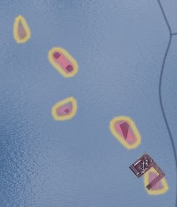
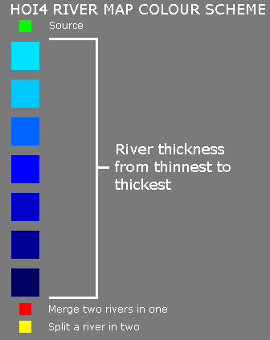
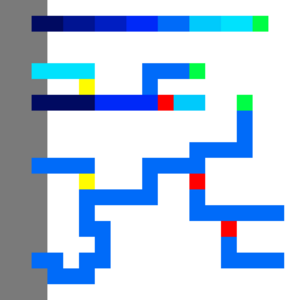

# Table of contents

- [Quick overview](#quick-overview)
- [Notes](#notes)
  - [BMP format](#bmp-format)
  - [Correcting a broken 8-bit map](#correcting-a-broken-8-bit-map)
  - [Coordinate system](#coordinate-system)
- [State modding](#state-modding)
- [Strategic regions](#strategic-regions)
  - [Weather](#weather)
- [Provinces](#provinces)
  - [Continents](#continents)
- [Terrain](#terrain)
  - [Provincial terrain](#provincial-terrain)
  - [Graphical terrain](#graphical-terrain)
- [Height map](#height-map)
- [Normal map](#normal-map)
- [Rivers](#rivers)
- [Trees](#trees)
- [Colour maps](#colour-maps)
  - [Water](#water)
  - [RGB and city lights](#rgb-and-city-lights)
- [Buildings](#buildings)
- [Unit model and victory point positions](#unit-model-and-victory-point-positions)
- [Adjacencies](#adjacencies)
  - [Adjacency rules](#adjacency-rules)
- [Supply](#supply)
  - [Supply areas (For versions prior to 1.11)](#supply-areas-for-versions-prior-to-111)
- [Ambient objects](#ambient-objects)
- [References](#references)


---

The map of the game is primarily changed within the /Hearts of Iron IV/map/ folder. This includes provinces and details about them as well as the cosmetic appearance of the map: trees, terrain, cities.

/Hearts of Iron IV/map/\*.bmp files are referred to as bitmaps. Commonly these are used for the cosmetic appearance of the map, aside from the provinces bitmap.
/Hearts of Iron IV/map/\*.csv files are CSV tables. These may be edited within a text editor or a table editor such as Excel or OpenOffice. It can be preferable to open these with text editors for greater performance.

## Quick overview

These files in the map folder are common to edit:

- /Hearts of Iron IV/map/provinces.bmp is used as a map assigning the province borders.
- /Hearts of Iron IV/map/definition.csv is used in order to assign in-game province information, including terrain, continent, and the coastal status. This does not change the graphical appearance.
- /Hearts of Iron IV/map/terrain.bmp is used as the terrain map, assigning textures to the specified positions. This does not change the actual province terrain, just the appearance.
- /Hearts of Iron IV/map/heightmap.bmp is used as the heightmap, assigning a height for each pixel on the map. This is also used to put areas underwater.
- /Hearts of Iron IV/map/world\_normal.bmp is used as the normal mapping, assigning a slope to each pixel that gets used in lightning calculates. This is used to create more accurate shadows.
- /Hearts of Iron IV/map/terrain/colormap\_rgb\_cityemissivemask\_a.dds is used to create an overall colouring of the world and to change the opacity of city lights. **Oddities about the world's colouring typically come from this file not being adjusted**.
- /Hearts of Iron IV/map/terrain/colormap\_water\_0.dds is used to create a colouring of the world oceans.
- /Hearts of Iron IV/map/buildings.txt is used to assign the positions of building models and to assign the neighbouring sea province to the buildings that require it, i.e. naval bases and floating harbours. **This can cause a game crash if left unedited while adding new states or provinces.**
- /Hearts of Iron IV/map/unitstacks.txt is used to assign the information regarding the position and rotation of unit models and positions of unit models.
- /Hearts of Iron IV/map/rivers.bmp is used to assign rivers that appear in the world.
- /Hearts of Iron IV/map/trees.bmp is used to assign tree models that appear in the world.
- /Hearts of Iron IV/map/supply\_nodes.txt and /Hearts of Iron IV/map/railways.txt are used to assign the supply nodes and railways at the game's start. **This will cause a game crash if unedited on a new map.**
- /Hearts of Iron IV/map/adjacencies.csv is used to create special relationships between pairs of provinces, whether it's making the border impassable or creating a passage without a border.
- /Hearts of Iron IV/map/adjacency\_rules.txt is used to establish more complex rules for province relationships, primarily in regards to making straits that can be passable or not depending on circumstances.
- /Hearts of Iron IV/map/ambient\_object.txt is used to create models that are constantly present on the world map. **This includes the base game's world borders in the north and the south.**
- /Hearts of Iron IV/map/cities.txt is used to assign different city models to different parts of the world, by default using /Hearts of Iron IV/map/cities.bmp as the map.
- /Hearts of Iron IV/map/airports.txt and /Hearts of Iron IV/map/rocketsites.txt were deprecated and removed in the patch 1.15.

## Notes

- **Due to [how the game reads BMP files](#bmp-format), many image editors such as Paint.net or Microsoft Paint can't be used for most bitmap files**, with only provinces and world\_normal working. Photoshop and GIMP are alternatives that will always work, but the mode should never be changed from indexed when using them. [If a map was saved incorrectly, the later section on details of the BMP format provides an easy way to correct the map.](#fix-map) The method described there can also be used to export a new file.
- When exporting the map in GIMP, **"do not write color space information" must be checked on**.
- [Debug mode](<Modding - Hearts of Iron 4 Wiki.md#advantages-of-using-debug>) turned on via launch settings is essentially necessary for map modding. Without debug mode, any error marked with MAP\_ERROR will cause the game to fail to load and it wouldn't be possible to open the nudger within the main menu: some map errors may lead to the game being impossible to open in singleplayer.
- Some of the errors marked with MAP\_ERROR may not appear in the error log when it opens during the main menu loading. The error log after selecting a country in singleplayer will contain all of the map errors for sure.
- Using the nudger can make the map editing much easier, but the tool is still unstable. At times it can be better to do manual editing, but the nudge is still important to know of and use.
- The nudger will export files in the [User directory](<Modding - Hearts of Iron 4 Wiki.md>) directly, such as the Documents/Paradox Interactive/Hearts of Iron IV/ folder (Default location within Windows), with the folders of /history/, /map/, and /localisation/ potentially being created inside of that folder. These will be loaded by default in base game as well if left there. Additionally, these [have lower priority](<Modding - Hearts of Iron 4 Wiki.md#loading-mods>) than the mod files: if a mod is set to unload previously-loaded files within a generated folder via replace\_path or contains a copy of the edited file, editing via the nudger may appear to not show changes. However, the outputs will still be created, and moving the files to the mod files and making them get loaded – such as via the 'update'/'load' button in the nudger, depending on the menu, or by restarting the game – will still work as intended.
- replace\_path can be used to fully unload the contents of a single folder (but not subfolders) that get indexed at the main menu loading. This can be used to ensure that none of the base game's strategic regions or states will appear in the loaded files when the mod is enabled.
- /Hearts of Iron IV/map/default.map can be used in order to change the file used for a certain purpose, such as the name of the provinces bitmap. Within this article, it'll be assumed that /Hearts of Iron IV/map/default.map is unchanged, with the filenames being the same as in base game.

### BMP format

*This section is primarily the technical details on why the first two notes are necessary to be followed, as well as explaining some terminology used later in the article such as 'colourmaps' and '8-bit'/'8 bitdepth'/'8 bpp'.*

There are 3 primary types of BMP files used in Hearts of Iron IV: 8-bit greyscale/indexed greyscale, 8-bit indexed, and 24-bit RGB. A BMP file may have compression, but Hearts of Iron IV requires that absolutely none is present and the rest here will assume it being off. No compression means that each pixel is assigned the same amount of bits.
Bitdepth is the amount of bits per pixel, sometimes shortened as -bit (e.g. 8-bit) or bpp. The amount of bits per pixel assigns the total amount of possible colours in the file: bitdepth of 8 means

{\displaystyle 2^{8}=256} colours in the file, while bitdepth of 24 means

{\displaystyle 2^{24}=16777216} different possible colours. As the amount of bits per pixel, **wrong bitdepth on a file can be detected due to a large filesize difference** between the mod's and base game's versions of an image.
Some image editors, e.g. GIMP, don't explicitly have bitdepth as an option. In those, the bitdepth can be set by limiting the amount of possible colours. The RGB image mode allows each pixel to have 256 values for red, green, and blue colours, for a total of

{\displaystyle 256^{3}=2^{24}}, making a bitdepth of 24. If the image or a layer contains an alpha channel (i.e. making transparency allowed), which can be toggled on accidentally when creating a second layer as an overlay, the option of transparency adds even more possible colours, up to

{\displaystyle 256^{4}=2^{32}}, making a bitdepth of 32. If the image mode is set to Greyscale, then there are a total of 256 possible colours each pixel can be, making

{\displaystyle 2^{8}} total colours and a bitdepth of 8. With the indexed image mode, the amount of possible colours depends on the size of the colourmap/colour table and can be anything from 2 to 256. In Photoshop however, the bitdepth is explicitly set in the save settings window when exporting the file to bmp, with RGB mode images being able to select 16, 24 and 32-bit and Indexed mode images being able to select 4 or 8-bit.

In more detail on each image mode used:

- 24-bit RGB is used for `provinces` and `world_normal` bitmaps. Every pixel is assigned a direct colour value in each of the three colour channels, which gets read by the game to interpret it; either to assign province IDs in case of the former or to assign the vector proportions in case of the latter.
- 8-bit greyscale/indexed greyscale is used for the `heightmap` bitmap. The image mode is interpreted differently per image editor: in GIMP, the greyscale mode is used, while in Photoshop indexed colors mode is used, shown below, with a greyscale color table. This happens because of an internal behavior of Photoshop's greyscale mode. **Paint.net and MS Paint cannot be used to edit the heightmap bitmap**, since they generate a completely new colormap/color table when saving. Every pixel is assigned a value from 00 to FF that decides on the brightness of it and directly translates to height by the game.
- 8-bit indexed is used for every other bitmap: `cities`, `rivers`, `terrain`, and `trees`. This mode creates a colourmap (called color table in Photoshop), which is a list of 256 colours arranged in order from 00 to FF. Each pixel is assigned a value from 00 to FF, which directly corresponds to an entry on the colourmap. **The game checks this value on each pixel rather than the colour** and picks an entry based on the numeric value of that ID. Due to this, in order for the file to work correctly, the colourmap cannot be altered in any shape or form. For example, the image mode cannot be changed from Indexed to another one, since the image editor will not be able to preserve the order in memory, generating a new order after the image mode is set back to Indexed. For the same reason, **Paint.net and MS Paint cannot be used to edit the indexed bitmaps**, since they generate a completely new colormap/color table when saving rather than preserving it for the entirety of editing. In Photoshop, it is possible to save the indexed colors table to a .ACT file from the menu Image -> Mode -> Color Table, so the table can be loaded later when changing the image mode to Indexed. Newer versions of GIMP have access to a similar feature in the "use custom palette" option when changing the image from RGB to Indexed mode, which can be used to transfer the colormap from the base game file, by having it open in another tab.

When using image editors that don't have a complete support of editing the colormap/color table, 8-bit Indexed bitmaps cannot be easily converted back to how they're intended to be. Adding a new layer or changing the image mode will break how the map will be interpreted. Instead, it's possible to keep another image within the mod files as a backup and, when needed to use a layer as an overlay, edit the backup rather than the one interpreted by the game. After finishing the edits, it's possible to copy the contents of the backup inside of the image editor and paste them into the file interpreted by the game: that way it's possible to copy the color of each pixel without copying over the rest of the file's format. **Paint.net or MS Paint will not work for this.**

BMP files contain a DIB header at the beginning that assigns image file information. The game is set-up to expect BITMAPINFOHEADER as the format of the header for all BMP files. This depends on the image editor and most should save within this one by default.
However, other formats for the header exist: the most common one to accidentally save in is BITMAPV5HEADER, written by the GIMP foundation. This is used in order to add the ICC information, characterizing in which colour space the image has to be read in. *Hearts of Iron IV's engine is not set to recognise this header*. For this reason, **when exporting in GIMP, "do not write colour space information" must be checked on** in order to save with BITMAPINFOHEADER rather than BITMAPV5HEADER.

### Correcting a broken 8-bit map

As it's possible to edit an 8-bit file without palette restrictions by keeping a separate 24-bit copy of the file, the same can also be used to correct a file which had its colourmap reset or which was erroneously saved in a higher bitdepth. This needs to be done in an editor that does have support for Indexed mode images, except for Paint.net and MS Paint. Photoshop and newer versions of GIMP have better alternatives to fix this. To do this type of fix, this checklist can be followed:

- Change the filename of the mod's broken bitmap. For this example, map/terrain\_broken.bmp will be used (with map/terrain.bmp as the original file), but the same can be applied to every other bitmap.
- Copy the base game's according map/terrain.bmp file into the mod. If the mod's map had its dimensions changed, this image should be resized to the proper ones, otherwise it shouldn't be touched.
- Open both map/terrain\_broken.bmp and map/terrain.bmp within the editor. **Paint.net or MS Paint will not work.**
- Within the image editor, select everything in map/terrain\_broken.bmp (using ctrl+A or Select -> All) and copy it to the clipboard.
- Paste the contents of the file into map/terrain.bmp.
- Export the opened map/terrain.bmp file with correct settings.
- Optionally delete the map/terrain\_broken.bmp file.

In Photoshop, this can be done easily using the indexed Color Table menu. For a BMP file that is already in 8-bit indexed mode but with incorrect palette:

- Open the corresponding base game file in Photoshop.
- Select the menu Image -> Mode -> Color Table.
- Click "Save" to save a .ACT file with the table.
- Open the broken file in Photoshop.
- Select the menu Image -> Mode -> Color Table.
- Click "Load" and load the saved .ACT file, then click OK.
- Go to "File" menu and click "Save".

The same can be done for exporting a new file, starting in RGB mode:

- Open the RGB mode image in Photoshop.
- Select the menu Image -> Mode -> Indexed Colors.
- In palette, select "Custom".
- In the Color Table menu, select "Load" and select the .ACT file saved from the corresponding base game file, then click OK.
- Go to "File" menu and click "Save a copy".
- In the save dialog, select BMP.
- In the settings dialog that comes up, select "Windows" in format, "8 bits" in depth and leave the boxes unchecked, then click OK.

In newer versions of GIMP, this can be done with the "use custom palette" option in the Indexed mode window:

- Open the corresponding base game file in GIMP.
- Open the broken file in GIMP, keeping both files open.
- Go to Image -> Mode and change it to RGB, if it isn't already.
- Go to Image -> Mode and select Indexed.
- Select the "Use Custom Palette" option and click on the icon below it.
- In the dropdown list, select "Colormap of Image#(number)...", which is the base game file.
- Click convert.
- Export the opened file, disabling the option to write color space information.

### Coordinate system

Since the map is a 3D object, there are X, Y, and Z positions using a [typical Cartesian coordinate system](http://en.wikipedia.org/wiki/Cartesian_coordinate_system), which are commonly referred to in a multitude of map files. For disambiguation, these are the coordinates that the game uses:

- A single X coordinate is equivalent to a single pixel within the provinces bitmap horizontally. The horizontal edges of the map are at 0, and it goes left-to-right (or west-to-east). Note that the map loops horizontally.
- A single Y coordinate is equivalent to a value of 10 (in decimal) within the heightmap. A Y position of 0 is equivalent to pure black on the heightmap, while a Y position of 25.5 is equivalent to pure white on the heightmap. The water level, for example, is located at 9.5 by the Y position.
- A single Z coordinate is equivalent to a single pixel within the provinces bitmap vertically. The lower (or southern) edge of the map is at 0, and it goes down-to-up (or south-to-north). **Note that most image editors have it the other way around**: the position at 0 by the axis would be at the top and it going up-to-down. When wanting to know the Z coordinate, it can be useful to change the coordinate system that the editor uses (if possible) or temporarily flip the image upside down.

## State modding

*Main article: [State modding](<State modding - Hearts of Iron 4 Wiki.md>)*

States are defined within /Hearts of Iron IV/history/states/\*.txt files, with information about the states: provinces containing them, the state category, the starting buildings and owner.
The nudger works for editing states, however, there are several issues:

- If a state's name contains any special character requiring more than one byte to represent in UTF-8 (e.g. any letters outside of the English alphabet), the nudger will crash when trying to create one.
- Every quote within the state's history file will get removed if a nudger edits it. This can break DLC checks (e.g. `has_dlc = "Waking the Tiger"`), present in base game Turkish or Chinese states.

Additionally, note that the nudger dynamically updates strategic regions with states: a newly-created state will not have its provinces assigned to strategic regions and that will have to be done via the nudger. Since strategic regions are assigned for each province individually, deleting the strategic region outputs within the user directory's /Hearts of Iron IV/map/strategicregions/ folder may work, as long as the strategic region borders don't need to be adjusted, as all provinces of one state must be within the same strategic region.

## Strategic regions

*Main article: Strategic region modding*

Strategic regions are defined within /Hearts of Iron IV/map/strategicregions/\*.txt files, where provinces are added to them individually. A province *must* have a strategic region. Otherwise, many interactions with that province can cause a game crash, sometimes appearing before the game can launch. The strategic regions are used for ships and airforce as regions where they can be assigned, but they also serve for assigning weather. A naval strategic region may also have [naval terrain](#provincial-terrain) assigned with `naval_terrain = terrain_name`.

### Weather

*See also: Nudger § Weather*

Each strategic region has weather defined in periods, as

```text
weather={
        period={
            between={ 0.0 30.11 }
            temperature={ -6.0 12.0 }
            no_phenomenon=0.500
            rain_light=1.000
            rain_heavy=0.150
            snow=0.200
            blizzard=0.000
            arctic_water=0.000
            mud=0.300
            sandstorm=0.000
            min_snow_level=0.000
        }
    }
}
```

- `between = { ... }` decides in which period the weather applies: both dates within the definition of the period are included within the period; the first number is the day, the second is the month; the count for days and months starts from 0 rather than 1.
- `temperature = { ... }` assign the maximum and minimum temperatures for the period.

Most of the lines decide the chance for each province in the strategic region to have that weather type, assuming that the chance `no_phenomenon` evaluates as false. Multiple weather types can happen at the same time, and weather is calculated daily.
`min_snow_level` decides the visual appearance of snow in the region. Usually set to 0.1 in the particularly snowy periods such as winter in Northern Scandinavia.

Additionally, the /Hearts of Iron IV/map/weatherpositions.txt file decides the *position* of weather objects such as the clouds. A single entry in the file has the following layout:

```text
strategic region ID;X position;Y position;Z position;size
```

For example, `1;2781.24;9.90;1571.49;small` means that the strategic region with the ID of 1 has a small weather object in the specified position.
The size only has 2 values: small and large. Multiple definitions or none at all may be present for the same strategic region, however, there should be at least one definition in the file for both large and small objects to avoid a game crash.

Weather is best generated with nudger in the strategic region menu.

## Provinces

*See also: Nudger § Database*

There are two files related to the province definitions:

- /Hearts of Iron IV/map/provinces.bmp, which decides how the provinces are placed on the map.
- /Hearts of Iron IV/map/definition.csv, which decides the exact details about the province: ID, RGB value to link to the map, coastal status, terrain.

The provinces bitmap is saved as a 24-bit RGB file. Saving in 32-bit will result in a 'We do not support bitdepth at 32' error, resulting in a crash on startup. The province bitmap being saved wrong (Such as the prior 32 bitdepth or being the wrong format renamed to BMP) will result in 'X4008: floating point division by zero' errors. Due to proportions of other map files, **both length and width have to be a multiple of 256**. Due to the engine limitations, the total area of the file in pixels cannot exceed 13 238 272, approximately.

An unused colour for the bitmap can be picked by using the database menu within the nudger. However, considering the sheer amount of possible colours, randomising a colour using a site such as [random.org](https://www.random.org/colors/hex) can also be used, with a chance of overlap being extremely low.
If the province definitions are incomplete or incorrect, the game creates a 'corrected' copy of this file in the [user directory](<Modding - Hearts of Iron 4 Wiki.md>) to replace the CSV table for province definitions, with any incomplete or missing province definitions filled in, as /Hearts of Iron IV/map/definition.csv.fixed and other copies of the file in that folder. It might be necessary to delete this copy after making changes to the original file.
Both of these can be used to speed up province creation by painting random colours on the map, then letting the game generate the CSV table which'll be adjusted manually once ported over to the mod.

The previously-mentioned corrected copy of the province definition within the user directory would contain every province definition from the mod's definition.csv alongside every colour that's present on the bitmap but doesn't have a definition, which'll have a default entry as a land province with no continent and unknown terrain. This can be used with an image editor to locate any unintended colours in the provinces.bmp file. These can be the result of picking a wrong colour or of anti-aliasing being turned on when editing the map. To locate them, one can choose the colour that the newly-generated province has and paint it over a spot that's safe to paint (Such as a large sea province or a corner of the map), and then use the colour select tool with 0% tolerance/0 threshold (name for the option depends on the image editor) in order to select it. In image editors, this is commonly either a separate option (Such as in GIMP) or an option within the magic wand tool for it to have a global flood mode (Such as in Paint.net).
After having located the province in question, the question of what to do with it is left up to the modder: it can be made into a separate province entirely (and so should be assigned to a state and strategic region), possibly altering its borders to fit better, or it could be removed entirely from the provinces.bmp file. In either of these cases, the spot that has been made in order to find the province should be reverted to its initial state.

An entry within the /Hearts of Iron IV/map/definition.csv follows the specified format:

```text
Province ID; R value; G value; B value; Province type (land|sea|lake); Coastal status (true/false); Terrain; Continent (integer)
```

Example definition of these include the following:

```text
7;212;179;179;sea;true;ocean;0
114;40;15;15;land;false;plains;1
260;170;235;235;land;true;urban;1
```

The RGB values for each province should be unique in order for them to be identifiable on the bitmap and are integers on the scale from 0 to 255. [The continent](#continents) must be an integer that represents a continent. For sea provinces, it must be kept at 0, while for lakes it *may* be kept at 0.
[Terrain](#terrain) is defined for each province individually here. This *does not* change the appearance of the province, just the terrain it's assigned, which changes naval or land combat. For lake provinces, terrain must be 'lakes' while for sea provinces it must be 'ocean'.
In here, the coastal status is used for both seas and land provinces. For land provinces, it means that a border with a sea province (not a lake), and for sea provinces it means that a border with a land province. This is used for determining, for example, where naval bases can be built and where they can't. If bitmap and province definition disagree on whether or not a province is coastal, such as if a land province is specified as non-coastal but still borders sea provinces or vise-versa, bitmap's results will be preferred. This does mean that there is no reason to specify the coastal status within the province definition, and it remains a leftover from before 1.11.

**Province IDs should go in order**. While a gap in province IDs will not necessarily crash the game, it will instead create a different problem: each province after the gap will take on the properties of the next province by ID other than the colour on the bitmap. For example, if province 23 doesn't exist, province 24 will take on the terrain, type (land|sea|lake), coastal status, and continent of province 25, which will copy from province 26 in turn and so on. This can cause highly unintended behaviour if not crashes, so it's best to not have any province gaps: if a province is to be deleted, another one must fill the gap, such as the last province by ID.



Hearts of Iron IV has a limit on province displaying. No more than 65536 different province borders can be displayed at the same time before an integer overflow causes the in-game engine to stop displaying any additional ones. In-game, this is usually hit at about 21000 provinces. In other words, **province amount should be kept low**, with the base game's roughly 13000-14000 provinces being an amount to aim for. More can cause the game to run more slowly and unstably. If a province borders another province several times in a disjointed manner, such as in the attached image, each one counts as a separate border.

These disjointed island provinces may also cause a game crash if they're *too* disjoined with large distances between them. This is not anything to worry about with regular provinces, but if two share a colour by accident, this may happen.
Province borders are also not drawn between provinces that are on land and those that are in a sea or a lake, according to definition.csv. If there is a particular spot or series of spots where provinces don't work, it might also be caused by a wrong province type assignment in definition.csv.

Additionally, these errors are common to encounter:

- "Map invalid X crossing. Please fix pixels at coords": Four provinces share a common corner. The game connects the bottom left and the top right provinces but this situation is confusing to the player and should be avoided. Keep in mind that the map loops horizontally, so this X crossing may be right at the edge of the province bitmap. The coordinate system used in the coordinates is the more traditional left-to-right then down-to-up, rather than [the one used by the game in other circumstances](#coordinate-system).
- "Province X has TOO LARGE BOX. Perhaps pixels are spread around the world in provinces.bmp": The province has a width/height of more than 1/8th of the total map width/height. This might be an indication that two provinces inadvertently share a colour, but it may also be a large province. Large provinces aren't treated stably by the game and should be avoided.
- "Province X has only N pixels": The province consists of no more than NGraphics.MINIMUM\_PROVINCE\_SIZE\_IN\_PIXELS (8 by default). This is likely too small to be easily usable by the player.
- "Prov 12345 has no continent": There are two common causes for the error.
  - The province is a land province, yet its continent ID is left at zero. **This also includes the auto-generated province definitions**, present if a colour is found that isn't present in the definition file. If the province doesn't exist in the regular provinces.csv file, [check the "fixed" variant created by the game in user directory.](#provincesfixed)
  - The province entry doesn't end with the Windows-style CRLF line ending. If every single province continent is broken, this is a sign that the line break is improper in the file (The Unix LF format is a common cause, as certain programs will change it in .csv files). The exact process of conversion to CRLF depends on the text editor. For example: in Visual Studio Code, this is changed with the bottom bar; in Notepad++, this is changed with the "EOL conversion" in the Edit menu; in Sublime Text, this is changed with the "Line endings" in the View menu.
- "Bitmap and province definition disagree on whether or not province 12345 is coastal. Bitmap adjacency result will be prefered. ": This error has these common causes:
  - Exactly what the error states: the province is a coastal land province yet it's marked as non-coastal within /Hearts of Iron IV/map/definition.csv or vise-versa. Adjust the province definition accordingly.
  - There's a missing province ID somewhere earlier in the file, which offsets the province definitions from their intended colours later on in the file. This is typically the case if there is a large quantity of such errors and the province definition matches up with the coastal status. A broken-looking terrain map mode can also be an indicator of this issue. This can be checked by comparing the difference between the province ID and the line number where it is defined: if the definition for the province 0 exists, the line number and the province ID must have a difference of 1.
- "Province X has no pixels in provinces.bmp": There are two common causes for the error, depending on whether there are any pixels with that colour in the bitmap, [which can be checked using a colour select tool within an image editor](#provincesfixed).
  - The colour within the province's definition has no pixels in the provinces.bmp. This may be a sign that the wrong colour has been used for the province or that the entry remains while the province has been erased. Ensure that there are no new provinces in the "fixed" definition generated by the game that may be intended to be the pixelless province; otherwise remove the province definition, with one another province definition to fill the gap since there can be no province ID gaps.
  - There are several provinces with the same colour on the bitmap. If this is the case, the game will assign each pixel of the colour to only one of the provinces, leading the other with no pixels. If this is the case, change the colour of the second province if they're intended to be separate, otherwise remove one of the definitions while still making sure to have one another province definition to fill the gap. This may commonly, though not necessary, occur together with a TOO LARGE BOX error for the other province.

### Continents

Continents are defined within the /Hearts of Iron IV/map/continent.txt file within the `continents = { ... }` table. The continents have several uses in-game:

- Used for a state-scoped trigger checking the continent.
- Used for assigning [AI areas](<AI modding - Hearts of Iron 4 Wiki.md#ai-areas>) for a variety of AI strategies.
- Used for assigning a [set of randomly-generated portraits](<Portrait modding - Hearts of Iron 4 Wiki.md>) to a country if there is not a country-specific one defined.

The continents block is a simple list of continents. The IDs are assigned in the order defined.

All land provinces must belong to a continent to avoid errors. The continents are assigned in /Hearts of Iron IV/map/definition.csv, also possible to apply via the Database menu in nudger. Continents do not need to follow state borders.
These continents exist in base game:

- **1**
  - Internal name: europe
  - Localised name: Europe
  - Notes: Includes Cyprus. The border between Europe and Asia runs in the Ural mountains, cutting states such as Kalmykia and Archangelsk in half.

- **2**
  - Internal name: north_america
  - Localised name: North America
  - Notes: Erroneously includes 2 provinces in Albania's North Epirus.

- **3**
  - Internal name: south_america
  - Localised name: South America
  - Notes: This also includes Central America (up to Guatemala/Belize, including these) and the Caribbean.

- **4**
  - Internal name: australia
  - Localised name: Australia
  - Notes:
    ```text
    This
    only
    includes the Australian mainland, New Zealand, as well as the islands and archipelagos of Papua, Tasmania, Bismarck, Solomon Islands, and French Polynesia. The rest of the Pacific islands are Asian.
    ```

- **5**
  - Internal name: africa
  - Localised name: Africa
  - Notes: The Suez canal is considered the border: the entire state of Sinai is in the Middle East.

- **6**
  - Internal name: asia
  - Localised name: Asia
  - Notes: The border with the Middle East runs cutting the states of Herat and Baluchistan in half, while others are almost entirely contained in one or the other.

- **7**
  - Internal name: middle_east
  - Localised name: Middle East
  - Notes: The border with Europe in Caucasus Mountains cuts Abkhazia, Kabardino-Balkaria, North Ossetia, Azerbaijan, and Istanbul in half. The rest are entirely contained within one or the other.

## Terrain

There are two primary types of terrain in the game: graphical and provincial. Both terrain types are defined within /Hearts of Iron IV/common/terrain/\*.txt files.
Provincial terrain is assigned within /Hearts of Iron IV/map/definition.csv to each province for land provinces and within the [strategic regions](#strategic-regions) for sea provinces. This does not change the graphical appearance in any way (aside from the 'simple terrain' map mode), instead, this assigns modifiers to the province and details about land or naval combat.
Graphical terrain is assigned within /Hearts of Iron IV/map/terrain.bmp to the map itself. This file is a 8-bit indexed image with the same dimensions as the provinces bitmap. This is purely the visual appearance of the map and doesn't change it in any actual way. However, the database section in the nudger has a setting to auto-generate the provincial terrain based off the graphical terrain.

Provided are tables of base game terrain types.
Since the game decides the terrain based off the [colourmap IDs](#bmp-format), the colours in the graphical terrain can be changed to anything as long as the colourmap ID (specified in the ID column) is the same and the file will be treated no different, so the colours here are merely the ones that the base game uses. 'Terrain type' in the graphical terrain table refers to the nudger-generated provincial terrain type. Appearance in the graphical terrain table is the specified segment of the [atlas file](#graphical-terrain) set to full opacity: in practice, the atlas file has transparency so that some parts of the terrain are more visible than others.

- **0**
  - Colour: (86, 124, 27)
  - Terrain type: plains

- **1**
  - Colour: (0, 86, 6)
  - Terrain type: forest
  - Notes: Typically used for the dense forests.

- **2**
  - Colour: (112, 74, 31)
  - Terrain type: hills

- **3**
  - Colour: (206, 169, 99)
  - Terrain type: desert

- **4**
  - Colour: (6, 200, 11)
  - Terrain type: forest
  - Notes: Typically used for the sparse forests.

- **5**
  - Colour: (255, 0, 24)
  - Terrain type: plains
  - Notes: Typically used for farmland.

- **6**
  - Colour: (134, 84, 30)
  - Terrain type: mountain

- **7**
  - Colour: (252, 255, 0)
  - Terrain type: desert

- **8**
  - Colour: (73, 59, 15)
  - Terrain type: desert

- **9**
  - Colour: (75, 147, 174)
  - Terrain type: marsh

- **10**
  - Colour: (174, 0, 255)
  - Terrain type: mountain

- **11**
  - Colour: (92, 83. 76)
  - Terrain type: mountain

- **12**
  - Colour: (255, 0, 240)
  - Terrain type: desert

- **13**
  - Colour: (240, 255, 0)
  - Terrain type: urban
  - Notes:
    ```text
    Automatically spawns
    city models
    .
    ```

- **14**
  - Colour: (55, 90, 220)
  - Terrain type: lakes
  - Notes:
    ```text
    Never used in-game, seems to refer to an invalid texture. Instead, the
    ocean terrain
    is used for lakes.
    ```

- **15**
  - Colour: (8, 31, 130)
  - Terrain type: ocean

- **16**
  - Colour: (255, 255, 255)
  - Terrain type: mountain
  - Notes:
    ```text
    Is permamently covered in snow, unlike
    the other graphical terrain using the same appearance
    ```

- **17**
  - Colour: (132, 255, 0)
  - Terrain type: hills

- **18**
  - Colour: (255, 126, 0)
  - Terrain type: mountain
  - Notes: Never used in base game.

- **19**
  - Colour: (114, 137, 105)
  - Terrain type: plains
  - Notes:
    ```text
    Is permamently covered in snow, unlike
    the other graphical terrain using the same appearance
    ```

- **20**
  - Colour: (58, 131, 82)
  - Terrain type: mountain

- **21**
  - Colour: (255, 0, 127)
  - Terrain type: jungle

- **22**
  - Colour: (0, 82, 82)
  - Terrain type: jungle
  - Notes: Never used in base game.

- **27**
  - Colour: (243, 199, 147)
  - Terrain type: mountain

- **31**
  - Colour: (27, 27, 27)
  - Terrain type: mountain
  - Notes: Never used in base game.

- **unknown**
  - Localised name: Unknown
  - Terrain type: land
  - Notes: Default terrain for new provinces.

- **forest**
  - Localised name: Forest
  - Terrain type: land
  - Notes: 84 optimal combat width, -15% division attack.

- **hills**
  - Localised name: Hills
  - Terrain type: land
  - Notes: 80 optimal combat width, -25% division attack.

- **mountain**
  - Localised name: Mountain
  - Terrain type: land
  - Notes: 75 optimal combat width, -50% division attack.

- **plains**
  - Localised name: Plains
  - Terrain type: land
  - Notes: 90 optimal combat width

- **urban**
  - Localised name: Urban
  - Terrain type: land
  - Notes: 96 optimal combat width, -30% division attack.

- **jungle**
  - Localised name: Jungle
  - Terrain type: land
  - Notes: 84 optimal combat width, -30% division attack.

- **marsh**
  - Localised name: Marsh
  - Terrain type: land
  - Notes: 78 optimal combat width, -40% division attack.

- **desert**
  - Localised name: Desert
  - Terrain type: land
  - Notes: 90 optimal combat width

- **ocean**
  - Localised name: Ocean
  - Terrain type: sea
  - Notes: Default terrain for sea provinces.

- **lakes**
  - Localised name: Lakes
  - Terrain type: sea
  - Notes: Default terrain for lake provinces.

- **water_fjords**
  - Localised name: Fjords and Archipelagos
  - Terrain type: naval
  - Notes: Makes battlecruisers, battleships, heavy cruisers, and carriers less viable (-20% attack, defence, and movement), makes the navy harder to detect (-20% visibility), and removes 15% from positioning.

- **water_shallow_sea**
  - Localised name: Shallow Sea
  - Terrain type: naval
  - Notes: Makes submarines easier to detect (+100% visibility) and removes 5% from positioning.

- **water_deep_ocean**
  - Localised name: Deep Oceans
  - Terrain type: naval
  - Notes: Makes destroyers have 20% less of attack, movement, and defence; light cruisers have 10% less of attack, movement, and defence; makes the submarines harder to detect (-15% visibility) but slower by 25%. The chance to hit a naval mine is halved.

### Provincial terrain

Provincial terrain types are defined within /Hearts of Iron IV/common/terrain/\*.txt files in the `categories = { ... }` block. Each terrain is a code block, and the name of the block gets taken as the terrain's name, such as this creating terrains my\_terrain\_1 and my\_terrain\_2.

```text
categories = {
    my_terrain_1 = {
        <...>
    }
    my_terrain_2 = {
        <...>
    }
}
```

The following arguments go into terrain:

- `color = { 100 120 140 }` assigns a colour to the terrain in the 'Simplified terrain' map mode. This is a RGB value, where each one goes on the scale from 0 to 255.
- `sound_type = forest` assigns the ambient sound played by the terrain. This appears to be unused.
- `movement_cost = 1.0` assigns the move speed for this terrain in particular. A higher value means that divisions or ships will move slower.
- `units = { ... }` assigns unit-scoped modifiers that would apply on every land division or ship within this province within battle, such as `attack = 0.1` or `defence = -0.1`.
- `my_subunit = { ... }` serves to make these apply to specific sub-units, with `units = { ... }` within being for combat and the rest for outside. For example,

```text
carrier = {
    units = {
        attack = -0.2
    }
    navy_fuel_consumption_factor = 0.2
}
```

- Additionally, the terrain serves as a modifier block, allowing any provincial [modifier](<Modifiers - Hearts of Iron 4 Wiki.md>) to be used within. These include many combat-related and state-scoped modifiers.
- `is_water = yes` if set, will mark this as water terrain, making it only possible to use for seas and lakes. Additionally, `naval_terrain = yes` would be needed to mark it as a naval terrain which can be used in strategic regions.

The following arguments are **only for land** terrain:

- `combat_width = 78` assigns the base combat width. Up to this many units would be able to participate in the battle without penalties.
- `combat_support_width = 24` assigns the combat width *on top* of the combat\_width. After combat\_width is exceeded, combat\_support\_width more worth of troops can still engage in combat, but with penalties.
- `supply_flow_penalty_factor = 0.2` assigns a penalty to supply flow through provinces with this terrain.
- `match_value = 8` assigns a terrain value for this province. This is primarily used for the state\_and\_terrain\_strategic\_value trigger/variable and to assign costs to the peace conference.
- `ai_terrain_importance_factor = 8.0` assigns a strategic importance value for AI on this terrain. A higher value means that AI would recognise this as a defensible province.

Some common [modifiers](<Modifiers - Hearts of Iron 4 Wiki.md>) to use include the following:

- `attrition = 0.1` sets the base attrition for the land province.
- `enemy_army_bonus_air_superiority_factor = -0.1` modifies the bonus that would be given to the attacker from air superiority.
- `sickness_chance = 1.0` makes combat on this province result in a possibility of the army leader becoming sick.
- `positioning = 0.1` modifies the navy positioning within this sea province.
- `navy_visibility = -0.2` modifies the visibility of navies within this sea province.

[Localisation](<Localisation - Hearts of Iron 4 Wiki.md>) can be added with using the terrain's ID as the localisation key:

```text
 my_terrain_1: "My terrain"
 my_terrain_1_desc: ""
```

For land provinces, there are 2 sprites: regular (with GFX\_terrain\_ prepended before the terrain's name) and winter (Additionally with \_winter appended in the end). The winter sprite appears when the province is covered in snow, while the regular one appears regularly. These would be the following for `my_terrain_1`:

```text
spriteType = {
    name = GFX_terrain_my_terrain_1
    textureFile = gfx/interface/terrains/terrain_my_terrain_1.dds
}
spriteType = {
    name = GFX_terrain_my_terrain_1_winter
    textureFile = gfx/interface/terrains/terrain_my_terrain_1_winter.dds
}
```

For naval terrain, there are 10 sprites: regular, rain, storm, snow, and snowstorm for both day and night.

### Graphical terrain

Graphical terrain is defined within the /Hearts of Iron IV/common/terrain/\*.txt files within the `terrain = { ... }` block. Each graphical terrain type is a separate block within that overarching block, with the name of the block being irrelevant, with overlaps possible. Example definitions include:

```text
terrain = {
    my_terrain = {
        type = urban
        color = { 23 }
        texture = 1
        spawn_city = yes
    }
    my_terrain = { type = plains color = { 24 } texture = 2 }
}
```

In here, `type = urban` tells the [provincial terrain](#provincial-terrain) type that the nudger would assign to the graphical terrain of this type when auto-generating province terrains, `color = { ... }` is a list of [colourmap indices](#bmp-format) that get used for the graphical texture, and `texture = 1` assigns the atlas definition, beginning with 0.
Optional arguments are `spawn_city = yes`, which automatically spawns [city models](#cities), and `perm_snow = yes`, which makes the specified regions be covered in snow permamently.

The atlas files are /Hearts of Iron IV/map/terrain/atlas0.dds and /Hearts of Iron IV/map/terrain/atlas\_normal0.dds. These must be squares. By default, each is a map of tiles in a 4x4, where each tile is 512x512 pixels large.
The tiles are arranged in the left-to-right then up-to-down order starting from 0, as in the attached table.

- **4**
  - 1: 5
  - 2: 6
  - 3: 7

- **8**
  - 1: 9
  - 2: 10
  - 3: 11

- **12**
  - 1: 13
  - 2: 14
  - 3: 15

This order means that, for example, `texture = 11` within a graphical definition will result in the rightmost lower-middle tile being chosed assuming the default 4x4 arrangement.
atlas0 is the regular texture map, for the textures that will get assigned on the terrain, while atlas\_normal0 is [a normal map](http://en.wikipedia.org/wiki/Normal_mapping), which gets used to assign vectors perpendicular to each point on the texture which get used when shading the map.

The files atlas1 and atlas2, as well as atlas\_normal1 and atlas\_normal2 serve for farther zoom levels: the game uses lower-quality textures when the camera is more zoomed-out or with different graphics settings to save on performance. atlas1 has each of its dimensions at half-size of atlas0, and atlas2 has them at the quarter-size of atlas0.

For the game to read the file, mipmaps must be generated and DXT5 must be the compression algorithm used.

## Height map

/Hearts of Iron IV/map/heightmap.bmp is used in order to determine the height of a given position on the map. A minimum value (or pure black) translates to a height of 0 by the Y axis, while the maximum value (or pure white) translates to a height of 25.5 by the Y axis.
The sea level is set at the height of 9.5 by default, and so anything below the value of 95 (on the scale from 0 to 255) will be shown as underwater, while everything above 95 will be shown as above water. Water is always at the constant height.

It should be preferred to create smooth transitions in pixel's values in order to create more smooth-looking transitions. In addition to the heightmap, the [Normal map](#normal-map) also contributes to smoothness.

Heightmap has the same image dimensions as the provinces bitmap and is saved as a [8-bit greyscale/indexed greyscale](#bmp-format) image.

## Normal map

/Hearts of Iron IV/map/world\_normal.bmp is a [a normal map](http://en.wikipedia.org/wiki/Normal_mapping) saved in the 24-bit RGB format, deciding on the exact slope of each pixel within the 3D rendering of the map. This is used in the lighting calculations.
The red channel decides on the X value of the vector from -1 to 1: a value of 0 is pointing to the left (West) as much as possible while a value of 255 is pointing to the right (East) as much as possible.
The green channel decides on the Y value of the vector from -1 to 1: a value of 0 is pointing to the bottom (South) as much as possible, while a value of 255 is pointing to the top (North) as much as possible.
The blue channel decides on the Z value of the vector from 0 to -1: a value of 128 corresponds to 0, meaning it is not pointing at the viewer but rather perpendicularly depending on the X and Y values, while a value of 255 corresponds to -1, which means it's pointing at the viewer as much as possible.

There are several tools that can be used in order to generate a normal map from a heightmap. Some include:

- NVIDIA's Texture Tools Exporter for Photoshop
  Open the heightmap and change the image mode to RGB, save a copy menu -> select the NVIDIA exporter's DDS format. In Image Type, select "Normal Map : Tangent Space". In "Height Source", select either "Max RGB" or "Average RGB" and in "Height Generation", check "Wrap" and "Invert Y". The "Filter Type" can be changed at will, look at the preview to see the results. "Scale" is the most important factor that will change the general look of the map, as this controls the intensity of the Normal Map. The larger the Scale, the "bumpier" the map becomes. At lower levels, this makes the generated map empty. Set "Alpha Field" to "Unchanged" and check "Normalize". Then open the saved DDS file and export to the BMP format.
- NVIDIA's Texture Tools standalone app
  Works the same way as the screen in the Photoshop plugin.
- Within older versions of Photoshop CC, Filter -> 3D -> Generate Normal Map.
  The 3D features of Photoshop were discontinued in 2021 and fully removed in 2024. The last fully working version was 2021 v22.2.
- Within GIMP, using the normal map plugin
  Download the plugin, open the heightmap, change image mode to RGB, Filter -> Map -> Normal, and invert the Y axis.

## Rivers





An example of how rivers will look like in the bitmap. Each of the pixels has been resized to a 50x50 pixels large square and the rivers flow from right to left.

/Hearts of Iron IV/map/rivers.bmp is an 8-bit indexed bitmap file that decides the positioning of rivers. Rivers *must* be exactly one pixel thick and only go in orthogonal directions: pixels do not connect diagonally. As the river counts as a level 1 railway, particularly long rivers can cause the game to slow down or run unstably. The river map is a 8-bit indexed bitmap with the same dimensions as the provinces bitmap.

To correctly render, each river must have exactly one, by default green, start marker. In this case a river is taken as a single contiguous block of river pixels: those connected with red flow-in or yellow flow-out sources count as the same river as the main flow. **Only the 'main branch' of the river should have the green source pixel, any branch connected to it via the red flow-in shouldn't have it.**

- **0**
  - Colour: (0, 255, 0)
  - Function: The source of a river

- **1**
  - Colour: (255, 0, 0)
  - Function: Flow-in source. Used to join multiple 'source' paths into one river.

- **2**
  - Colour: (255, 252, 0)
  - Function: Flow-out source. Used to branch outwards from one river.

- **3**
  - Colour: (0, 225, 255)
  - Function: River with narrowest texture.

- **4**
  - Colour: (0, 200, 255)
  - Function: River with narrow texture

- **5**
  - Colour: (0, 150, 255)

- **6**
  - Colour: (0, 100, 255)
  - Function: River with wide texture.

- **7**
  - Colour: (0, 0, 255)

- **8**
  - Colour: (0, 0, 225)

- **9**
  - Colour: (0, 0, 200)

- **10**
  - Colour: (0, 0, 150)

- **11**
  - Colour: (0, 0, 100)
  - Function: River with widest texture.

By default, indexes 0 up to including 6 are treated as small rivers for game mechanics, indexes up to including 11 as large rivers. Pixels with any other index within the file do not get read in-game and serve as 'comments', usually used to signify the land province outlines to make it easier to place rivers.

If the path connecting the centres of two provinces overlaps at least one river pixel, it is considered a river crossing. If it intersects multiple river pixels of different types, the crossing type is implementation defined. To avoid player confusion, province paths should either clearly cut or stay clear of a river.

A possible error to encounter is `MAP_ERROR: Palette in rivers.bmp is probably not correct`. This can *entirely be ignored*: the rivers.bmp file will be loaded regardless and, unlike other map errors, this does not prevent the game from loading without debug mode.
This error is caused by GIMP: editing in Photoshop does not produce this. By default, [the DIB header](#bmp-format) is set to say that the colourmap has 0 colours despite the fact that the colourmap still contains 256 colours. This is to ensure that the game does not spend time reading colours within the BMP file and instead skips straight to the bitmap itself. GIMP instead sets the DIB header to say that there are 256 colours in the palette, which is unexpected by the game. This cannot be fixed within GIMP itself, however, assuming that the rivers bitmap is otherwise correct (Saved in 8-bit indexed mode with BITMAPINFOHEADER) this can also be fixed by opening the rivers bitmap within a hex editor and changing two values: addresses `00 00 00 2F` and `00 00 00 33` should both be `00` instead of `01` as set by GIMP.

## Trees

*See also: [Entity modding](<Entity modding - Hearts of Iron 4 Wiki.md>)*

{\displaystyle {\frac {75}{256}}} of the provinces bitmap.

The map decides on the positions of pdxmesh objects. A sprite with the ID of 14 will cause the pdxmesh with the name of `mapobject_14` to spawn on that location, for example:

```text
pdxmesh = {
    name = "mapobject_14"
    file = "gfx/models/mapitems/trees/my_tree.mesh"
    scale = 0.5
}
```

This definition would be within a /Hearts of Iron IV/gfx/entities/\*.gfx file within the `objectTypes = { ... }` block. By default, these tree types exist within the base game:

- **2**
  - Colour: (30, 139, 109)
  - Tree Type/Density: Sparse Palm

- **3**
  - Colour: (18, 100, 78)
  - Tree Type/Density: Dense Palm

- **5**
  - Colour: (76, 156, 51)
  - Tree Type/Density: Sparse Forest

- **6**
  - Colour: (47, 120, 24)
  - Tree Type/Density: Dense Forest

- **11**
  - Colour: (255, 255, 0)
  - Tree Type/Density: Impassable Jungle

- **28**
  - Colour: (150, 0, 255)
  - Tree Type/Density: Sparse Jungle

- **29**
  - Colour: (88, 0, 138)
  - Tree Type/Density: Dense Jungle

## Colour maps

The colourmap files define the overall colour tint applied to the map. Without a colourmap file, all land will appear the same overall colour, regardless of terrain type. They should be saved in the .DDS format, using the 8.8.8.8 ARGB 32-bit profile with no mipmaps.

### Water

/Hearts of Iron IV/map/terrain/colormap\_water\_0.dds is used to give tint to the *water*. Each of its dimensions is halved compared to the provinces bitmap. Similarly applies for the water colourmaps 1 and 2: they are the same but with the dimensions halved compared to the previous level. This is for performance reasons as to make the game use lower-quality textures when zoomed out or with different graphics settings.

### RGB and city lights

/Hearts of Iron IV/map/terrain/colormap\_rgb\_cityemissivemask\_a.dds serves two purposes. The RGB channels define the default colouring of the map, which gets modified by terrain. When making changes to the terrain or height map, this colour map should be updated too to reflect the changes visually. The alpha channel is used for city lights at night: more opacity means stronger night lights. The file should use half of the vertical and horizontal resolution of the provinces bitmap.
Editing this colourmap in particular would be much easier if the alpha channel should be separated from the RGB channels, as these serve different purposes. The process to do so depends on the image editor.

- In GIMP it is done by adding a layer mask with the setting of "Transfer layer's alpha channel" selected, which'll allow editing the alpha channel by editing the mask and the RGB channels by editing the now non-transparent layer.
- In Photoshop it is done by using the channels tab. The channel being edited is the one that is both selected and set to visible. To visualize the edits on each channel separately, one must be both selected and set to visible, and the other must be set to not visible. When opening the dds file with the NVIDIA plugin, the box "Load Alpha as Channel Instead of Transparency" must be checked.
- **Paint.net cannot be used to edit this colourmap**, since it does not allow separate usage of the RGB and Alpha channels. The channels can't be visualized separately and the edits are applied to all channels at once, rather than allowing to edit each channel separately.

## Buildings

*See also: Nudger § Buildings*

Since the patch 1.15, there is only one primary file for buildings in the map folder: /Hearts of Iron IV/map/buildings.txt, which primarily decides the position of building models in each state. An entry in that file is defined as such (If unspecified, assume a number with up to 2 decimal digits):

```text
State ID (integer); building ID (string); X position; Y position; Z position; Rotation; Adjacent sea province (integer)
```

- State ID defines which state the building is located in. Even for provincial buildings, this is the ID of the state, not the province. Instead, provincial buildings have several entries per state, with the XYZ position being used by the game to know which province it's for.
- Building ID defines which model is being located. While this includes each building, this also includes floating harbours as floating\_harbor.
- X, Y, and Z position represent the position on the map of the building model using the [coordinate system](#coordinate-system).
- Rotation is measured in radians. A rotation of 0 will result in the building model pointing in the same direction as the model is set, while positives will rotate it counter-clockwise and negatives will rotate it clockwise. A full rotation resulting in the same position as 0 is equal to the number π multiplied by 2, roughly 6.28.
- Adjacent sea province is only necessary to define for naval bases and floating harbours, in order to let the game know from which sea province ships or convoys can access the land province where it is located. If the building type is not a naval base, it should be left at 0.

It is preferable to generate the building models in the building section in the nudger, rather than filling it out manually. However, note that the game will crash if the currently-existing /Hearts of Iron IV/map/buildings.txt file is entirely empty. The content of the file doesn't matter for this, as long as it's not entirely empty.

**If some naval base or floating harbour is missing a definition within this file, the game will crash** once any province with one would be evaluated by AI or tried to be used as a naval base. This represents as a crash with the [client\_ping or hourly\_ping last read file](<Troubleshooting - Hearts of Iron 4 Wiki.md#crash-data-log>) a few hours into the game, fixed by turning off AI. This is because the building definition is used not only for the model of the naval base, but also for assigning the sea province that the port goes out into. If there is no definition, the game fails at evaluating the spot where the navy would be placed, resulting in an infinite loop that eats the RAM and the CPU leading to a crash.

## Unit model and victory point positions

*See also: Nudger § Units*

The /Hearts of Iron IV/map/unitstacks.txt file decides on the positions of unit models and victory points within each individual province. This is edited via the `Unit` menu in nudger.
In particular, this decides the position of the victory point on the map if one is present within the province. Whether one is present, how it's called, and how much it's worth is decided within [state history files and localisation](<State modding - Hearts of Iron 4 Wiki.md#history>).

An entry in the file has the following formatting:

```text
Province ID; Type; X position; Y position; Z position; Rotation; Offset
```

- Province ID assigns to which province the model is aimed for.
- Rotation is done in radians, 0 being the default state and positives rotating it counterclockwise.
- The offset is used for the animation in order to make it so that the animations of units within provinces are not directly happening at the same time, but have a delay.
- Type is an integer from 0 to 38 assigning a purpose.

- **0**
  - Internal name: Standstill

- **1**
  - Internal name: Moving 0
  - Notes: Different numbers represent different needed levels of rotation

- **2**
  - Internal name: Moving 1
  - Notes: Different numbers represent different needed levels of rotation

- **3**
  - Internal name: Moving 2
  - Notes: Different numbers represent different needed levels of rotation

- **4**
  - Internal name: Moving 3
  - Notes: Different numbers represent different needed levels of rotation

- **5**
  - Internal name: Moving 4
  - Notes: Different numbers represent different needed levels of rotation

- **6**
  - Internal name: Moving 5
  - Notes: Different numbers represent different needed levels of rotation

- **7**
  - Internal name: Moving 6
  - Notes: Different numbers represent different needed levels of rotation

- **8**
  - Internal name: Moving 7
  - Notes: Different numbers represent different needed levels of rotation

- **9**
  - Internal name: Attacking

- **10**
  - Internal name: Defending

- **11**
  - Internal name: Disembarck 0
  - Notes: Different numbers represent different needed levels of rotation

- **12**
  - Internal name: Disembarck 1
  - Notes: Different numbers represent different needed levels of rotation

- **13**
  - Internal name: Disembarck 2
  - Notes: Different numbers represent different needed levels of rotation

- **14**
  - Internal name: Disembarck 3
  - Notes: Different numbers represent different needed levels of rotation

- **15**
  - Internal name: Disembarck 4
  - Notes: Different numbers represent different needed levels of rotation

- **16**
  - Internal name: Disembarck 5
  - Notes: Different numbers represent different needed levels of rotation

- **17**
  - Internal name: Disembarck 6
  - Notes: Different numbers represent different needed levels of rotation

- **18**
  - Internal name: Disembarck 7
  - Notes: Different numbers represent different needed levels of rotation

- **19**
  - Internal name: Ship in port

- **20**
  - Internal name: Ship in port moving

- **21**
  - Internal name: Standstill RG
  - Notes: RG stands for regrouping

- **22**
  - Internal name: Moving 0 RG
  - Notes: Different numbers represent different needed levels of rotation. RG stands for regrouping

- **23**
  - Internal name: Moving 1 RG
  - Notes: Different numbers represent different needed levels of rotation. RG stands for regrouping

- **24**
  - Internal name: Moving 2 RG
  - Notes: Different numbers represent different needed levels of rotation. RG stands for regrouping

- **25**
  - Internal name: Moving 3 RG
  - Notes: Different numbers represent different needed levels of rotation. RG stands for regrouping

- **26**
  - Internal name: Moving 4 RG
  - Notes: Different numbers represent different needed levels of rotation. RG stands for regrouping

- **27**
  - Internal name: Moving 5 RG
  - Notes: Different numbers represent different needed levels of rotation. RG stands for regrouping

- **28**
  - Internal name: Moving 6 RG
  - Notes: Different numbers represent different needed levels of rotation. RG stands for regrouping

- **29**
  - Internal name: Moving 7 RG
  - Notes: Different numbers represent different needed levels of rotation. RG stands for regrouping

- **30**
  - Internal name: Disembarck 0 RG
  - Notes: Different numbers represent different needed levels of rotation. RG stands for regrouping

- **31**
  - Internal name: Disembarck 1 RG
  - Notes: Different numbers represent different needed levels of rotation. RG stands for regrouping

- **32**
  - Internal name: Disembarck 2 RG
  - Notes: Different numbers represent different needed levels of rotation. RG stands for regrouping

- **33**
  - Internal name: Disembarck 3 RG
  - Notes: Different numbers represent different needed levels of rotation. RG stands for regrouping

- **34**
  - Internal name: Disembarck 4 RG
  - Notes: Different numbers represent different needed levels of rotation. RG stands for regrouping

- **35**
  - Internal name: Disembarck 5 RG
  - Notes: Different numbers represent different needed levels of rotation. RG stands for regrouping

- **36**
  - Internal name: Disembarck 6 RG
  - Notes: Different numbers represent different needed levels of rotation. RG stands for regrouping

- **37**
  - Internal name: Disembarck 7 RG
  - Notes: Different numbers represent different needed levels of rotation. RG stands for regrouping

- **38**
  - Internal name: Victory point

## Adjacencies

The adjacencies file is /Hearts of Iron IV/map/adjacencies.csv. This decides the relationships between borders of provinces, allowing to create borders between non-directly adjacent provinces (such as strait crossings), block the border between two directly adjacent provinces (making it impassable), or otherwise set up adjacency rules that make crossing the border limited (such as the Gibraltar strait).

The following format is used for adjacencies:

```text
Start province ID;End province ID;Adjacency type;Through province ID;Starting X position;Starting Y position;Ending X position;Ending Y position;Adjacency rule;Comment
```

For example, these are valid adjacencies:

```text
6891;3838;sea;5579;-1;-1;-1;-1;;Sardinia-Corsica
10910;12807;impassable;-1;-1;-1;-1;-1;;Himalayas
# Comment
3314;6336;sea;2752;2885;1578;2890;1581;;Afsluitdijk
```

There are 2 primary types of an adjacency: sea and impassable. 'Impassable' fully blocks the connection between two provinces, while 'sea' creates a conditional border between the provinces (using an adjacency rule or otherwise), not requiring these provinces to have a direct border. If a type is not specified, then it assumes to be sea. The sea connection must be between two provinces of the same type: sea or land. If the connection is between two land provinces, they can't directly border each other.
Since the impassable type can't go 'through' a province, does not have a start or ending positions for graphics, and can't have an adjacency rule set, these should remain unset. This is done by leaving the adjacency rule field completely blank and having the rest be left as -1.
'Through' marks a province that serves as a gateway for the adjacency for the sea type. If the two provinces do not directly border each other, it is *mandatory* to define a Through province. Enemy control of that province (such as an enemy ship in the sea province between the two land provinces) will prevent the adjacency from being possible to use. Additionally, it is possible to define an [adjacency rule](#adjacency-rules) in this case to apply to the provinces.

X and Y positions decide the start and end of the red line created with a strait crossing between two land provinces. These use [the X and Z coordinates in the 3D coordinate system](#coordinate-system). If set to -1, then the position will be calculated automatically, as the middles of the starting and ending provinces.

The last line of the file must be `-1;-1;-1;-1;-1;-1;-1;-1;-1`. This is used as an indicator that the file should stop being read, and any adjacency entries later in the file would get ignored. Even if the file is otherwise empty, this line should still be present to avoid hangup on loading.

### Adjacency rules

Adjacency rules, found at /Hearts of Iron IV/map/adjacency\_rules.txt are ways to establish more complex rules on who can access a specified adjacency, either a strait or a canal. In order to establish an adjacency rule, it must first specify the name in /Hearts of Iron IV/map/adjacency.csv. **This file must be encoded in UTF-8** without the byte order mark.

Determining what each type of relation has access to is next. Friends are any nation that is a subject, is given military access to, or in a faction with the controlling power of the specified adjacency. Contested is when two nations contest the adjacency by controlling different provinces within the required\_provinces. Enemy is any nation at war with the controlling power, and neutral is any nation that has no specific relation. Each relation should specify whether armies can pass through (transports), navies can pass through, submarines can pass through, and whether you can use it to get trade through.

After is the required provinces, these specify what a nation must control in order to be the owner of the adjacency. All of the provinces do not need to be within the same state or from the same country. A minimum of two provinces must be specified in this field.

`is_disabled` is a trigger block evaluated for the country trying to use the adjacency rule that blocks it entirely if true. `tooltip = localisation_key` serves as assigning a localisation key

`icon` specifies over which province the icon for the adjacency appears in the navy view. This should be a sea province.

`offset` specifies where the icon should move graphically starting from the middle of the province specified as the icon ( in the order { X value Z value Y value } ).

## Supply

*See also: Nudger § Supply*

Starting positions of supply nodes and railways are defined within /Hearts of Iron IV/map/supply\_nodes.txt and /Hearts of Iron IV/map/railways.txt respectively. **An invalid definition can cause crashes** when trying to open singleplayer or when trying to open the 'Supply' section in nudger. An invalid definition in this case is one that's going over non-existing or stateless provinces or a very disjointed railway definition.
It is recommended to use the nudger's Supply section to assign supply nodes and railways.

An entry in the supply nodes file has this formatting, without the semicolon:

```text
Level; Province
```

The level represents the level of the supply node. By default, supply nodes have the max level of 1, so this is limited to 1.
The province represents the ID of the province in which the supply node is located.
Example entry is `1 1234`

An entry in the railways file has this formatting, without the semicolons:

```text
Level; Amount of provinces; List of provinces
```

The level represents the level of the railway. By default, this is no more than 5.
The amount of provinces is how many provinces the railway lasts.
The list of provinces is a whitespace character-separated list of province IDs on which this railway goes.
A valid railway definition is the following: `4 4 693 1444 12 11`

### Supply areas (For versions prior to 1.11)

**Note: With the release of 1.11 and No Step Back, supply areas are deprecated and instead the initial logistics/supply system is defined through supply\_nodes.txt and railways.txt; see previous section. For further information on updating your map from 1.10 to 1.11, see [this post](https://www.reddit.com/r/hoi4modding/comments/r2876d/updating_custom_map_mods_to_work_with_nsb/).**

All states must be associated with a supply area. Each supply area can take any number of states, and each state should be in only one supply area.

Supply areas are formatted as follows:

```text
supply_area={
    id=1
    name="SUPPLYAREA_1"
    value=12
    states={
        5 85
    }
}
```

## Ambient objects

*See also: [Entity modding](<Entity modding - Hearts of Iron 4 Wiki.md>)*

The /Hearts of Iron IV/map/ambient\_object.txt file is used to define the cosmetic 3D objects found in the map that are always generated, such as the map frame or winds.
Each ambient object is a separate definition within the file of `type = { ... }`. The following arguments go inside of an ambient object definition:

- `type = object_type` refers to an entity defined within a /Hearts of Iron IV/gfx/entities/\*.asset file.
- `use_animation = no` sets whether the ambient object has an animation that should be used or not.
- `time_duration = 300` sets the time for how long the animation takes place.
- `scale = 100.0` sets the size of the ambient object. The default size is 1.
- `always_visible = yes`, if set, enforces the ambient object to be permamently visible such as the frames.
- `object = { ... }` decides each instance of the entity. Multiple can exist in the same ambient object. In particular, these arguments are used:
  - `name = my_entity_name` is the name of the object. This does not have to be unique and only shows up within the nudge.
  - `position = { ... }` is the [XYZ position](#coordinate-system) of the object.
  - `rotation = { ... }` is the rotation of the object by XYZ axes.

This is an example of an ambient object definition:

```text
type = {
    type = my_entity
    use_animation = no
    scale = 1000
    always_visible = yes
    object = {
        name = my_entity_name
        position={
            420.090 10.000 382.670
        }
        rotation={
            0.000 0.000 0.000
        }
    }
    object = {
        name = my_entity_name
        position={
            1234.890 10.000 407.440
        }
        rotation={
            0.000 0.000 0.000
        }
    }
}
```

The nudge can edit existing ambient objects, but it is unable to create new ones: they have to be created manually first.

## References

1. [↑](#cite-ref-1) This can be seen for example by opening the `heightmap.bmp` from the base game, Photoshop reads it as an indexed colors mode image, with the default greyscale color table, and the same happens with any image saved using GIMP's greyscale mode. Saving the image in greyscale mode with the sGray color profile also gives the same result: the saved file will actually be in indexed mode with a greyscale color table. However, using any other color profile in greyscale mode results in a broken file instead.
2. [↑](#cite-ref-2) Paint.net automatically generates the colourmap: <https://forums.getpaint.net/topic/10989-bitmap-colormap-editing/?do=findComment&comment=181320>
3. ↑ [Jump up to: 3.0](#cite-ref-water-height-3-0) [3.1](#cite-ref-water-height-3-1) `static const float WATER_HEIGHT = 9.5f;` in /Hearts of Iron IV/gfx/FX/constants.fxh
4. [↑](#cite-ref-4) [HoI 4 - map/definition.csv in user dir is used without validation](https://forum.paradoxplaza.com/forum/index.php?threads/1153223)
5. [↑](#cite-ref-5) `static const float MAP_NUM_TILES = 4.0f;` in /Hearts of Iron IV/gfx/FX/constants.fxh
6. [↑](#cite-ref-6) `static const float TEXELS_PER_TILE = 512.0f;` in /Hearts of Iron IV/gfx/FX/constants.fxh
7. [↑](#cite-ref-7) NDefines.NSupply.RIVER\_RAILWAY\_LEVEL = 1 in [Defines](<Defines - Hearts of Iron 4 Wiki.md>)
8. [↑](#cite-ref-8) NDefines.NMilitary.RIVER\_SMALL\_START\_INDEX = 0 in [Defines](<Defines - Hearts of Iron 4 Wiki.md>)
9. [↑](#cite-ref-9) NDefines.NMilitary.RIVER\_SMALL\_STOP\_INDEX = 6 in [Defines](<Defines - Hearts of Iron 4 Wiki.md>)
10. [↑](#cite-ref-10) NDefines.NMilitary.RIVER\_LARGE\_STOP\_INDEX = 11 in [Defines](<Defines - Hearts of Iron 4 Wiki.md>)
11. [↑](#cite-ref-11) As defined within /Hearts of Iron IV/common/buildings/00\_buildings.txt
12. [↑](#cite-ref-12) NDefines.NSupply.MAX\_RAILWAY\_LEVEL = 5 in [Defines](<Defines - Hearts of Iron 4 Wiki.md>)

When editing [Defines](<Defines - Hearts of Iron 4 Wiki.md>), make sure to use an override file rather than copying the entire file, as that can cause game crashes when new defines get added, which can happen even in 'minor' updates.

**[Modding](<Modding - Hearts of Iron 4 Wiki.md>)**
