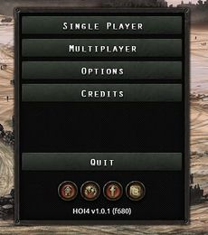
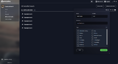

# Table of contents

- [Official video guides](#official-video-guides)
- [Guidelines](#guidelines)
- [Text editor](#text-editor)
  - [Searching multiple files](#searching-multiple-files)
  - [Indenting](#indenting)
- [Universal modding concepts](#universal-modding-concepts)
  - [User directory](#user-directory)
  - [Loading files](#loading-files)
  - [Folder structure](#folder-structure)
  - [Code structure](#code-structure)
  - [Debug mode](#debug-mode)
    - [Logs](#logs)
  - [Localisation](#localisation)
  - [GFX](#gfx)
- [Mod structure](#mod-structure)
  - [Descriptor contents](#descriptor-contents)
    - [replace_path](#replace_path)
- [Game data](#game-data)
- [Tools & utilities](#tools-utilities)
- [Common mistakes](#common-mistakes)
- [Useful knowledge](#useful-knowledge)
- [See also](#see-also)
- [Notes](#notes)


---

**Modding**, or creating mods, is the act of modifying the behavior of the base game (often referred to as *vanilla*), either for personal use, or to release publicly for other players, for instance - via the [Steam Workshop](http://steamcommunity.com/app/394360/workshop/).

As for all Paradox games, Hearts of Iron IV is moddable to a great extent. Motivations of modders may vary widely: a better translation to their native language, more events or decisions, better maps, a major overhaul, etc.

Mods are stored within the `mod/` folder within the [user directory](#user-directory). Alongside mods, the game will load any files stored in the user directory. The game's internal map editor, the Nudger, stores its output within that folder. [The path to the folder containing the mod files cannot contain any non-ASCII characters](#wrong-path), such as letters with diacritics or non-Latin script.

The game will read any [.mod file](#mod-structure) within the `mod/` folder, and a local mod can be created via the launcher: "All installed mods" -> "Upload mod" -> "Create a mod". This is limited in the path and allowed mod structure options, so manually editing the output may be necessary.

[Mods cannot coincide in name](#same-name), in which case only the first-loaded mod as decided by the filename of the user-specific descriptor will have any effect in-game.

## Official video guides

Official modding guides made by Paradox on Youtube.

- [Beginner's Modding Guide](https://www.youtube.com/playlist?list=PL6EAZcF5cWbg57Srq6BTVvguMl6YfP9pG)
- [Intermediate Modding Guide](https://www.youtube.com/playlist?list=PL6EAZcF5cWbiwdGsdZs-C3o6-uwgD4RKs)

## Guidelines

- **Never modify game files**: use a mod even for small changes, and never modify directly game files in Steam Hearts of Iron 4 folder, as your changes may be undone without warning.
- **Minimize overwrites of vanilla files** by adding separate files and loading from folders whenever possible, to improve mod compatibility and maintenance. (Your files can have any name, all files in the folder will be loaded by the game. So choose a name, no one else will ever use, like the name of your mod. Ex: coolmod\_countries)
- **Use a proper merge tool** (like [WinMerge](http://winmerge.org/)), to merge between folders, and update modified vanilla files to a new vanilla patch.
- **Backup your work** to avoid losing everything. Consider using a source control system like [Git](https://git-scm.com/) and a collaborative forge like [GitHub](https://github.com/) or [Gitlab](https://gitlab.com/) to manage team collaboration, or just make a copy of the file somewhere else. Version keeping via Github or Gitlab can also be very useful for debugging due to limiting the selection of potential broken files.
  - The [Modding Git Guide](https://docs.google.com/document/d/1bQdOVMY6FTu-2AKXZblYp6bF2-_W2JMUtXc5a0nZ8Ls) is a community made guide for using Git, GitHub/GitLab, and related tools such as KDiff3. It can be a useful stop for questions beyond this wiki, and contains step by step guides for much of what is talked about here.
- **Use UTF-8 encoding** without the byte order mark for text files. This is commonly called "UTF-8", but can sometimes be specified as "UTF-8 without BOM".
- **Use UTF-8 encoding with the byte order mark** for localisation files (.yml). This is commonly called "UTF-8-BOM", but can be just "UTF-8", in which case omitting the byte order mark is a separate option. Some text editors, such as Atom, do not support the byte order mark in entirety and should be avoided for localisation.
- **Use comments** starting with # character, to remember reasons for writing tricky stuff. A single sharp sign will make the rest of the line completely ignored. There is no multi-line comment notation in the code.
- **Debug** effectively by enabling [the debug mode](#debug-mode). Do this by adding **-debug** to your launch options in Steam. The launch options are accessed in the menu opened by right-clicking the game and choosing 'Properties..'.
   Alternatively, in Windows it's possible to create a shortcut to the hoi4.exe or dowser.exe file, and then to open the shortcut's properties and append -debug (separated by a space) after the path's end, such as "C:\Program Files (x86)\Steam\steamapps\common\Hearts of Iron IV\hoi4.exe" -debug.

## Text editor

These are the most common text editors to use for modding the game:

- [Visual Studio Code](https://code.visualstudio.com/Download).

:   Has a fan-made CWTools extension with Paradox syntax highlighting, validation and tooltips for triggers and effects. To install it, go to Extensions on the left panel of VS and search for CWTools. (Note: validation rules are incomplete and will show many false errors in gui and localization files).
    :   Recent versions with automatic highlighting of {} pairs in different colours and flagging opened/closing ones that are missing a partner red is worth it's weight in gold.

- [Notepad++](http://notepad-plus-plus.org/). Choose Perl as your language, as it will provide good highlighting and allow to fold blocks of code and comments. To set it as default, go to Settings, Style Configurator, find Perl in the list on the left and add "gui txt" (without quotes) to the "User ext." field at the bottom.

:   Some options that are commonly turned on by default in other text editors are turned off in Notepad++, but can be changed in the topbar. This includes Word wrap, Document map, Indent guide, and Folder as workspace.

- [Sublime Text](https://www.sublimetext.com/). There is an extension for it released by the developers of Imperator which could be used with HOI4 but use at your own risk: [Sublime Tools](https://forum.paradoxplaza.com/forum/index.php?threads/sublime-tools-for-imperator.1274246/). It adds colored highlighting for effects and triggers. If you want to toggle comments in Sublime, you also need to add this file to the same "User" folder.

Reasons to use a non-default text editor include the following:

- Bracket and syntax highlighting. Bracket highlighting makes it easier to detect any missing or unnecessary files by allowing to select a bracket and see where it opens or closes, as to know what's inside of that block. Syntax highlighting can make code more easily readable by highlighting more important parts, as well as excluyding brackets within comments from being considered such.
- Searching in multiple files in the same folder. In each provided tool, this is activated with the `^Ctrl` + `⇧Shift` + `F` hotkey and can have filename filters in order to limit the files that are searched (e.g. `*.txt` will only search text files, ignoring any other files, such as `*.dds` ones).
- Each line is numbered on its side. Since error log typically points to the line where an error is present, this makes finding the line in question much faster compared to how the Microsoft Notepad only tells the number of the currently-selected line in the below.
- Greater capabilities to work with multiple files. Each of these editors may only have one instance of it open at a time with multiple files open at once (switching between them with `^Ctrl` + `⇆Tab`), in contrast to Microsoft Notepad that opens a separate instance for each opened file, which can quickly fill the `Alt` + `⇆Tab` menu. Multiple instances of the text editor can still be opened, however. A text comparison tool also exists on each one of these: "ComparePlus" plugin in Notepad++, "Compare Side-By-Side" or "Diffy" package in Sublime Text, or a variety of Visual Studio Code extensions (["Partial Diff"](https://marketplace.visualstudio.com/items?itemName=ryu1kn.partial-diff) being the most popular one).
- Greater customisation capabilities: each of these text editors allows a wide variety of light or night themes that can be picked as fit, with downloadable themes existing as well. Since one would need to look at the text editor a lot while modding, selecting a theme that looks good to the eyes can make the experience much better.

### Searching multiple files

One feature of non-default text editors is a highly-customisable search of all files within the same folder. This is highly useful for dealing with errors and finding locations of certain elements.
**Windows File Explorer is a poor choice for doing this**, as it only searches inside of .txt files while it may be desirable to search files of other extensions, e.g. .yml, .gfx, .gui, or .asset, and it is very noticeably slower than either text editor: a search taking ~10 seconds on a text editor may take up to 15 minutes to conclude in the Windows File Explorer.

This is how exactly the feature is enabled in the common text editors:

- **Notepad++** – This is located in the "Search" topbar menu as "Find in Files...". By default, no folder is provided. "Follow current doc." allows the text editor to automatically input the currently-opened document's folder as the place for the search, or it can be entered manually. Alternatively, this menu can be opened from the right-click menu of a folder within the "Folder as Workspace" menu – accessed by a button in the topbar – which'll automatically set the folder location to be that folder. The `^Ctrl`+`⇧Shift`+`F` hotkey also opens the menu for this feature by default.
- **Sublime Text** – This is located in the "Find" topbar menu as "Find in Files...". In order to add a folder to search, the menu to the right of the "Where:" line can be opened, with either "Add Folder" (to select an individual folder) or "Add Open Folders" (To automatically select all folders opened via Sublime Text) buttons serving to do so. The `^Ctrl`+`⇧Shift`+`F` hotkey also opens the menu for this feature by default.
- **Visual Studio Code** – Visual Studio Code by default searches only the currently opened folder. A folder is opened either through the "Open Folder..." button in the "File" topbar menu or the "Explorer" menu, accessed through the bar on the left. After this, the functionality can be accessed in the "Edit" menu as "Find in Files". To search in other folders, open the 'search details' menu, represented with an ellipsis, and enter the full path to the folder in the 'Files to include' area. In order to speed up the search, filename filters can be used. For example, `localisation/english/*.yml` within "files to include" will only search every \*.yml file within the <currently opened folder>/localisation/english/ folder, where `*` stands for any amount (including 0) of any characters within the filename. Similar filters can be used in the previous two text editors, however without allowing folders to be filtered — only the filenames. The `^Ctrl`+`⇧Shift`+`F` hotkey also opens the menu for this feature by default.

A filter on the file extension can be set to speed up the search. This depends on the text editor. Note that `*` is used to mark any amount of any characters, and this is universal.

- In **Notepad++**, this is done with the 'filter' menu. Filters are separated with spaces, and an exclamation point in the beginning marks it as an exclude filter. For example, `*.yml !*french.yml` will result in searching every localisation file aside from the French ones.
- In **Sublime Text**, this is in the 'where' menu. Filters are separated with commas, and a minus sign in the beginning marks it as an exclude filter. For example, `C:\Program Files (x86)\Steam\steamapps\common\Hearts of Iron IV\, *.txt, -GER*` will search every text file in the base game (Assuming the default location within Windows on Steam) with the exception of those that begin with GER.
- In **Visual Studio Code**, this is in the menu triggered with the 'Toggle Search Details' button, represented with an ellipsis. This menu has separate "Files to include" and "Files to exclude" menus, used accordingly. Additionally, this allows representing folder names within the menus, with the doubled `*` (as in `**`) used to represent an arbitrary folder name. For example, `*.gfx` in the "Files to include" and `dlc/**` in "Files to exclude" will search every single file with the .gfx extension with the exception of those in the dlc folder.

There are the following uses for this:

- Finding out an internal ID by searching the localisation folder for the localised name. For example, searching for an event's title can be used to determine the ID.
- Finding out where the database entry of a certain type is defined where it is not immediately intuitive. For example, by searching for an equipment ID within the folder that stores equipment (or even /Hearts of Iron IV/common/ in general) can be used to find the exact file, which isn't immediately obvious for some equipment types.

:   A subset of this includes finding sprites' or interface elements' locations: The `gui` console command (or its main menu equivalent [in debug mode](#advantages-to-using-debug)) can be used in order to find the name of a certain SpriteType (prefixed with GFX\_) or interface element. A search query with the given name within the /Hearts of Iron IV/interface/ folder will provide the file where the sprite is defined (as such, also giving the `texturefile` that says the path of the image in gfx) or the interface folder (which allows copying it to the mod and editing it).

- Dealing with unintuitive errors where the location is not specified, such as `Invalid Decision Category`, where this can be used to locate *which* file is throwing the error.
- Finding out what can cause a certain occurance to happen, such what fires a certain event or what sets a certain cosmetic tag.
- Doing mass replacements in multiple files at the same time, usually used together with [regular expression](http://en.wikipedia.org/wiki/Regular_expression). This can be used to automate monotonous tasks, such as adding a log to every event, or most simply to change the owner in multiple states (such as by [commenting out](#code-structure) the previous owner and inserting another one by replacing `owner=` with `owner=XYZ#`).

### Indenting

Another reason to use non-default text editors is greater indenting capabilities. Indenting refers to the usage of newlines and spaces at the beginning of the line, which does not leave an impact on how the code is interpreted, but makes it easier to see the relations between different parts of the code.
Typically, either a tab character (represented as `\t`) or 4 spaces are used as a single indenting level, placed from the beginning of the line to the beginning of code on the line. In order to increase the indenting level of code, the `⇆Tab` button is used in text editors, which can be done on multiple lines at the same time by selecting them. Inversely, `⇧Shift`+`⇆Tab` is used to decrease the indenting level of the line by one.

An additional option present in these editors is 'Indent guide', drawing a line on each indent level in order to make it easier to see the borders of each indent level, which can assist in code capability. While turned on by default in Sublime Text and Visual Studio Code, this must be turned on manually in Notepad++ within the topbar.

These are the typical conventions used for indenting:

- The first line of the file has zero indenting.
- An opening bracket and its corresponding closing bracket must be placed on lines with the same indenting level.
- If a line introduces an unclosed opening bracket, then everything until the proper closing bracket must be one indent level to the right compared to the line with the opening bracket.
- A line shouldn't have more than one bracket of each kind.
- If a line includes a closing bracket without including an opening bracket, then it shouldn't have anything other than the closing bracket and indentation before it.

This is an example of proper indenting:

```text
TAG = {
    if = {
    |    limit = {      # The bar character "|" is used to visualise the indent guide, rather than being used in-code.
    |    |    has_stability > 0.5
    |    |    has_war_support > 0.5
    |    }
    |    country_event = { id = my_event.1 hours = 1 }
    }
}
```

Proper indenting has two primary benefits:

- It's easy to where an argument is contained by moving one indenting level to the left and then following the indent guide's line until it hits code.
- It's easy to find what falls within a block by following the indent guide's line from the line with the open bracket to the point where it hits the closing bracket.

Some common errors to check for in the indenting are the following:

- Unnecessarily removing an indentation level. This can usually be detected by detecting any interruptions in the indent guide–generated line from the line with the opening opening bracket drawn to the closing bracket:

```text
ideas = {
    country = {
    |   my_idea_1 = {
    |   |   modifier = {
    |   |   |   political_power_gain = 0.1
    |   |   } # closes modifier = { ... }
    |   my_idea_2 = { # Interrupts the line from my_idea_1 to the closing bracket, so is erroneous
    |   }             # Doesn't work due to being located inside my_idea_1
    }
}
```

```text
characters = {
    my_character = {
    |   name = character_name
    |
    portraits = {  # Erroneous
    |   civilian = {
    |   |   large = GFX_my_sprite
    |   }
    } # closes portraits = { ... }
    my_character_2 = { # Doesn't work due to being inside another character
    |   <...>
    }
}
```

- Putting a closing bracket on the same level as prior script:

```text
if = {
    limit = {
        my_scripted_trigger = yes
    }
    } # Closes the if statement, and so should've been one more level to the left to match the if statement's indent level.
    my_scripted_effect = yes # Always executed due to being outside of the if statement.
}
```

```text
country_event = {
    id = my_event.1
    option = {
        name = my_event.1.a
        } # Closes option = { ... }
    }     # Closes country_event = { ... }
    option = { # Does not work due to being defined outside of an event.
        <...>
```

- Not adding an indenting level after an unclosed opening bracket:

```text
my_technology_1 = {
enable_building = {
    building = industrial_complex
    level = 20
} # Closes enable_building
my_technology_2 = { # Inside of my_technology_1 = { ... }, doesn't work.
    ...
}
```

- Placing neighbouring lines with a difference of at least 2 indent levels:

```text
focus = {
    <...>
    completion_reward = {
        TAG = {
            country_event = my_event.1
    } # Closes TAG = { ... }
}     # Closes completion_reward = { ... }
focus = { # Does not work due to being contained within another focus = { ... }
    <...>
}
```

Following the indenting rules and checking for these indenting errors will ensure that there will be no bracket-related errors within the code.

## Universal modding concepts

*It's heavily recommended to turn off Windows file explorer from hiding file extensions from the filename*, if using Windows. File extensions are considered a part of the filename, and hiding them can cause files to not work due to wrong filenames (Such as accidentally saving localisation files as .txt files, saving an image in the wrong format and not realising it, et cetera).

### User directory

The user directory is used for storing the information related to Hearts of Iron IV that's not built into the game, but instead created by the user. The location is decided by `gameDataPath` in the base game's /Hearts of Iron IV/launcher-settings.json. By default, the user directory for Hearts of Iron IV is located in the following folders:

- **Windows**: `C:\Users\<Username>\Documents\Paradox Interactive\Hearts of Iron IV\` or `C:\Users\<Username>\OneDrive\<Documents (in the system language)>\Paradox Interactive\Hearts of Iron IV\`
- **Mac OS**: `~/Documents/Paradox Interactive/Hearts of Iron IV/`
- **Linux**: `~/.local/share/Paradox Interactive/Hearts of Iron IV/`

In particular, these contents are notable contents of the user directory:

- The user-specific mod descriptors are located inside of the /Hearts of Iron IV/mod/ folder. This is used for assigning the mod information, such as the path to the folder that contains the mod. The same folder contains the default location of local mods after being created in the launcher, though any folder can be used for it.
- The nudger's outputs are stored in this folder. In particular, /Hearts of Iron IV/map/, /Hearts of Iron IV/history/states/, and /Hearts of Iron IV/localisation/ may be created by the user as outputs of the nudger. **From here, they will be loaded into the game when it is opened, having priority over the base game's files.**
- The game's logs are created in /Hearts of Iron IV/logs/. From there, they can be used for [troubleshooting](<Troubleshooting - Hearts of Iron 4 Wiki.md>) or useful information. See also [§ Logs](#logs).
- The savefiles are stored in /Hearts of Iron IV/save games/.
- The game's screenshots are stored in /Hearts of Iron IV/screenshots/. This includes both the regular `F11` screenshots and the map generated with `F10`, which is a pixel-perfect representation of the entire world map taking the province borders from /Hearts of Iron IV/map/provinces.bmp.
- /Hearts of Iron IV/settings.txt is modified by the game's settings menu and includes some that aren't possible to change there. In particular, `save_as_binary=no` isn't possible to change anywhere else, and so is changing the default text editor used by the game.

**If there are non-ASCII characters in the path to the user directory, it may not work as intended**. In particular, the game will be unable to open error.log (but will change it regardless) or mods stored there. To circumvent this, either just mods may be moved to a different folder by modifying the `path` in the [user-specific descriptor](#mod-structure) or it's possible to move the entire user directory by editing /Hearts of Iron IV/launcher-settings.json and moving the files accordingly.

### Loading files

After creating a mod folder within the launcher, every single file within will get loaded at the same location as in base game. Taking a mod with the name of "yourmod" as an example, every single file within mod/yourmod/common/national\_focus will get loaded alongside files in base game's /Hearts of Iron IV/common/national\_focus assuming the default path. However, inserting one more folder as in mod/yourmod/test/common/national\_focus will result in the files in that folder not being loaded as national focus files, appearing to get ignored.
The root folder of the mod, considered the same as the /Hearts of Iron IV/ folder in the base game, will be defined in the user directory's /Hearts of Iron IV/mod/yourmod.mod file, opened with a text editor. This is set via `path = ""` in that file, by default being user directory's /Hearts of Iron IV/mod/yourmod.

The base game is loaded first, while mods are loaded later. The order of loading files is primarily used to determine two things:

- In case of files with the same name in the same location, the load order decides which one gets used. For example, if a mod and the base game edit ../events/Generic.txt, the game will read the mod's version. This applies only to individual files and not entire folders. It is never possible for several files with the same name in the same location to each get loaded: it will only pick the later-loaded one and disregard the older ones.
- In case of replace\_path being used inside of a mod descriptor, the load order decides which files will be unloaded inside of the specified folder.

Aside from replace\_path, there is no way to completely unload a file, though it can be overwritten if there is one with the same filename. For example, if the only file in a mod is ../common/national\_focus/generic.txt, then it will only overwrite the base game's generic national focus tree, but other national focus trees will remain the same as they are in the base game. If another mod that only edits a different focus tree (e.g. a new `malta.txt`), then the game will read the edit to the generic national focus tree, read `malta.txt`, and have the rest as in the base game.

The load order in the game is as such:

- Base game. Due to being earliest in the load order, this has the lowest priority in case of overlap.
- DLCs, in the order of their internal ID (follows release date). For example, if the base game, DLC018, and DLC20 each contain ../interface/frontendmainviewbg.gfx, the game will only read the version in DLC020 and ignore the rest. Due to checksum constraints, DLC folders usually only contain graphics and audio related to the DLC, while the code is always kept in the base game itself, locked behind a [has\_dlc check](<Triggers - Hearts of Iron 4 Wiki.md#has-dlc>).
- User directory. While it's usually limited to the nudger's outputs, any other folder also works here.
- Mods, ordered by using [filenames of user-specific descriptors](#mod-structure). For example, if mods with descriptors of mod/abc\_mod.mod and mod/xyz\_mod.mod both overwrite ../events/my\_events.txt, only the version in the mod with the descriptor of mod/xyz\_mod.mod will be read.

This can be overwritten using `dependencies = { ... }` in the [descriptor contents](#descriptor-contents). **replace\_path does not change the order**, but it is used to completely unload everything previously-loaded from a certain folder.

Due to DLCs being their own source of loaded files, the modname/dlc/ folder and its subfolders will have no effect. Instead, the file has to follow the actual load location: e.g. to edit ../dlc/dlc023\_man\_the\_guns/music/mtg\_music.txt, the mod will have to contain modname/music/mtg\_music.txt.

During the process of loading, the files remain as pure text and do not immediately get interpreted. Exceptions for this are files that are necessary for the loading screen to work and localisation. Afterwards, there's the process of interpretation/evaluation, which reads the text files and creates content (such as national focuses, countries, or states) accordingly. **Filenames don't matter in how the file is interpreted** with few exceptions. For vast majority of files, they're either read only by the virtue of being within a specific folder (Such as national focuses), or by a direct link within a different file (Such as `oob = "TAG_1936"` within a [country history file](<Country creation - Hearts of Iron 4 Wiki.md>) loading the /Hearts of Iron IV/history/units/TAG\_1936.txt file for unit locations). This allows avoiding overwriting base game files in many cases, which eases making the mod's contents be compatible to the next major update.

For the vast majority of folders, such as /Hearts of Iron IV/interface/\*.gfx files, the [ASCII character IDs](http://en.wikipedia.org/wiki/ASCII#Printable_characters) are used to sort them by filename for the interpretation. This is different from the alphabetic sorting used by the file explorer as uppercase letters are considered to come before lowercase letters and there are multiple characters inbetween (such as underscores) that lie inbetween. In order to place a file particularly high in the evaluation order, a prefix using late character IDs such as `zz_` can be used and a reverse for the other way around, with the base game commonly using `00_` for this.

**The order of loading doesn't matter during evaluation**: if there is overlap in entries between different files, the game typically uses the order of evaluation in order to determine which one should get priority. For example, if the base game contains a state with the ID of 123 in `123-ABC.txt` and the mod contains its information for state 123 in the file of `123-XYZ.txt`, the game will prioritise the state created first, which is the base game's definition. On the converse, between `321-WWW.txt` in the base game and `321-DEF.txt` in the mod files, the mod's `321-DEF.txt` will be chosen. How exactly duplicates are handled depends on the exact file: some don't handle them well and should be avoided (e.g. national focus duplicates break prerequisite line generation), some prefer the first-created entry, some prefer the last-created entry.

Changing the interpretation order has very limited use, but it is present. Some notable cases of this include:

- /Hearts of Iron IV/interface/\*.gfx files that create sprites assigning information to images, such as attaching a singular name. If there are multiple definitions of the same sprite, only the later-evaluated sprite is used, with the earlier one being ignored. The base game notably uses this for DLCs: if a character only has a portrait within a DLC, then they will be set to use a sprite as the portrait. Within the base game, the sprite is set to lead to a generic portrait, as otherwise the character may appear broken, which is plausible in multiplayer. However, within the DLC files, the sprite that's used for the portrait is defined once again in a separate file later in the evaluation order to ensure that the DLC-added portrait will be used for the DLC owners.
- /Hearts of Iron IV/common/country\_tags/\*.txt files: the order in which country tags are defined matters. While the base game places the evaluation order mostly in the order inside of the files here, it is still relevant. This decides on such things as the order in which /Hearts of Iron IV/history/countries/ files are evaluated, which may result in subjects having broken popularities otherwise, the order in which events/decisions/focuses/etc are evaluated (whether it's the triggers for firing it or the AI selecting it), or the order when a scope selects several countries: both evaluated and in the tooltip.



The main menu showing a checksum of f680 on version 1.0.1

The **checksum**, the 4-character alphanumeric code that can be seen next to the version in the main menu, such as a2b4, decides multiplayer and achievement compatibility: servers can be joined only if the checksum is identical to the host's, while achievements are only enabled if the checksum is identical to the base game's, which can be seen in the launcher. The list of what changes it can be seen in the base game's /Hearts of Iron IV/checksum\_manifest.txt file, which includes entire common/, events/, and history/ folders, as well as most of the map/ folder, other than map/terrain/. Any change to the files in that folder will change the checksum, while any mod that doesn't change them will not.

### Folder structure

These folders are common to edit within mods:

- /Hearts of Iron IV/common/: This is the primary folder in which nearly every database entry is defined: countries, technologies, focuses, et cetera.
- /Hearts of Iron IV/events/: The folder which defines events.
- /Hearts of Iron IV/history/: This folder primary decides on starting historical information: which states are owned by which countries, the starting political and diplomatic situations, the army positions, starting buildings, and so on. Typically, if something happens before any country gets selected, it's decided here. However, starting railways and supply nodes are instead defined in the /Hearts of Iron IV/map/ folder.
- /Hearts of Iron IV/map/: This folder is used to edit the appearance of the map, such as provinces, the shown terrain, the heightmap, and so on. This also includes the strategic regions and starting supply nodes and railways. However, the boundaries of states are instead defined in the /Hearts of Iron IV/history/states/ folder.
- /Hearts of Iron IV/localisation/: This folder is used to define how the text is shown, depending on the currently turned-on language.
- /Hearts of Iron IV/gfx/: This folder is used to store images. However, most of the time, [these images aren't automatically loaded but must be linked to in sprites](#gfx). Commonly-edited exceptions include /Hearts of Iron IV/gfx/loadingscreens where every single file is always loaded, /Hearts of Iron IV/gfx/flags and subfolders where the country tries to load the flag upon ideology or cosmetic tag change, and /Hearts of Iron IV/gfx/interface/equipmentdesigner/graphic\_db/\*.txt files that assign sprites to the pools of images shown in the equipment designer. Everything else requires a sprite.
- /Hearts of Iron IV/interface/ (not to be confused with /Hearts of Iron IV/gfx/interface/): This folder is mostly filled with `*.gfx` and `*.gui` files, both of which can be opened in a text editor. The former define the graphical entries that are shown in-game: sprites that assign a name and properties (such as animation, the amount of frames, or loading type) to an image file, fonts, text colours, map arrows, et cetera. The latter define the graphical user interface itself: how the buttons and icons are laid out, which GFX is used where, where to write text, et cetera. This only decides on the appearance of the GUI, the attributes such as effects have to be defined elsewhere.
- /Hearts of Iron IV/music/: This folder is used to define songs that play within the radio stations, and the possibilities in the weighted shuffle.
- /Hearts of Iron IV/sound/: This folder is used to define sounds that play elsewhere, usually tied to an element of the GUI. This also includes such entries as the division voicelines.
- /Hearts of Iron IV/portraits/: This folder is used to assign sprites as portraits for randomly-generated generic characters.

### Code structure

The script language in which the code is built always has a common structure: `<attribute> = <argument>` (sometimes using inequality signs in case of triggers), such as `add_political_power = 100`, with few exceptions where the argument can be dropped. Each attribute and argument is a single word (A word character includes the `[a-zA-Z0-9_.,\-/]` group), with whitespace characters serving as delimiters. There are two types of arguments that may include more than a single word, however:

- Strings are marked with quotation marks (only `"`) on both sides. A space will not interrupt the string, but a direct newline will. If there aren't any whitespace characters inside, omitting the quotation marks will not change the result (such as `date > "1936.1.1"` and `date > 1936.1.1`). There are two special characters allowed to use in strings: `\"` is used to write a quotation mark and `\\` is used to write a backslash, a backslash may not be used in any other way. It's impossible to include a newline directly inside of a string. Occassionally the attribute itself may be enclosed in quotation marks, such as `"TAG" = { has_political_power > 100 }`. A string can include at most 255 characters, not including the null terminator.

Where text is intended to be displayed to the player, such as tooltips, attributes generally accept a [localisation key](#localisation) as the argument. This allows the shown text to change depending on the enabled language and contains more capabilities, such as not being bound to 255 characters or capabilities for text customisation (e.g. coloured text, newlines, or dynamic changes). If the game detects no defined localisation key in the enabled language's database, it will default to directly displaying the argument.

- In certain types of attributes, figure brackets are used to attach an entire block of code as the argument, which usually consists of other code in the same `<attribute> = <argument>` format. As an example, `random_country = { add_stability = 0.1 }` (as an [effect](<Effect - Hearts of Iron 4 Wiki.md>)) is an attribute of `random_country` with the argument of `{ add_stability = 0.1 }`; that argument itself consists of an attribute of `add_stability` with an argument of `0.1`. In particular, this will scope into a random existing country and add 10% Stability.

If the attribute doesn't support grouping together attributes, then using the opening bracket will be interpreted as the argument itself. For example, the game would interpret `transfer_state = { 123 321 }` as trying to transfer the state with the ID of `{`. Afterwards, the game encounters `123` which'd get interpreted as [scoping into a state](<Scopes - Hearts of Iron 4 Wiki.md#state-id>), which'd get interrupted prematurely by the closing bracket. As a result, there's one more closing bracket which doesn't have a proper opening bracket, which will likely lead to a scoping error, breaking the rest of the file.

**Omitting the argument/equality sign is almost always erroneous**. For example, it is always mandatory where effects or [triggers](<Triggers - Hearts of Iron 4 Wiki.md>) are expected, making this incorrect: `GER = { leave_faction }`. Instead, where there is no expected argument, `yes` is commonly used as `GER = { leave_faction = yes }`. There are few exceptions where an argument should be omitted, such as inside of [the expanded form of add\_ideas](<Effect - Hearts of Iron 4 Wiki.md#add-ideas>).

Comments are marked with the `#` character: everything after that character until the newline will be entirely ignored by the game. For example:

```text
completion_reward = {
    add_political_power = 100 #TODO: Check if balanced
}
```

There exists no multi-lined comment block.

Aside from comments and strings, newlines are treated entirely identically to spaces as delimiter characters. As a result, indenting does not matter: most files can be done on one line in total without any change in how they get interpreted. However, doing indenting properly can make detecting bracket problems much easier without using a text editor's bracket highlighting and overall makes it easier to see at a glance what each block includes within of itself and what it doesn't.
This also means that an attribute's argument should never be left empty, as it'll interpret the next attribute as the argument instead. For example:

```text
focus = {
    id = TAG_focusname
    icon =
    x = 2 # Will not work in-game.
}
```

In this case, the focus' icon attribute is set with `icon = x`, and next the game has no idea how to interpret `= 2`. In practice, this'll lead to the focus not being at the expected position.

There are these types of argument blocks are particularly common:

- Effects are used in circumstances such as focus completion rewards, event options, decision effects, [on actions](<On actions - Hearts of Iron 4 Wiki.md>), country history files, and so on. They are used in order to enact a one-time change to the game's state.
- [Triggers](<Triggers - Hearts of Iron 4 Wiki.md>) are used in circumstances such as focus and decision availability checks, event triggers, or [if statements](<Effect - Hearts of Iron 4 Wiki.md#if-statements>). They return a strictly boolean value of either true or false, without actually changing anything in the game's state.
- [Scopes](<Scopes - Hearts of Iron 4 Wiki.md>) are a particular subset of triggers and effects that can be used to change for which country/state/character/division the effects are executed or triggers are checked for.
- [Modifiers](<Modifiers - Hearts of Iron 4 Wiki.md>) are used to apply a constant numeric change, such as the daily political power gain. Commonly, [ideas such as spirits](<Idea modding - Hearts of Iron 4 Wiki.md>) are used to apply it to countries.

The order in which attributes are placed may matter or not depending on the context. In particular, these are the general rules:

- The order of effects and triggers matters the most: they are executed in the order that they are placed and this decides the placing of them in the tooltip shown to the player. For example, if an effect block first contains `annex_country` and then [an if statement](<Effect - Hearts of Iron 4 Wiki.md#if>) checking for the annexed country owning a state, the if statement will always be false since the country is already annexed. In triggers, the order of execution matters for temporary variables.
- The order of modifiers doesn't matter at all and their order in the tooltip is hard-coded.
- The order of different attributes of the same entry doesn't change the interpretation. For example, if a national focus' reward is defined before its position instead of the opposite as normally done, it won't be treated any differently.
- For the same type of database entries, the position in the file is used for the order in which they are created. Examples where this order is especially visible to the player are decisions (unless overridden with `priority`), buildings, or ideologies.
  - This order of creation may matter in other references. For example, in equipment, an equipment type must be assigned an existing archetype. If the archetype doesn't exist when the equipment type is created, the game will crash to desktop, even if there is a definition later in the file.
  - Where applicable, [the filename is primarily used for evaluation](#loading-files), with the order inside of the files being secondary. As [the ASCII order](http://en.wikipedia.org/wiki/ASCII#Printable_characters) is used for this, the filename beginning with `00_` is usually used to ensure that it's to be evaluated near the beginning, while beginning with `zz_` is used in the opposite manner.
- For the same type of attribute in a database entry, the interpretation varies. If multiple are supported, the position in code decides the order (e.g. every `prerequisite = { ... }` in a national focus must be met for it to be possible to complete, or every `immediate = { ... }` in an event will be executed when the event is fired). Otherwise, it may pick the earliest or the latest definition of the attribute, disregarding the other ones (For example, in scripted localisation, the first valid `text = { ... }` where the trigger is met will be used).

It is common for the same attribute to intentionally be duplicated with different arguments. The handling of duplicated attributes varies and isn't intended everywhere. For example, each instance of `focus = { ... }` inside of a national focus tree is treated as a separate national focus. Usually if an effect block is duplicated (such as an event's `immediate = { ... }`), each one gets executed in order that they are placed.
Occassionally, the name of the attribute is arbitrary. For example, in ideas, each idea (placed inside of an idea category) the attribute's name will be treated as the name of the idea.

### Debug mode

The debug mode is activated using the `-debug` launch option. In particular, there are two ways to apply it:

- The Steam properties of the game include launch options. Right-clicking on the game's entry in the list of owned games provides a menu. In the bottom of the menu is "Properties...", which'll show a separate window. In the bottom of the "General" section (opened by default) are launch options. Each launch option is entered separated with spaces, such as `-checksum -debug`
- In Windows it's possible to apply a launch option through a shortcut to the hoi4.exe or dowser.exe file in the game's directory. After creating the shortcut, right-clicking it, and going to properties, the shortcut's properties menu will open. In the "Shortcut" section of properties (opened by default), the "Target" section contains the path to the file. Launch options are inserted after the closing quote located after the filename. There must be at least one space between the quotation mark and the beginning of the launch option, and further launch options are also separated by spaces. An example "target" section is "C:\Program Files (x86)\Steam\steamapps\common\Hearts of Iron IV\hoi4.exe" -debug -start\_tag=ALB.

The debug mode is very useful for modding, resulting in these benefits:

- **Automatic loading** - Edits to files done inside the mod folder will show up in-game without the need to use the 'reload' console command. This will also automatically add the errors in the files to the error log. **This only applies to files that existed when the game was launched**, with an exception: if a file's direct path gets mentioned elsewhere within the mod, then it can still get loaded for that use in particular. Examples of that include [orders of battle](<Division modding - Hearts of Iron 4 Wiki.md>), as [load\_oob = "TAG\_my\_oob"](<Effect - Hearts of Iron 4 Wiki.md#load-oob>) functions as a direct link to /Hearts of Iron IV/history/units/TAG\_my\_oob.txt; or GFX, as [sprites](<Graphical asset modding - Hearts of Iron 4 Wiki.md#sprite-types>) directly reference the position of the image. Although, notably, the loading of images in-game does not uncompress them properly, leading to visible distortion or black backgrounds which get fixed on a restart. Although edits to most files work, this doesn't work with /Hearts of Iron IV/history/countries/, /Hearts of Iron IV/history/states/, and /Hearts of Iron IV/map/, although the nudge partially can be used for the latter two.
- **No map definition crash** - If the map is edited, there's a possibility for errors to appear. Any map-related errors will crash the game when loading with a message saying 'Some errors are present in the map defition[*sic*] and have been logged to error.log'. If debug mode is on, the game will continue to load properly. The map definition occurs when there is any error containing MAP\_ERROR within the error log *after loading into a country*, as certain map errors do not get logged yet when the debug launch option opens the log during the main menu loading.
- **Extended error log** - Certain errors do not get logged in the log unless the debug mode is turned on. An example would be the map definition errors mentioned above, as the game crashes before getting a chance to log them. Enabling debug mode will ensure that all errors that can be logged in the error log will get logged.
- **Ease of error log opening** - As long as there are any errors in the log, the log will automatically open when loading the game or after selecting a country. The log will also be able to get accessed by clicking on the error dog in the bottom-right corner after loading into a country, which appears each time a new error appears in the log (since files get automatically loaded-in). If the full path to the user directory, after expanding the `gameDataPath` in /Hearts of Iron IV/launcher-settings.json, contains any non-ASCII characters, such as non-Latin script or diacritics, then it will fail to open with "The system cannot find the path specified", which can be fixed by changing the folder used for the game data, moving the files if needed.
- **Ease of nudge access** - With debug mode turned on, an option to open the nudge will appear in the main menu. This can be useful to save time or to be able to open the nudge if the game crashes when you're trying to load into a country (This can happen if the /Hearts of Iron IV/tutorial/tutorial.txt file references invalid states, if that file doesn't contain at least one `tutorial = {}` even if not containing anything, if [supply nodes and railways aren't set up properly](<Map modding - Hearts of Iron 4 Wiki.md#supply-nodes-and-railways>), or for other reasons).
- **Graphical interface information in the main menu** - As long as the debug mode is turned on, hitting the ` button (Typically in the top left corner of QWERTY keyboards, used to open the console by default) in the main menu will provide information about the graphical interface used, giving the names of elements, their positions, and the sprites used by them. This is equivalent to using the "gui" console command, but the debug mode makes it possible to do in the main menu.
- **Expanded information** - With debug mode turned on, there will be additional information when hovering over the province, including its and the state it's in's IDs, tags of owner and controller, et cetera. This debug information is also given for entire countries when hovering over their flag in the country politics/diplomacy view, such as the tag, the original tag (for dynamic countries), and the cosmetic tag.
- **Access to more console commands** - Certain console commands are locked for developers only and debug mode allows the player to use them. However, note that not all console commands will become available.
- **Ease of access to GUI files** - When hovering over a GUI element, *Ctrl+Alt+Right Click* can be used to open a debug menu, which will allow going to the GUI file where the element is defined.
- **Automatic saving on peace deals** - The game automatically creates a savefile each time a peace conference occurs with debug.

If the 'debug' console command is used, **only the last 4 advantages** will be available to use. If debug is turned on via launch options, be that `-debug` or `-crash_data_log` (doesn't enable automatic loading), all benefits will be granted. However, multiplayer will be disabled and the game's performance will drop compared to not enabling it.

#### Logs

The logs are located in the [user directory](#user-directory)'s /Hearts of Iron IV/logs/ folder and may be used for [troubleshooting](<Troubleshooting - Hearts of Iron 4 Wiki.md>) the game. In particular, these are especially useful when dealing with unexpected behaviour:

- `text.log` is used for duplicate definitions of [localisation](<Localisation - Hearts of Iron 4 Wiki.md>) values.
- `game.log` is information that's logged in the middle of the game. In particular, "log" (either as an [effect](<Effect - Hearts of Iron 4 Wiki.md#log>) or a [trigger](<Triggers - Hearts of Iron 4 Wiki.md#log>)) outputs its logs into this file.
- `error.log` logs what the game developers have foreseen as potential errors that may occur when modding the game. As such, it usually omits crash-causing errors, detailing potential unexpected behaviour instead. However, it can be useful for [troubleshooting](<Troubleshooting - Hearts of Iron 4 Wiki.md>) crashes either way, since that unexpected behaviour may sometimes lead to crashes (e.g. an "[invalid event target](<Scopes - Hearts of Iron 4 Wiki.md#invalid-event-target>)" error may lead to an uncontrolled state being transferred, causing a crash). **Every error marked with MAP\_ERROR requires the debug mode to appear**, otherwise the game will fail to open. Some of the MAP\_ERROR errors only appear after selecting a country and starting a playthrough.
- `system.log` details the system-generated information, usually to do with graphics. With the `-checksum` launch option, it also generates an output for the checksum, which may be compared with a different user's checksum to find out where exactly the difference is.

### Localisation

*Main article: [Localisation](<Localisation - Hearts of Iron 4 Wiki.md>)*

Names depending on language are defined within [localisation](<Localisation - Hearts of Iron 4 Wiki.md>). Taking only the English language into consideration, the /Hearts of Iron IV/localisation/english folder is used. A file within must end with `_l_english.yml` in the filename to work properly, including the extension that is hidden by default within the Windows File Explorer. The file must be encoded in the UTF-8 encoding with the byte-order mark included, usually called UTF-8-BOM. The exact details on conversion depend on the text editor. The first line in the file is `l_english:` to assign it to that database.

A localisation entry is structured as  `localisation_key:0 "Value of the key"`. In here, the first part before the colon is referred to as the localisation key, the ending part in quotes is referred to as the localisation key's value, and the number in-between is the version number. The version number is purely a comment and isn't read by the game, and it can be omitted entirely. **Any localisation file can be used for any localisation**, and it's better to use new files rather than copying over base game files.
While it is theoretically possible to avoid using localisation in many cases, localisation has advantages over using strings directly:

- Text customisation support. This necessarily includes newlines and coloured text, which never work inside of strings. In some cases, dynamic localisation as marked with square brackets as e.g. `[TAG.GetName]` will work with localisation, but not in strings.
- Multiple language support. Even if the mod is only intended to only be within English or a different language, it is better to allow the option to be open for potential sub-mods. While it is still possible to make translation sub-mods to mods that don't use localisation, it becomes much harder to keep it up-to-date (As more than just localisation files need to be changed in this case) and changes the checksum (Making it impossible to have a multiplayer session between those that have the translation sub-mod and those that don't).
- Strings have a character limit of at most 255 visible characters, making it impractical to use them on large chunks of text such as descriptions.
- Non-ASCII characters, such as umlauts and other diacritics are unsupported by strings in multiple files, such as country leader traits or adjacency rules. Non-ASCII support is usually marked by the file having the byte order mark (usually noted as a separate encoding with UTF-8-BOM), which causes the game to fail to load the file if not directly supported.

### GFX

*Main article: [Graphical asset modding](<Graphical asset modding - Hearts of Iron 4 Wiki.md>)*

Most of the time, images are stored in the [DDS format](http://en.wikipedia.org/wiki/.dds), typically ARGB8 (or A8R8G8B8. depending on the image editor) without mipmaps. The exact format doesn't strictly matter, however: most image files can be saved in either DDS, TGA, PNG, or BMP; as long as information in the sprite is correct. Main exceptions to this include the [flags representing countries](<Country creation - Hearts of Iron 4 Wiki.md#flags>) that must be 32-bit TGA files without RLE encoding and bottom-left origin point, and files in the map folder.

A sprite is used to add extra information to an image file (such as a sprite's name, loading type, the amount of frames, or animation), and are required for an image to be shown in the graphical user interface. Sprites are defined in the /Hearts of Iron IV/interface/\*.gfx files opened with a text editor. Note that the folder is not related to /Hearts of Iron IV/gfx/interface/.

Sprites are defined within the `spriteTypes = { ... }` block and have different definitions, such as a simple `spriteType`, a `corneredTileSpriteType` that can be used with an arbitrary size, stretching to fit taking corners into consideration, a `frameAnimatedSpriteType` that allows creating an animation sequence rather than being limited to scripted ones that can be done in `spriteType`s, and so on. A simplest possible sprite file consists of the following:

```text
spriteTypes = {
    spriteType = {
        name = GFX_my_sprite_name
        texturefile = gfx/interface/folder/filename.dds # Must use / for folder separation
    }
    spriteType = {
        name = GFX_my_second_sprite
        texturefile = gfx/anotherfolder/filename.dds
    }
}
```

This assigns the /Hearts of Iron IV/gfx/interface/folder/filename.dds file to have the `GFX_my_sprite_name` sprite in-game. This sprite can then be used in the graphical user interface, such as a decision or a focus icon ([Note that focus icons must also have a separate sprite for the shine animation](<National focus modding - Hearts of Iron 4 Wiki.md#icon>)).
The only images that do not have any definition within interface files are:

- Flags used for countries in /Hearts of Iron IV/gfx/flags/ and its subfolders.
- Loading screens within /Hearts of Iron IV/gfx/loadingscreens/. Note that, however, the main menu background usually stored in that folder *is* defined as a sprite.
- Character portraits. They *may* use a sprite as a definition, but they're the only place in the game which doesn't have it as a mandatory requirement, accepting direct links to the file as an alternative.

There are also potential errors that may occur related to sprites:

- A sprite is entirely transparent: This is an indication that the sprite exists, but the image within can't be loaded. This occurs if the `texturefile` is defined to a file that doesn't exist (The folder path or the filename may not correspond with the file itself) or if the image itself is corrupted. This is usually accompanied with a `Texture Handler encountered missing texture file` error.
- A sprite is replaced with the default image: This is an indication that there is something wrong with the sprite itself rather than the image: the game links to a non-existing sprite somewhere. This is typically a typo within the sprite's name or a failure to follow a name format (Such as omitting \_shine from the end of a [national focus icon's shine sprite](<National focus modding - Hearts of Iron 4 Wiki.md#icon>)). Ensure that the sprite exists and has the right name.
- The character uses a randomly-generated portrait: This is an indication of either of the previous two problems: a character with an invalid sprite or a missing file will have their portrait randomised.

## Mod structure

*The .mod file extension doesn't show up in the Windows File Explorer by default, which can make finding the files mentioned here more difficult. [Ensure that file extensions are set to show up.](https://support.microsoft.com/en-gb/windows/common-file-name-extensions-in-windows-da4a4430-8e76-89c5-59f7-1cdbbc75cb01)*

*Unless stated otherwise, this section assumes that the files are in the [user directory](#user-directory).*

There are two descriptor files with the .mod extension associated with each mod:

- The user-specific descriptor file, that assigns the information used for loading the mod. In particular, the path to the folder storing the mod must be defined only here, since it can differ depending on the user. They are stored within the user directory's /Hearts of Iron IV/mod/ folder, where the filename decides the order in which they will be loaded (unless overwritten by dependencies). The filename can't contain spaces. For example, /Hearts of Iron IV/mod/ugc\_1234567890.mod or /Hearts of Iron IV/mod/modname.mod are user-specific descriptors.
- The mod-specific descriptor file, that assigns the information that the mod has that should be shared regardless of the user. This file must be called `descriptor.mod` and is located within the primary folder of the path, i.e. the folder specified in the path within the file above. For example, /Hearts of Iron IV/mod/my mod/descriptor.mod or ../steam/steamapps/workshop/content/394360/1234567890/descriptor.mod are mod-specific descriptors.

The two descriptors are intended to have mostly identical information, aside from the fact that only the user-specific file should have a `path` entry within its definition, since this isn't shared across different users and can vary significantly. The launcher enforces this for arguments that can be defined in the launcher, however other arguments such as `replace_path` will not get automatically ported over.



The launcher's "Create a mod" menu, accessed via "Upload mod" in the top right of the "All installed mods"

The launcher can be used to create a pair of descriptors: the menu accessed via "All installed mods" -> "Upload mod" -> "Create a mod" is used for this purpose. This doesn't allow freedom in the location of the folder used as the mod folder and doesn't provide all arguments possible to include within a mod descriptor, so manually editing the descriptors in the output may be necessary to add other mod attributes or change the folder location.

In addition, these files within the user directory are also used when loading mods:

- /Hearts of Iron IV/dlc\_load.json provides a list of enabled mods (in the form of a list of shortened paths to the .mod files, as in `"mod/modname.mod"`) and disabled DLCs while opening the game. While this gets automatically changed by the launcher before the game's launch, this allows toggling off and on different mods without using the launcher. If there are multiple `enabled_mods` definitions, the game will use the first-defined definition, allowing a set of playlists without using the launcher.
- /Hearts of Iron IV/launcher-v2.sqlite or /Hearts of Iron IV/launcher-v2\_openbeta.sqlite is a [SQLite](http://en.wikipedia.org/wiki/SQLite) database that is used to generate the mod information and playsets within the launcher. Occassionally, the launcher may fail to update existing mods (e.g. an "invalid path" error may remain eternally even after the path is fixed or a new user-specific mod descriptor may fail to get detected), and a deletion of this file allows to re-generate the playsets. After the file is deleted, the game will pick up every user-specific mod descriptor and recreate the list of mods using each one. Mods hosted on Steam workshop and Paradox mods will be automatically added to the default playset; local mods will remain in the "All installed mods" list but not be assigned to any playset by default.

### Descriptor contents

Most .mod files contain content similar to this, which is possible to set within the launcher:

```text
name = "Average mod"
path = "mod/modname"
picture = "thumbnail.png"
version = "v1"
supported_version = "1.13.*"
tags={
    "Gameplay"
    "Historical"
}
remote_file_id="1678247250"
```

These are the following arguments:

- `name` is the name of the mod, as it appears in the launcher. This also gets used within the `dependencies` attribute of mods. The name must be unique in comparison to other installed mods.
- `path` is used to defined the location of the mod folder. For local mods, entering `path = "mod/modname/` as a shortened location will automatically prepend the user directory's location after opening the launcher. Any folder can be used to store a mod, however **only [ASCII](http://en.wikipedia.org/wiki/ASCII) characters can be used within the path**. If the path contains non-ASCII characters, such as diacritics or non-Latin scripts, the mod will fail to be loaded. The folder separator is strictly a forward slash "/". This should only be present in the user-specific file.
- `picture` is the filename of the picture that's assigned to the mod. This will appear in the launcher for mods of the Steam and Paradox nature, and also as the thumbnail in Steam Workshop and Paradox Mods. The image must be contained within the root directory of the mod (defined via `path`) and must be less than 1MB in size. This must be defined after the name of the mod. **Local mods will not have a picture in the launcher** even with this defined.
- `version` is a string that's shown near the mod's name in the launcher as the mod's version. Any string is accepted and grants no change.
- `supported_version` is used to determine for which version of the game the mod is meant for, granting the 'out of date' marker in the launcher otherwise. The last number of the version can be replaced with an asterisk, which will signify that the mod will work on any minor update within that major update.
- `tags` is a list of tags that get used within the Steam Workshop and Paradox Mods.
- `remote_file_id` is used to attach a Steam Workshop or a Paradox Mods item to the mod, as to enable updating it within the launcher.

These arguments aren't possible to set within the launcher and can only be added directly:

```text
 user_dir = "NewSaveFolder"
 dependencies = { "Major Mod" "Major Mod 2" }
 replace_path = "history/states"
 replace_path = "map/strategicregions"
```

- `user_dir` changes the folder where the game stores saves. This prevents loading a save made in base game and mods with a different `user_dir` entry and, vise-versa, prevents saves made in this mod to be loaded in the base game or mods with a different `user_dir` entry.
- `dependencies` changes the [order in which mods will be loaded](#loading-files), in particular forcing this mod to be loaded after every mod listed in this attribute. This doesn't make this mod require the listed mods to work. Changing the load order will ensure that any [replace\_path](#replace-path) within the dependency mod will leave this mod's files untouched and that this mod's files will overwrite the dependency mod's files in case of overlapping filenames. **Necessary for sub-mods to work correctly**.

#### replace\_path

`replace_path` is used in order to unload every previously-loaded file during the main menu loading within the specified folder. This only applies to files directly within that folder, any sub-folders will left untouched.
**This does not force the mod to replace the folder's contents**: anything higher in the load order than the mod will be loaded in the exact same way, anything lower than the mod will first get loaded before getting unloaded (e.g. the error where a file will get loaded twice if there's one with a filename differing only by capitalisation will still be present even if one of the files is intended to be replaced with replace\_path), anything loaded after the main menu will still get loaded from "replaced" folders. **This doesn't change the load order**: if a file fails to overwrite another mod's file, it will still not do so with this attribute used; instead, `dependencies` is used in the mod's attributes to change the load order. In case the mod fails to overwrite base game's files, this will never solve the problem: ensure that the folder you're writing to is indeed the mod's folder rather than, for example, the user directory or a backup of the mod; in case of flags, the game may occassionally fail to make the mod's /Hearts of Iron IV/gfx/flags folder overwrite the base game which can be solved by creating another mod and moving the files there.

For example, `replace_path = "history/states"` will ensure that no state files from the base game or the user directory will be loaded when the game is launched with the mod. This can be used within major map overhauls to ensure that no base game contents will be read with unexpected results. Since the user directory is earlier in the load order than the mod files, this will also seemingly prevent the Nudger from having any impact on the states, however the files will still be outputted in the folder even if immediately unloaded upon saving.

Since this only unloads indexed files, a direct link to a file will not change regardless of the replace\_path being present. For example, `replace_path = "history/units"` will not change anything, since the files in that folder aren't checked during the main menu loading but rather get loaded with a direct link to the filename, such as `oob = "TAG_1936"` in [the country history file](<Country creation - Hearts of Iron 4 Wiki.md#orders-of-battle>). Similarly, a `replace_path = "gfx/flags"` will not change anything since the country-identifying flags are only loaded when the country changes the ruling ideology group.
This is particularly obvious with the loading screens: `replace_path = "gfx/loadingscreens"` will prevent any base game or DLC loading screen from appearing during the loading, however the main menu background will remain the same as if the replace\_path wasn't present. This is since the main menu background is defined as a sprite with a direct link to the image, by default in /Hearts of Iron IV/interface/frontendmainviewbg.gfx.

**This option must be added to both .mod files**: leaving it out from the mod-specific descriptor will cause the launcher to remove it from the user-specific one, while leaving it out from the user-specific descriptor will cause it to not take effect instead of being copied from the mod-specific descriptor as most other attributes do.
**This commonly causes game crashes and unintuitive errors if used recklessly**. In some folders, the game isn't built for there being no database entries, such as [national focuses](<National focus modding - Hearts of Iron 4 Wiki.md>), resulting in a crash; in others, such as Scripted triggers, there are several usages for entries besides the obvious, which can cause unintuitive errors such as the resistance system being triggered when unintended. Therefore, the `replace_path` attribute shouldn't be used recklessly: there should always be at least one file with content within the replaced folder in the mod files, and the base game's contents in the folder should be checked manually to see if anything useful is better left as remaining in the mod.

## Game data

- [Console commands](<Console commands - Hearts of Iron 4 Wiki.md>), useful for debugging mods.
- [Scopes](<Scopes - Hearts of Iron 4 Wiki.md>), [Triggers](<Triggers - Hearts of Iron 4 Wiki.md>), and Effects used for scripting.
- [Modifiers](<Modifiers - Hearts of Iron 4 Wiki.md>), used to influence calculations made by the game.
- [Localisation](<Localisation - Hearts of Iron 4 Wiki.md>), used for the text shown to the player depending on the currently-enabled language.
- [Graphical asset modding](<Graphical asset modding - Hearts of Iron 4 Wiki.md>) for creating sprites, used for nearly every 2-dimension image that may appear in-game.
- [Defines](<Defines - Hearts of Iron 4 Wiki.md>), which allow to change constants used in some of the hard-coded calculations, such as the starting date or the necessary amount of victory points to show a specific icon over the province.
  - Static modifiers also include modifiers applied in hard-coded cases, such as non-core state malus or the political power cost when a national focus is selected.

## Tools & utilities

- [Official Paradox Forum for mods](https://forum.paradoxplaza.com/forum/index.php?forums/hearts-of-iron-4-user-mods.950/)
- [Maya exporter](https://forum.paradoxplaza.com/forum/index.php?threads/information-and-faq.924764/) - Clausewitz Maya Exporter to create your own 3D models.
- [Steam Workshop](http://steamcommunity.com/app/394360/workshop/) - The place where you can share your creations with other players.

## Common mistakes

- **Multiple mods with the same name in the launcher** (*Mod fails to load*) – This commonly happens when subscribing to one's own mod on Steam Workshop. If there are two mods with the same name that may be selected from the launcher, only the one that is loaded earlier will have its files detected; the other mod will appear as changing nothing in-game. This is corrected by changing the `name` attribute in the descriptors of either one of the mods.

Generally, there is no reason to subscribe to your own mod in the Steam Workshop: it will almost never function any differently from the local mod and this may also occassionally break updating the mod due to duplicate `remote_file_id` attributes in different mods.

- **Wrong path** (*replace\_paths apply, yet the mod doesn't get loaded*) – In this case, the needed file to adjust is user directory's /Hearts of Iron IV/mod/modname.mod, opened directly within a text editor. There are two primary variations on this issue:

- **Incorrect path** – This is commonly the cause if the game displays the filesize of the mod, but doesn't load it. The mod doesn't route to the file directly. This can sometimes be a cause of further subfoldering, such as if the mod is located in mod/my\_mod/cool\_mod, yet the user-specific .mod file contains `path = "mod/my_mod"`. In this case, the files still exist and get loaded. However, the game, for example, expects focus trees in the /Hearts of Iron IV/common/national\_focus/ folder. mod/my\_mod/cool\_mod/common/national\_focus/ gets taken to be /Hearts of Iron IV/cool\_mod/common/national\_focus/ instead, as `path = "mod/my_mod"` doesn't knock off the /cool\_mod/ folder. This is corrected simply by adjusting the path to be to the correct folder.

- **Invalid path** – The *intended* folder is correct, yet it's stated in a way that the game can't recognise.
    :   One of the ways of doing so is using backslashes for folder separations, such as `path = "mod\my_mod"`. **This is incorrect**, as a single backlash gets taken to be an [escape character](http://en.wikipedia.org/wiki/Escape_character) instead. Using forward slashes as in `path = "mod/my_mod"` is correct.
    :   Another way of doing so is using special characters in the name, such as `path = "C:/Users/Пример кириллицы/Documents/Paradox Interactive/Hearts of Iron IV/mod/my_mod"`. In this case, a special character is defined as one that takes more than 1 byte to write with UTF-8, not being present in [ASCII's printable characters](http://en.wikipedia.org/wiki/ASCII#Printable_characters). This is commonly non-English language folder names, such as diacritics or non-Latin alphabets. In this case, it can be rerouted to a folder that does not contain special characters in the name, such as `path = "D:/Hearts of Iron IV modding/my_mod"`.
    :   If the path to the [user directory](#user-directory) itself contains special characters, it's better to re-route the entire directory to another folder. To do so, edit the base game's /Hearts of Iron IV/launcher-settings.json file and change the folder specified under `gameDataPath`. After doing so, move the user directory's contents to that folder as to not lose save games and other information. The mod's path also needs to be adjusted properly.
    :   **If the user directory has non-ASCII characters in the path to it, then all local mods stored there (as the default place to store them) will fail to be loaded and the in-game means will fail to open the error log**, with a pop-up saying that the system cannot get access to the file. The default Steam installation folder has a path that will only have ASCII characters in it, making the Steam mods work as intended even if the user directory has non-ASCII characters in it.
In case the launcher shows that the mod has an invalid path even after correcting the issue, make sure that the user-specific mod descriptor file directly within the user directory's /Hearts of Iron IV/mod/ exists and try forcing an update of mod information by deleting the [SQLite database that stores mod information](#mod-structure), located at either /Hearts of Iron IV/launcher-v2.sqlite or /Hearts of Iron IV/launcher-v2\_openbeta.sqlite.

- **Incorrect dependency name** (*Mod fails to loaded when enabled with the main mod*) – If a mod is intended to be a sub-mod to a larger mod or several, it is, in most cases, mandatory to include `dependencies = { "Main mod 1" "Main mod 2" }`, which will place it higher in the load order. In this case, the name of the mod must be the exact same as in the .mod file of the mod, also showing up in the launcher. This can include special characters (e.g. `name = "Main mod – Subtitle"` in the main mod will require `dependencies = { "Main mod — Subtitle" }` in the sub-mod with an en dash rather than a hyphen). For this reason, it's preferable to copy over the name from the .mod file of the main mod rather than manually retyping it from the launcher: some special charactes may be difficult to notice or to distinguish from other characters.
- **Not copying over mod information entries** (*Entries such as replace\_path fail to apply*) – The game keeps the mod's modname/descriptor.mod file as the information for the mod in general and /Hearts of Iron IV/mod/modname.mod as the information for the mod that gets read for the machine. While the launcher typically attempts to keep the machine-specific file up to date with the general mod information file, it sometimes fails to do so, such as for replace\_paths where it succeeds at deleting unneeded entries but not at copying needed ones. In this case, both files must be edited manually for a replace\_path to apply. This also may be needed for other entries in the file.
- **Files with similar names** (*File gets loaded twice*) – In this case, "similar" is defined as a pair of files within the same folder that have names made up of different characters, but would be considered as having the same name with case-insensitive checking, such as /Hearts of Iron IV/events/Generic.txt and /Hearts of Iron IV/events/GENERIC.txt. If the mod files contain a file that has a similar name to a base game file, the mod file will get loaded twice. Adjusting the filename to be the exact same as the base game file or entirely distinct will fix this issue. **This applies even if the folder that the base game file is in is unloaded with replace\_path**.
- **Extra closing bracket** (*File stops being executed prematurely*) – If, while interpreting a file, the game encounters a closing bracket that doesn't match up with any other opening bracket, the file will stop interpretation prematurely at the point of the closing bracket. This will lead to nothing else after that closing bracket being executed. This is most commonly an issue in files that do not force a root-level block, such as /Hearts of Iron IV/history/countries, as a single extra closing bracket there will usually be enough to instantly end interpretation, instead of creating unexpected token entries in `error.log` until the end of the file.

```text
capital = 123
set_convoys = 321
recruit_character = TAG_countryleader

set_technology = {
    infantry_weapons = 1
}
} # Extra closing bracket

set_politics = { # Will be ignored
    ideology = neutrality
    elections_allowed = no
}
```

## Useful knowledge

Large English-speaking modding communities include [the HOI4 Modding Coop](https://discord.gg/8p7PSbR) and [the HOI4 Modding Den](https://discord.gg/4DczT9pVtH), which can be joined on [Discord](https://discord.com/). It's useful to join one or multiple of them, as they contain links to modding resources and you can ask questions regarding modding in them.

`settings.txt`, located within the user directory also containing the `mod` folder, can be changed to change the game uses to open files from Microsoft Notepad, if the path to the editor is correct. Here are examples with 2 of frequently used text editors:

**Notepad++**:

```text
editor="C:\\Program Files\\Notepad++\\notepad++.exe"
editor_postfix=" -n$"
```

**Sublime Text**:

```text
editor="C:\\Program Files\\Sublime Text 3\\sublime_text.exe"
editor_postfix=":$:1"
```

## See also

- Mods
- Getting started with modding [forum: 995985](https://forum.paradoxplaza.com/forum/index.php?threads/995985)
- How to create a new ship unit in Man the Guns [forum: 1157324](https://forum.paradoxplaza.com/forum/index.php?threads/1157324)
- How to add a new unit - Checklist [forum: 947435](https://forum.paradoxplaza.com/forum/index.php?threads/947435)

## Notes

**[^](#ref-a)** **a:** Setting an empty file to overwrite a file is generally identical to unloading it in practice, since the game usually uses neither division into multiple files nor the filename of files for how it gets interpreted. This only applies to text files and not images such as loading screens.
**[^](#ref-b)** **b:** These exceptions that may reasonably be changed within a mod are the following:

- /Hearts of Iron IV/gfx/flags/ and its subfolders, where the name must follow a strict formatting in order to be automatically loaded for a country.
- /Hearts of Iron IV/history/countries/, where the first 3 letters assign it to a country.
- .txt files directly inside of /Hearts of Iron IV/common/ (Most importantly achievements.txt, combat\_tactics.txt, and graphicalculturetype.txt)
- /Hearts of Iron IV/common/countries/colors.txt and /Hearts of Iron IV/common/countries/cosmetic.txt must remain with the same name. The rest are directly linked to in /Hearts of Iron IV/common/country\_tags/\*.txt files.
- A variety of items within gfx such as /Hearts of Iron IV/gfx/maparrows/maparrow.txt or /Hearts of Iron IV/gfx/HOI4\_icon.bmp. This does not include /Hearts of Iron IV/gfx/loadingscreens (every file within there is loaded regardless of filename) or most font/image files (as they're loaded by a link within a different file).
- Files within the /Hearts of Iron IV/map/ and /Hearts of Iron IV/map/terrain/ folders, with the exception of /Hearts of Iron IV/map/strategicregions and those defined within /Hearts of Iron IV/default.map.
- /Hearts of Iron IV/tutorial/tutorial.txt

**[^](#ref-c)** **c:** The only exception that gets treated as a regular error is `MAP_ERROR: Palette in rivers.bmp is probably not correct`, caused by the palette in the file having a non-zero amount of colours, typically a product of saving over it in GIMP. Unlike other entries in error.log marked with MAP\_ERROR, this allows the game to be opened without the debug mode and doesn't place a warning when trying to go into singleplayer.
**[^](#ref-d)** **d:** In dynamic modifiers and only them, the order of modifiers in the tooltip isn't hard-coded. Instead, the game places them in the same order that they were written in the code of the dynamic modifier. However, the order of modifiers inside of dynamic modifiers cannot result in any difference in how they will get interpreted.
**[^](#ref-e)** **e:** In rare cases, there is no image set to be placeholder, making it so that using a non-existing sprite also results in nothing appearing. An example of this happening is in [balances of power](<Balance of power modding - Hearts of Iron 4 Wiki.md>), where specifying a non-existing sprite to represent a side will result in the side having no icon. This is particularly rare since there is a default fallback image of `GFX_default`, showing the error dog in the base game.

**Modding**

**Hearts of Iron IV**
