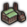
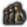
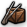
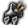

# Table of contents

- [Focus tree](#focus-tree)
  - [Examples](#examples)
  - [Shortcuts](#shortcuts)
  - [Inlay window](#inlay-window)
    - [Definition](#definition)
    - [Declaration](#declaration)
- [National focuses](#national-focuses)
  - [Name and description](#name-and-description)
  - [Position](#position)
  - [Interaction with other focuses](#interaction-with-other-focuses)
  - [Cost](#cost)
  - [Icon](#icon)
  - [Dynamic appearance](#dynamic-appearance)
  - [Triggers](#triggers)
  - [Effects](#effects)
  - [Search filters](#search-filters)
  - [Titlebar styles](#titlebar-styles)
  - [AI will do](#ai-will-do)
    - [Formulas for chance calculation](#formulas-for-chance-calculation)
  - [Other](#other)
  - [Examples](#examples_2)
- [Shared focuses](#shared-focuses)
  - [Joint focuses](#joint-focuses)
  - [Example](#example)
- [Continuous focuses](#continuous-focuses)
  - [Focus palettes](#focus-palettes)
  - [Focuses](#focuses)
- [AI strategy plans](#ai-strategy-plans)
  - [Example](#example_2)
- [Notes](#notes)
- [References](#references)

---

National focus trees are defined within /Hearts of Iron IV/common/national\_focus/\*.txt files. Like most other files, the filename is irrelevant and isn't used for anything other than organisation. One file can store more than one focus tree or none at all.

## <a id="focus-tree"></a>Focus tree

A focus tree is defined by using a `focus_tree = { ... }` block. The following arguments are used:

`id = my_focus_tree` decides the ID that the focus tree uses. It is mandatory to define, and an overlap will result in an error. The ID is primarily used for the has\_focus\_tree trigger and the [load\_focus\_tree effect](<Effects - Hearts of Iron 4 Wiki.md#load-focus-tree>), whose tooltips use it as a localization key.

`country = { ... }` is a [MTTH block](<AI modding - Hearts of Iron 4 Wiki.md#ai-will-do>) that assigns a score for the focus tree, deciding which one is used in-game. This is evaluated *before the game's start* and the check is essentially **never refreshed**<a id="ref-a"></a>[[a]](#cnote-a). The focus tree with the highest score will be the one that gets loaded for the country. By default, the score starts with 1. A typical usage looks like this:

```text
country = {
    factor = 0
    modifier = {
        add = 20
        original_tag = TRA
    }
}
```

In this case, countries originating from  Transylvania (i.e. the country itself and any civil war or collaboration government breakaways, as ensured by the original\_tag trigger) will have the score of 20, while every other country will have the score of 0. Assuming that there is no other focus tree where  Transylvania has a higher country score, this will ensure that this focus tree gets loaded for it.

`default = yes` sets the focus tree to be marked as default. In total, *there should be one total default focus tree*, no more, no less. A focus tree being marked as default means that if every other focus tree has a country score of 0, this tree will be chosen instead. Additionally, a country starting with a focus tree will fail to appear in the "minor countries" section within the "interesting countries" menu before the game's start. If this is left out from a focus tree, it gets assumed to be non-default.

`reset_on_civilwar = no` is not determined on its effect. Instead, this is how focus trees are handled in civil wars, regardless of if `reset_on_civilwar` is set or how it's set:  
When a civil war starts, the original country will always continue using the focus tree. The focus it's doing will not be paused or cancelled by the civil war itself. The revolter will have the focus tree it's using evaluated when the civil war starts, assigning one depending on each tree's `country = { ... }` value. If the same focus tree gets used for the revolting country as the one that the original country used when the civil war started, every focus that the original country has completed will get completed for the revolting country, including setting the same focus progress for the one that's being completed by the original country at the moment. Otherwise, the focus progress will get lost.

`shared_focus = TAG_focusname` will set the focus tree to include the specified [shared focus](#shared-focuses) and every focus that is connected to it via prerequisites. **Setting this to a non-existing focus causes a game crash when loading into the main menu.**

`continuous_focus_position = { x = 1200 y = 100 }` is the position of the top left corner of the continuous focus menu *in pixels*. For comparison, by default<a id="ref-b"></a>[[b]](#cnote-b), the continuous focus palette has the position of 50 on the X axis and 1000 on the Y axis. If both x and y are set to 0 or the position is undefined for the tree, it resets to the default position.

`initial_show_position = { ... }` decides the initial position of the camera when the focus tree is first opened. There are 2 ways to arrange it:

- `focus = TAG_focusname` will make the camera centre on the specified focus in particular. It'll be in the top centre of the screen exactly, taking offsets into consideration.
- `x = 12 y = 0` decides the exact position of the top-centre of the camera. This uses the same coordinate system as regular focuses do, by default a unit of x being equal to 96 pixels and a unit of y being equal to 130 pixels<a id="ref-c"></a>[[c]](#cnote-c)

This also accepts `offset = { ... }`, adding the specified values to respective positions if the conditions within the `trigger = { ... }` trigger block are met for the country. For example, this will apply the modifier and result in a position of x = 13, y = 1 if the country is BHR:

```text
initial_show_position = {
    x = 17
    y = 0
    offset = {
        x = -4
        y = 1
        trigger = {
            tag = BHR
        }
    }
}
```

`focus = { ... }` are the focuses themselves. Each focus that's put within the focus tree will. The focuses **have** to be within a `focus_tree = { ... }` in order to let the game know which focus tree exactly to assign them to. If a `focus = { ... }` blocks ends up outside of a `focus_tree = { ... }` or within another `focus = { ... }`, this gets marked within the [error log](<Modding - Hearts of Iron 4 Wiki.md#advantages-to-using-debug>) as "focus" being an unexpected token, fixed by adjusting brackets as needed.

### <a id="examples"></a>Examples

Pure minimum, with 2 focuses:
| The text in this section has been collapsed by default. |
| --- |
| `focus_tree = { id = BHR_focus_tree country = { base = 0 modifier = { add = 10 tag = BHR } } focus = { ... } focus = { ... } }` |

Average tree, with 2 focuses:
| The text in this section has been collapsed by default. |
| --- |
| `focus_tree = { id = OMA_focus_tree country = { base = 0 modifier = { tag = 25 original_tag = OMA } } continuous_focus_position = { x = 450 y = 800 } initial_show_position = { focus = OMA_focus_name } focus = { id = OMA_focus_name ... } focus = { ... } }` |

### <a id="shortcuts"></a>Shortcuts

Shortcuts are used to add navigation buttons in the lower left corner that, when clicked, will move the camera to a specific focus.

Parameters:

- `name = lockey`, the localized name that will be displayed on the button.
- `target = focus_id`, focus where the camera should be moved.
- `scroll_wheel_factor = <float>`, zoom, the higher the value the greater the zoom. (between 0 and 1)
- `trigger = { ... }`, a trigger block specifying whether the shortcut button should be visible, optional. (If true, it will not supersede allow conditions of target focus.)

An example shortcut definition is as such:

```text
shortcut = {
  name = GER_oppose_hitler_shortcut
  target = GER_oppose_hitler_ww 
  scroll_wheel_factor = 0.485
  trigger = {
    has_dlc = "Gotterdammerung"
  }
}
```

### <a id="inlay-window"></a>Inlay window

Focus inlay windows are generic inlay components that can be added to the focus tree, similar to the continuous focus window, a [scripted GUI](<Scripted GUI modding - Hearts of Iron 4 Wiki.md>) object.

#### <a id="definition"></a>Definition

Definitions for inlay windows are located in /Hearts of Iron IV/common/focus\_inlay\_windows/\*.txt.

For a guide written by the game developers, see [Dev dairy modding](https://forum.paradoxplaza.com/forum/developer-diary/developer-diary-performance-modding.1713814/)

Parameters:

- `window_name = gui_component_name` the name of the scripting GUI to use.
- `internal = <bool>` if true, then the inlay window is only visible to the country itself. (defaults no)
- `visible = { ... }` whether the inlay window should be visible, when not visible, no evaluations will be done.
- `scripted_buttons = { ... }` list of images that should have dynamic sprites.
  - `<button_name> = { ... }` name of the button.
    - `available={ ... }` List of triggers when the button is allowed to be pressed.
    - `click_effect={ ... }` List of effects the button will have upon being pressed.
- `scripted_images = { ... }` list of images that should have dynamic sprites.
  - `<icon_name> = { ... }` name of the icon (must be a subcomponent of "gui\_component\_name"). List of possible gfx:es for the icon, first that evaluates to true is selected.
    - `<gfx_name> = { ... }/yes` If a trigger is provided, then it will be evaluated with the country scope of the focus tree. If "yes" is set, then it will always be used. Note: "yes" is commonly the last entry in the list that acts as a default case.

An example for inlay window definition:

```text
inlay_window_id = {
  window_name = gui_component_name
  internal = yes
  visible = {
    visibility_triggers
  }
  scripted_buttons = {
    my_button = {
      available = {
        triggers
      }
      click_effect = {
        add_political_power=5
      }
    }
  scripted_images = {
    advisor_portrait = {
      gfx_name = {
        has_completed_focus = TAG_focus_name_example
      }
      gfx_name_fallback = yes
    }
  }
}
```

#### <a id="declaration"></a>Declaration

Inlay window must be declared in focus tree. Any number of inlay windows can be defined for focus tree.

Parameters:

- `id = inlay_window_id` inlay window identifier.
- `position = { x = <int> y = <int> }` position on the tree, same syntax and scale as continuous focus position.

An example declaration of inlay window is as such:

```text
inlay_window = {
  id = ger_inner_circle_inlay_window
  position = { x = 4500 y = 1150 }
}
```

## <a id="national-focuses"></a>National focuses

The ID for the focus is defined using `id = TAG_focusname`. While it's optional to preface the focus' ID with the country's tag, doing so is preferred to avoid overlapping focus IDs from different focus trees. Having the same focus ID in different focus trees leads to errors, such as broken prerequisite lines and effects or triggers such as [complete\_national\_focus](<Effects - Hearts of Iron 4 Wiki.md#complete-national-focus>) or has\_completed\_focus not working correctly. Instead, it could be possible to use [shared focuses](#shared-focuses) to put the same focus in different focus trees.

### <a id="name-and-description"></a>Name and description

The name of the focus depending on the language that's turned on is defined within /Hearts of Iron IV/localisation/, using the ID of the focus as the localisation key. For English in particular, this is defined within any /Hearts of Iron IV/localisation/english/\*\_l\_english.yml file with the UTF-8-BOM encoding. It is preferable to use new localisation files when possible rather than overwriting base game localisation in order to not have to change that for compatibility with recent versions, and to do so, the file should have a new name that doesn't exist in base game, but it must still end with `_l_english.yml` to be loaded properly. The focus' ID is used as the localisation key used to establish the name in the enabled language, while a description uses the focus' ID with `_desc` appended:

```text
l_english:
 TAG_focus_name: "Example focus"
 TAG_focus_name_desc: "Example focus description"
```

### <a id="position"></a>Position

The position of the focus is decided via `x = 5` and `y = 1` attributes. By default, a unit of x is equal to 96 pixels and a unit of y is equal to 130 pixels<a id="ref-c"></a>[[c]](#cnote-c). In other words, a focus directly below another focus would have a unit difference of 1, while a focus directly to the right of another one would have a unit difference of 2. By default, this is relative to the top left corner of the tree: a larger x value moves the focus right, a larger y value moves the focus *down*.

It is also possible **and preferred** (on focuses with prerequisites) to make the focus' position be relative to another focus with doing `relative_position_id = TAG_other_focus`. This will position the focus relative to that focus, adding the `x` and `y` values to the other focus' position (after calculating that one's relative\_position\_id too). Doing so allows for more flexibility in the focus tree design by allowing to easily modify the position of the entire branch at the same time, due to updates to the children focuses' positioning. This also allows to only use the later `offset = { ... }` only in the top focus of each branch that requires to be moved.  
For example, if focus A has `x = 1 y = 2`, focus B is positioned relative to focus A and has `x = 3 y = 4`, then the focus B will be positioned, in total, 4 steps to the right and 6 steps down of the top-left corner. A focus C positioned relative to focus B at `x = -1 y = 1` would then be located 3 steps to the right and 7 steps down of the top-left corner.  
The game can behave unstably with an incorrect relative position ID. A recursion (such as a focus being positioned relative to itself or focus A and focus B being positioned relative to each other) may cause a game crash since it is impossible to determine the exact position of the focus, and the focus must also be located in the same focus tree for the argument to work properly.

Changing a focus' position based on a condition being met is done with `offset = { ... }`. The `x = 10` and `y = -3` values will be added to the focus' position if the conditions within `trigger = { ... }` are met for the country *when the focus tree is loaded*. This looks like the following:

```text
offset = {
    x = -5
    trigger = {
        has_dlc = "Poland: United and Ready"
    }
}
```

This in particular will move the focus 5 units to the left if the "Poland: United and Ready" DLC is turned on. This check also can be refreshed mid-session with the [mark\_focus\_tree\_layout\_dirty effect](<Effects - Hearts of Iron 4 Wiki.md#mark-focus-tree-layout-dirty>)<a id="ref-d"></a>[[d]](#cnote-d), applying the offset if true.

### <a id="interaction-with-other-focuses"></a>Interaction with other focuses

<a id="prerequisite"></a>
`prerequisite = { focus = TAG_other_focus }` decides the focuses necessary to complete for this focus to be available. At least one focus within a prerequisite has to be completed to mark the prerequisite as true, and each prerequisite much be completed to take the focus. If neither of the prerequisites is located in the same focus tree, then the focus will not appear. In other words, an OR statement is done by putting 2 focuses inside a prerequisite as `prerequisite = { focus = TAG_other_focus_1 focus = TAG_other_focus_2 }`, while an AND statement is done by putting two different prerequisites like the following:

```text
prerequisite = { focus = TAG_other_focus_1 }
prerequisite = { focus = TAG_other_focus_2 }
```

This system cannot represent every boolean logical arrangement, such as  (Where , , and  represent whether a focus is complete) or with anything using negation. In this case, it can be possible to, instead, put an OR statement for either of the focuses necessary to complete this one and use the has\_completed\_focus trigger within the `available = { ... }` block with necessary flow control tools. A custom trigger tooltip can be used to make it easier for the player to understand.

<a id="mutually-exclusive"></a>
`mutually_exclusive = { focus = TAG_other_focus }` makes this focus impossible to select if the specified focus has been completed. If both focuses are mutually exclusive toward each other, then the mutually exclusive arrows will be shown in the focus tree view. Mutual exclusivity to multiple focuses is usually done by putting several of `focus = TAG_focusname` in the same mutually\_exclusive, but defining several of mutually\_exclusive is also possible.

Neither prerequisites nor mutual exclusivity require the other focus to be in the same focus tree. This means that it can be used with [shared focuses](#shared-focuses) to declare a regular, non-shared focus as mutually exclusive or a prerequisite without any errors, even when used in a focus tree not containing that focus.

The difference between prerequisites and using has\_completed\_focus within the `available = { ... }` block is that the prerequisites show up as lines within the national focus tree view and show up separately from other triggers in the tooltip of a focus.

There is an issue that leads to prerequisite lines not working properly: duplicate focus IDs within different focus trees. In this case, the game can take the position of the focuses as the ones within the different focus tree that contains the same focuses, leading to them appearing to link towards empty spaces or start inside of them. This can also break the path-generating algorithm and make it use the wrong turn sprites, which will show up broken even in trees that don't have any duplicates.  
In order to avoid this, duplicate focus IDs must be avoided. A simple way to decrease the chance drastically is to preface the focus IDs with the country tag (such as `TAG_focus_name`) or something else that's unique for the focus tree (Such as `REGION_focus_name` for a shared regional tree). If the same focus tree should be used for several countries, this can be done by only having one focus tree where the `country = { ... }` of the tree is set up so that the desire to use it is the highest for several countries instead of just one; if the same focus tree branch should be used within several different focus trees, then [shared focuses](#shared-focuses) can achieve exactly that.

Additionally, the game intends for a focus' prerequisite to be placed above the focus that requires it and it is unable to correctly generate the path to the focus otherwise, which will show up as having a path that uses the wrong sprites in the 90° turns.

### <a id="cost"></a>Cost

Another important aspect of the focus is `cost = 8`. This sets how long the focus takes to complete. By default, a cost of 1 is taken to be 7 "points",<a id="cite-ref-1"></a>[[1]](#cite-note-1) of which by default 1 is completed daily, although it's possible to set different speeds depending if the country is at war or at peace.<a id="cite-ref-2"></a>[[2]](#cite-note-2) In other words, a cost of 1 represents a week by default. This behaviour can be changed via the [Defines](<Defines - Hearts of Iron 4 Wiki.md>) file. Decimals within cost are supported, and it will get rounded down to a whole day in the game.

Focus cost can be changed on a per focus basis via the `reduce_focus_completion_cost` effect. Examples are provided [here](<Effects - Hearts of Iron 4 Wiki.md>).

### <a id="icon"></a>Icon
| General sprite overview |
| --- |
| For loading GFX, the game uses the sprite system. Sprites are code definitions that attach a name to an image file, as well as optionally adding additional information, such as animation, the amount of frames, the way that the image will be loaded, and so on. This means **placing an image into the gfx folder isn't enough for it to work**, a sprite has to use that image file as well. Sprites are defined in any /Hearts of Iron IV/interface/\*.gfx file (this is separate from gfx/interface/), opened with a text editor. To create a new .gfx file, a text file can be created and renamed to change the extension (on Windows, the [Windows Explorer needs to show the extensions, which it doesn't by default](https://support.microsoft.com/en-gb/windows/common-file-name-extensions-in-windows-da4a4430-8e76-89c5-59f7-1cdbbc75cb01)). In particular, sprites are defined within a `spriteTypes = { ... }` block, as to separate from fonts and map arrows also defined in that folder, while the simplest sprite with the least mandatory properties is a `spriteType = { ... }`. The simplest sprite definition looks like the following:   `spriteTypes = { spriteType = { name = GFX_first_sprite # In some cases, beginning with GFX_ is mandatory for it to work. texturefile = gfx/interface/folder/filename.dds # The folder and filename don't matter, as long as they are correct } # Only the forward slash '/' (can be doubled as '//') can be used to separate folders. spriteType = { # The image doesn't have to be .dds, as .tga and .png are acceptable. name = GFX_second_sprite texturefile = gfx/interface/folder2/filename2.dds noOfFrames = 2 # Splits the image into 2 halves, which may be switched between dynamically in GUI } }`   In this case, this creates a sprite with the name of `GFX_first_sprite` and attaches the /Hearts of Iron IV/gfx/interface/folder/filename.dds image to it, and a second sprite similarly. The second sprite will be split into 2 frames: this is decided by having the left half of the image as the first frame and the right half as the second frame (more frames would further split the image horizontally). This doesn't make the sprite animated, just turns on the option to switch between the two halves as needed. `GFX_second_sprite:1` serves as a reference to the first frame, and GUI can be set up to change the shown frame depending on context, such as with radio stations.  In order to add animation, a [frameAnimatedSpriteType](<Graphical asset modding - Hearts of Iron 4 Wiki.md#frameanimatedspritetype>) is used.  **It's never mandatory to copy a base game file to change a sprite**. If there are duplicate definitions of a sprite with the same name in different files, the game will prioritise the one that would be [evaluated later, based on the filename](<Modding - Hearts of Iron 4 Wiki.md#loading-files>), and the older sprite will be ignored in entirety. This can be ensured by beginning the replacement file's name with a symbol late in the ASCII character table. Typically the lowercase letter 'z' is used for this purpose. For example, to change the amount of frames in `GFX_idea_traits_strip` to 10, it is possible to define a sprite with that name with 10 frames in the mod's modname/interface/zz\_replace.gfx file instead of copying over the base game file.  Since most .gfx files define integral parts of the user interface, copying them over can lead to the mod's loaded files missing sprites upon a major game update, which would appear in-game as the default image, which is the error dog by default. As to ease the burden of needing to check the interface files, it's best to never copy over .gfx files, unless more additions would be actively harmful to the mod, such as with interface/subuniticons.gfx |

Within a focus, an icon is assigned with the line of `icon = GFX_focus_icon`. This assigns two sprites to the focus, in particular:

- Regular sprite, with the name of `GFX_focus_icon`. This is used in the focus description view and in the focus tree view when the focus is unavailable, is being completed, or has been completed.
- Sprite for the shine animation, with the name of `GFX_focus_icon_shine` (With \_shine at the end). This is used in the focus tree view for focuses that are currently available and in the country politics and diplomacy views for the focus currently being complete. Since the game [doesn't use filenames in evaluation](<Modding - Hearts of Iron 4 Wiki.md#loading-files>), putting the spriteType definition into a file with `shine` in the filename isn't either necessary or sufficient. Only the name of the sprite is used, which must be the same as the regular sprite with \_shine appended to the end. **The most common mistake when the shine doesn't work is not following this naming rule**.

If one of these is undefined or is defined incorrectly, the  missing focus icon will be used instead of the appropriate sprite, however the working sprite will continue to be used.  
If the texturefile links to a non-existing file, whether it's the folder path that's incorrect<a id="ref-e"></a>[[e]](#cnote-e) or the filename, including the extension, the focus icon will appear as fully transparent.  
By default, the base game stores images for focus icons in the /Hearts of Iron IV/gfx/interface/goals/ folder and sprites in the interface/goals.gfx and interface/goals\_shine.gfx files. Since there's no reason to copy the files to the mod and doing so will lead to needing to update the file after a major update to use new sprites, it's best to create a new file in the folder for sprite definitions.  
The following is an example of an interface file that defines both of the sprites:
| Example interface file |
| --- |
| `spriteTypes = { spriteType = { name = GFX_focus_icon texturefile = gfx/interface/goals/filename.dds } spriteType = { name = GFX_focus_icon_shine # Change the name, note to keep _shine in the end texturefile = gfx/interface/goals/filename.dds # Change to the focus icon effectFile = gfx/FX/buttonstate.lua animation = { animationmaskfile = gfx/interface/goals/filename.dds # Change to the focus icon animationtexturefile = gfx/interface/goals/shine_overlay.dds animationrotation = -90.0 animationlooping = no animationtime = 0.75 animationdelay = 0 animationblendmode = "add" animationtype = "scrolling" animationrotationoffset = { x = 0.0 y = 0.0 } animationtexturescale = { x = 1.0 y = 1.0 } } animation = { animationmaskfile = gfx/interface/goals/filename.dds # Change to the focus icon animationtexturefile = gfx/interface/goals/shine_overlay.dds animationrotation = 90.0 animationlooping = no animationtime = 0.75 animationdelay = 0 animationblendmode = "add" animationtype = "scrolling" animationrotationoffset = { x = 0.0 y = 0.0 } animationtexturescale = { x = 1.0 y = 1.0 } } legacy_lazy_load = no } }` |

When copying from the template, note to change the `animationmaskfile` in each animation within the sprite with the shine alongside the `texturefile` and `name`.

### <a id="dynamic-appearance"></a>Dynamic appearance

`dynamic = yes` allows the title and icon of the focus to be dynamic. In particular, it allows using scripted localisation in focus titles and a dynamic icon. If false or unset, it will still allow using them, but instead it will pick one at the game's start and never change it.

Dynamic icons are treated similarly to events' titles or descriptions: instead of a single `icon = GFX_focus_example` a focus can contain multiple assets in the one `icon = { ... }` parentheses at the same time, each with a unique trigger. The first possible icon will get used in the focus. An `icon = { ... }` consists of a GFX\_asset\_name `= { ... }` with a trigger inside, which must be fulfilled by the country for the icon to be selectable. To set a default icon you need to put `GFX_focus_example = yes` in `icon = { ... }` parentheses.

An example dynamic focus definition, with all other optional arguments omitted:

```text
focus = {
    id = TAG_political_focus # In localisation, TAG_political_focus: "[THIS.GetRulingIdeology] political focus"
    icon = {
        GFX_focus_example_democratic = {
             has_government = democratic
        }
        GFX_focus_example_fallback = yes
    }
    dynamic = yes
}
```

### <a id="triggers"></a>Triggers

*See also: [Triggers](<Triggers - Hearts of Iron 4 Wiki.md>)*

In order to take the focus, aside from the focus prerequisites, the conditions within the `available = { ... }` block must be met. This functions as an [AND block](<Scopes - Hearts of Iron 4 Wiki.md#and>), so each of the triggers must be true to fulfilled. [Scopes](<Scopes - Hearts of Iron 4 Wiki.md>) can be used to check for conditions for other countries or within states. By default, the scope is of the country doing the focus. For example, this example requires the country to have more than 10%  Stability and for the state 294 to be owned by the  Republic of Qatar:

```text
available = {
    stability > 0.1
    294 = { is_owned_by = QAT }
}
```

`bypass = { ... }` is similar, but for bypassing the focus. Bypassing a focus marks the focus as complete, but does not grant its effects within the completion reward, instead focus can have `bypass_effect = { ... }`, focus can have `enable_automatic_bypass = no` to prevent bypassing focus automaticly. The exact same applies as to `available`: it's an AND block that assumes the country doing the focus by default. `bypass_if_unavailable = yes` can be used to make the focus automatically bypass as soon as the `available = { ... }` block is not met without needing to port over the triggers.

<a id="allow-branch"></a>`allow_branch = { ... }` is used to tell when the focus should be visible. **This is only checked when the focus tree is first loaded**. However, this check also can be refreshed mid-session with the [mark\_focus\_tree\_layout\_dirty effect](<Effects - Hearts of Iron 4 Wiki.md#mark-focus-tree-layout-dirty>)<a id="ref-d"></a>[[d]](#cnote-d), making the focus visible or invisible depending on if it's true or not. By default, a focus will also be disallowed if either of the parent focuses (as set by prerequisites) is disallowed. However, a focus containing `allow_branch` within its definition will only check its own allowed status, still showing up if it has disallowed parents. This means that if a branch is set to be disallowed under certain conditions, the first focus in any sub-branch that has its own conditions for being allowed must also contain the parent branch's condition within of itself, while other focuses may not have any `allow_branch` defined at all due to it being inherited from parents.

`available_if_capitulated = yes` sets the focus to be possible to complete while being capitulated. By default, this is set to false.

`cancel_if_invalid = no` and `continue_if_invalid = yes` decide how to treat the focus if the `available = { ... }` block becomes false while doing it. By default, these are true and false respectively. If both are set to false, the focus would pause when the `available = { ... }` block is false. This will not remove the gain\_focus [static modifier](<Modifiers - Hearts of Iron 4 Wiki.md#static-modifiers>), which by default results in costing 1  Political Power per day when doing the focus.

`cancel = { ... }` decides additional conditions which would cancel the focus if met. This is usually paired with `cancel_if_invalid = no`.

`historical_ai = { ... }` decides when the AI is able to pick this focus with the historical focus turned on. This does not ensure it picks this focus, rather prevents it from picking it when false. This takes priority over the order of focuses granted within [AI strategy plans](#ai-strategy-plans): if the AI were to do this focus next by the plan, yet `historical_ai = { ... }` is false and historical focus is turned on, then it won't be able to.

### <a id="effects"></a>Effects

*See also: [Effects](<Effects - Hearts of Iron 4 Wiki.md>)*

The primary reward of the focus is done with `completion_reward = { ... }`. This executes each [effect](<Effects - Hearts of Iron 4 Wiki.md>) within the specified [scopes](<Scopes - Hearts of Iron 4 Wiki.md>) in order that they are put in the file. The assumed scope is the country doing the focus. For example, this would add 100  Political Power to the country doing the focus and fire the `my_event.0` country event to  Oman:

```text
completion_reward = {
    add_political_power = 100
    OMA = { country_event = my_event.0 }
}
```

The tooltip of the focus can be changed with `complete_tooltip = { ... }`, *which is also an effect block*. This would be equivalent to putting the contents of the reward inside of [hidden\_effect](<Scopes - Hearts of Iron 4 Wiki.md#hidden-effect>) and using [effect\_tooltip](<Scopes - Hearts of Iron 4 Wiki.md#effect-tooltip>) in the same reward. This can be useful if the tooltip of the reward appears cluttered. For instance, using [random\_owned\_controlled\_state](<Scopes - Hearts of Iron 4 Wiki.md#random-owned-controlled-state>) thrice with the same effect in each one can result in a cluttered tooltip, as each state and its effects would appear individually. But if, instead, the code [sets a state flag](<Effects - Hearts of Iron 4 Wiki.md#set-state-flag>) for each state in the reward and, in the tooltip, uses [every\_state](<Scopes - Hearts of Iron 4 Wiki.md#every-state>) limited to the ones that have the state flag, it'll show the same effect being executed for 3 states at the same time, cutting it into a third of what it was.

Additionally, `select_effect = { ... }` is used to execute an effect when the focus is *selected*. This has no tooltip shown to the player. This also automatically makes the focus impossible to cancel manually. It may still be cancelled automatically if set to do so, so in most cases it'd be preferable to set it to not cancel if invalid in order to prevent the effects within from firing more than once, as there is no way to execute an effect when the focus gets cancelled.

Additionally, `bypass_effect = { ... }` is used to execute an effect when focus is [*bypassed*](#triggers).

**The focus is not yet marked as complete when the effects are being executed.** What this means is that any has\_completed\_focus check ran within will return as false. This can be a hinderance in some cases, most commonly when using allow\_branch (as the effect to refresh the check will not work properly when put within a focus). Some alternatives can be considered:

- [Country flags to track that a focus has been completed](<Data structures - Hearts of Iron 4 Wiki.md#flags>). Since country flags are set immediately, as long as the setting precedes the requirement, this will work.
- Delaying the effects that would require the focus to be complete. This is usually done by firing a hidden event. If done with no delay, the event will be fired *right after* the focus is complete, resulting in no noticeable delay for the player, but still executing the effects in order.
- Forcefully marking the focus to be complete. This, for example, can be done by using [load\_focus\_tree](<Effects - Hearts of Iron 4 Wiki.md#load-focus-tree>) for the same focus tree with the completed focuses being kept. Doing so will not interrupt the completion reward's execution.

### <a id="search-filters"></a>Search filters

Search filters for each focus are set with `search_filters = { ... }`. Within that block, each search filter that the focus has is put inside, separated by whitespace characters. For instance, the following will assign FOCUS\_FILTER\_MANPOWER and FOCUS\_FILTER\_POLITICAL to the focus: `search_filters = { FOCUS_FILTER_MANPOWER FOCUS_FILTER_POLITICAL }`. These filters get used in the search menu in the top right of the national focus tree view.

A focus filter is not defined in any file, but instead they are created dynamically for each focus tree. Each one uses the sprite the same as its name but with `GFX_` inserted in the beginning. For instance, this defininition within any /Hearts of Iron IV/interface/\*.gfx file would be used for FOCUS\_FILTER\_MY\_MOD:

```text
spriteType = {
    name = GFX_FOCUS_FILTER_MY_MOD
    texturefile = gfx/interface/focusview/filter/my_mod_icon.dds
}
```

As before with regular focus icon, the exact folder where filter icons are stored is irrelevant, as long as the texturefile specified within the sprite is correct.

The localisation key used for the focus filter is the same as its name. For example, with the prior example of FOCUS\_FILTER\_MY\_MOD, this would get defined for the English language in any /Hearts of Iron IV/localisation/english/\*\_l\_english.yml file as  `FOCUS_FILTER_MY_MOD: "My mod"`

A list of every base game focus filter:
| Icon | Internal name | Localised name | Notes |
| --- | --- | --- | --- |
|  | FOCUS\_FILTER\_POLITICAL | Political | Typically used when gaining political power, when changing the internal political situation, or when improving diplomatic relations. |
|  | FOCUS\_FILTER\_RESEARCH | Research | Used for tech bonuses, scientists, research sharing groups, etc. |
|  | FOCUS\_FILTER\_INDUSTRY | Industry | Used for economic modifiers and gaining factories |
|  | FOCUS\_FILTER\_STABILITY | Stability |  |
|  | FOCUS\_FILTER\_WAR\_SUPPORT | War support |  |
|  | FOCUS\_FILTER\_MANPOWER | Manpower | Usually used when gaining more manpower (directly or via conscription), equipment, generals, or when creating units. |
|  | FOCUS\_FILTER\_ANNEXATION | Territorial Expansion | Usually used in demands for territory and avoided in outright declarations of war. |
|  | FOCUS\_FILTER\_HISTORICAL | Historical | Usually used for focuses taken on the historical focus on. |
|  | FOCUS\_FILTER\_INTERNATIONAL\_TRADE | International Trade | Usually used for focuses related to the international market. |
|  | FOCUS\_FILTER\_ARMY\_XP | Army Experience | Used when gaining Army Experience or modifiers related to it. |
|  | FOCUS\_FILTER\_NAVY\_XP | Navy Experience | Used when gaining Navy Experience or modifiers related to it. |
|  | FOCUS\_FILTER\_AIR\_XP | Air Experience | Used when gaining Air Experience or modifiers related to it. |
|  | FOCUS\_FILTER\_TFV\_AUTONOMY | Autonomy | Used when adding or subtracting autonomy or modifiers related to it. |
|  | FOCUS\_FILTER\_POLITICAL\_CHARACTER | Political Character | Used for focuses about a nation’s politics |
|  | FOCUS\_FILTER\_MILITARY\_CHARACTER | Military Character | Used for focuses about a nation’s military |
|  | FOCUS\_FILTER\_INTERNAL\_AFFAIRS | Internal Affairs | Used in the  Bulgarian and  Greek national focus trees for focuses dealing with the internal factions. |
|  | FOCUS\_FILTER\_FRA\_POLITICAL\_VIOLENCE | Political Violence | Used in the  French national focus tree for the focuses that remove the *political violence* spirit. |
|  | FOCUS\_FILTER\_PROPAGANDA | Propaganda | Used in the  Soviet national focus tree for the focuses dealing with the propaganda system. |
|  | FOCUS\_FILTER\_FRA\_OCCUPATION\_COST | Occupation Costs | Used in the  Vichy French national focus tree for the focuses dealing with the  German occupation. |
|  | FOCUS\_FILTER\_CHI\_INFLATION | Inflation |  |
|  | FOCUS\_FILTER\_BALANCE\_OF\_POWER | Balance of Power | Used when implementing, modifying, or removing a balance of power |
|  | FOCUS\_FILTER\_SWI\_MILITARY\_READINESS | Military Readiness | Used in the  Swiss focus tree for focuses dealing with Switzerland’s ‘‘Military Readiness’’ system. |
|  | FOCUS\_FILTER\_USA\_CONGRESS | Congress | Used in the  United States focus tree for focuses requiring or changing support in Congress. |
|  | FOCUS\_FILTER\_MEX\_CHURCH\_AUTHORITY | Church Authority | Used in the  Mexican national focus tree for focuses dealing with the church. |
|  | FOCUS\_FILTER\_MEX\_CAUDILLO\_REBELLION | Caudillo Rebellion |  |
|  | FOCUS\_FILTER\_SPA\_CIVIL\_WAR | Spanish Civil War |  |
|  | FOCUS\_FILTER\_SPA\_CARLIST\_UPRISING | Carlist Uprising |  |
|  | FOCUS\_FILTER\_TUR\_KURDISTAN | Kurdistan | Used in the  Turkish focus tree for focuses dealing with Kurdistan and Kurdish resistance |
|  | FOCUS\_FILTER\_TUR\_KEMALISM | Kemalism |  |
|  | FOCUS\_FILTER\_TUR\_TRADITIONALISM | Traditionalism |  |
|  | FOCUS\_FILTER\_GRE\_DEBT\_TO\_IFC | Debt to the I.F.C. |  |
|  | FOCUS\_FILTER\_SOV\_POLITICAL\_PARANOIA | Political Paranoia |  |
|  | FOCUS\_FILTER\_ITA\_MISSIOLINI | Mussolini's Missions | Spelt exactly as used in-game. |
|  | FOCUS\_FILTER\_FOLKHEMMET | Folkhemmet |  |

In addition, it is possible to set the priority of focus filters. This is done with the `search_filter_prios = { ... }` block *outside of the `focus_tree = { ... }`*. This priority is impossible to set to be focus tree-specific and instead is global. An entry within that block is done in the format of `FOCUS_FILTER_MY_MOD = 1200`, where the first part decides the filter and the second part decides the priority. Focus filters with the higher priority appear earlier in the top view. By default, the game does it in the file containing the generic focus tree: /Hearts of Iron IV/common/national\_focus/generic.txt.

### <a id="titlebar-styles"></a>Titlebar styles

Styles are used for determining the picture used for the titlebar, the background on which the focus name is shown.
A titlebar is set by using `text_icon = mod_focus_style` in the focus.

A style that can be used in focuses is created by using a root-level `style = { ... }` block in a /Hearts of Iron IV/common/national\_focus/\*.txt file, by default `00_titlebar_styles.txt`. There are these possible attributes that can be used inside of a style:

- `name = example_style` is the name of the style. The argument determines what needs to be written in a focus' `text_icon` to reference this style.
- `default = yes`, if written, will make any focus without a defined `text_icon` use this style. Only one style total may use this.
- `unavailable = GFX_focus_unavailable_example` is the sprite that gets used when the focus is unavailable.
- `completed = GFX_focus_unavailable_example` is the sprite that gets used when the focus has been completed.
- `available = GFX_focus_unavailable_example` is the sprite that gets used when the focus is available for completion, but not yet selected.
- `current = GFX_focus_unavailable_example` is the sprite that gets used when the focus is currently in progress of being completed.

An example style definition is as such:

```text
style = {
	name = example_style
	unavailable = GFX_focus_unavailable_example
	completed = GFX_focus_completed_example
	available = GFX_focus_can_start_example
	current = GFX_focus_current_example
}
```
| Example sprite definitions |
| --- |
| `spriteTypes = { spriteType = { name = GFX_focus_unavailable_example textureFile = gfx/interface/focusview/titlebar/focus_unavailable_example_bg.dds } spriteType = { name = GFX_focus_can_start_example textureFile = gfx/interface/focusview/titlebar/focus_can_start_example_bg.dds } SpriteType = { name = "GFX_focus_current_example texturefile = gfx/interface/focusview/titlebar/focus_can_start_example_bg.dds # Usually the same as the available sprite effectFile = gfx/FX/buttonstate_onlydisable.lua animation = { animationmaskfile = gfx/interface/focusview/titlebar/focus_ongoing_mask2.dds animationtexturefile = gfx/interface/focusview/titlebar/focus_ongoing_texture.dds # <- the animated file animationrotation = -90.0 # -90 clockwise 90 counterclockwise(by default) animationlooping = yes # yes or no ;) animationtime = 20.0 # in seconds animationdelay = 0.2 # in seconds animationblendmode = add #add, multiply, overlay animationtype = rotating #scrolling, rotating, pulsing animationrotationoffset = { x = 0.0 y = 0.0 } animationtexturescale = { x = 1.0 y = 1.0 } } animation = { animationmaskfile = gfx/interface/focusview/titlebar/focus_ongoing_mask4.dds animationtexturefile = gfx/interface/focusview/titlebar/focus_ongoing_texture.dds animationrotation = 90.0 # -90 clockwise 90 counterclockwise(by default) animationlooping = yes # yes or no ;) animationtime = 15.0 # in seconds animationdelay = 0.2 # in seconds animationblendmode = add #add, multiply, overlay animationtype = rotating_ccw #scrolling, rotating, pulsing animationrotationoffset = { x = 0.0 y = 0.0 } animationtexturescale = { x = 1.0 y = 1.0 } } legacy_lazy_load = no } SpriteType = { name = GFX_focus_completed_example texturefile = gfx/interface/focusview/titlebar/focus_completed_example_bg.dds effectFile = gfx/FX/buttonstate_onlydisable.lua animation = { animationmaskfile = gfx/interface/focusview/titlebar/focus_completed_mask.dds animationtexturefile = gfx/interface/focusview/titlebar/focus_completed_texture.dds # <- the animated file animationrotation = 0.0 # -90 clockwise 90 counterclockwise(by default) animationlooping = yes # yes or no ;) animationtime = 26.0 # in seconds animationdelay = 0.0 # in seconds animationblendmode = add #add, multiply, overlay animationtype = scrolling #scrolling, rotating, pulsing animationrotationoffset = { x = 0.0 y = 0.0 } animationtexturescale = { x = 1.0 y = 1.0 } } legacy_lazy_load = no } }` |

### <a id="ai-will-do"></a>AI will do

`ai_will_do = { ... }` is a [MTTH block](<AI modding - Hearts of Iron 4 Wiki.md#ai-will-do>) that decides the likelihood for the AI to do this focus if [an AI strategy plan](#ai-strategy-plans) is not set.  
By default, each focus has a score of 1. The arguments of `base` (changing the value), `add`, and `factor` (multiplying it) can be used to modify it.  
Within the `ai_will_do = { ... }` block, `modifier = { ... }` functions as a trigger block where the prior three value-modifying arguments are also supported. The value will be modified if the triggers are true. For example, the following will result in the value of 15 for POL and a value of 5 for every other country:

```text
ai_will_do = {
    base = 5
    modifier = {
        factor = 3
        tag = POL
    }
}
```

An arbitrarily large amount of modifiers is possible to add to an ai\_will\_do, and they will apply in the order they're put in the code. It is also possible to use variables within a modifier of the ai\_will\_do value.

The way that the value is evaluated for AI picking the focus is that, when picking a focus to do, it generates a random decimal value between 0 and the ai\_will\_do value for each of the focuses. If the evaluated focus has a prerequisite focus that the AI has just completed, the generated ai\_will\_do value gets multiplied by 1.5 before the game picks a focus.<a id="cite-ref-3"></a>[[3]](#cite-note-3) If the [AI strategy plan](#ai-strategy-plans) that the country is currently following has `focus_factors = { ... }` defined for this focus, the value gets multiplied by the specified value. Afterwards, the game picks the focus that has the highest generated value. If neither of the focuses has a value above 0, the AI will not pick any of them, instead going into continuous focuses if possible or not doing any otherwise.  
**Due to that algorithm, low values are less likely to be picked than intuition suggests.**

To reiterate, **this is only evaluated if the [AI strategy plan](#ai-strategy-plans) for the country doesn't have the order of the focuses set** or if none of the focuses in that order can be followed.Comparing the chances between focuses is the following:

#### <a id="formulas-for-chance-calculation"></a>Formulas for chance calculation

As the general formula can be complex to calculate without a special tool, simpler calculations for special cases can provide quite useful: whether for approximating a chance by substituting similar numbers or for calculating the exact chance if the numbers align. Each case will be provided with three paragraphs — The formula in the first paragraph, an example in the second paragraph, and a general explanation of why it applies (though not necessarily a rigorous proof) in the third paragraph. The total chance will be given on the scale of 0—1; focuses are assumed each to have a positive value, as negatives are unintended and a focus with a chance of zero will never get picked by the game's AI meaning they can be excluded from the calculation entirely; and the modifiers applying to the focus' AI will do value (e.g. from AI strategy plans or the bonus for continuing the same branch) have already been applied, as multiplying the result of the rolled dice by a number would be the same as multiplying the ends of a range by that number.  
In shortened form, the ai\_will\_do value of a focus will be referred simply as the "focus' value".
| One focus with a large value and other focuses with the same smaller value |
| --- |
| Let there be  focuses: a focus with the chance of  and  focuses with the chance of , where . In this case, the chance for the focus with the value of **`{\displaystyle a}`** has a chance of **`{\displaystyle \frac{a-b}{a} + \frac{b}{n\*a}}`** , while the focuses with the value of **`{\displaystyle b}`** each have the chance of **`{\displaystyle \frac{b}{n\*a}}`** . For example, if there are 3 focuses with values of **`{\displaystyle 2}`** , **`{\displaystyle 1}`** , and **`{\displaystyle 1}`** , the chance for the first focus will be **`{\displaystyle \frac{2-1}{2} + \frac{1}{3\*2} = \frac{2}{3}}`** , while the chance for a focus with a smaller chance to be picked is **`{\displaystyle \frac{1}{6}}`** (Since there are 2 such focuses, this adds up to 1 in total).  Intuitively, the chance for the largest-valued focus to get picked consists of 2 mutually exclusive possibilities: the picked value between **`{\displaystyle 0}`** and **`{\displaystyle a}`** is larger than **`{\displaystyle b}`** and the opposite: it is smaller. While it's theoretically possible that the same value will get picked for both, this [almost never](http://en.wikipedia.org/wiki/Almost_never) happens, so it can be disregarded. The chance of the former is the first element of the sum: **`{\displaystyle 1 - \frac{b}{a} = \frac{a-b}{a}}`** . If that possibility is fulfilled, the element with the chance of **`{\displaystyle a}`** will get picked every time since other focuses can't get a higher value. If the latter possibility is met, which has the chance of **`{\displaystyle \frac{b}{a}}`** , each focus has an equal chance to be picked. Since there are **`{\displaystyle n}`** focuses in total, the chance gets divided by that number. That is the entire chance for the smaller-valued focuses, while it gets added to the larger-valued focus alongside the chance for the initial possibility. |
| Focuses split across two different values |
| --- |
| Let there be two sequences of focuses: **`{\displaystyle (a\_i)\_{i=1}^n}`** and **`{\displaystyle (b\_i)\_{i=1}^k}`** where each focus in a given sequence has the same value — respectively **`{\displaystyle a}`** and **`{\displaystyle b}`** . Focuses are arranged so that **`{\displaystyle a \ge b}`** . The first sequence will have **`{\displaystyle n}`** focuses, while the second sequence will have **`{\displaystyle k}`** focuses. In this case, a focus with the value of **`{\displaystyle a}`** will have the chance of **`{\displaystyle \frac{1}{n} - \frac{kb^n}{n(n+k)a^{n}}}`** , while a focus with the value of **`{\displaystyle b}`** will have the chance of **`{\displaystyle \frac{b^n}{(n+k)a^n}}`** For example, if there are 3 focuses with a value of 4, and 2 focuses with a value of 3, then the former focuses will each have a chance of **`{\displaystyle \frac{1}{3} - \frac{2 \* 3^3}{3 \* 5 \* 4^3} = \frac{1}{3} - \frac{54}{960} = \frac{160}{480} - \frac{27}{480} = \frac{133}{480} \approx 27.71\%}`** . The latter focuses will each have a chance of **`{\displaystyle \frac{3^3}{5 \* 4^3} = \frac{27}{320} \approx 8.44\%}`**  For an understanding of this, it's once again useful to split this into two possibilities: Each focus with the value of **`{\displaystyle a}`** rolled a number between **`{\displaystyle 0}`** and **`{\displaystyle b}`** and the reverse: at least one focus has rolled a number above **`{\displaystyle b}`** .  In regards to the first possibility, this has the chance of **`{\displaystyle \left(\frac{b}{a}\right)^n = \frac{b^n}{a^n}}`** , since this is **`{\displaystyle n}`** independent events, each with a chance of **`{\displaystyle \frac{b}{a}}`** . If this is fulfilled, each individual focus has a chance of **`{\displaystyle \frac{1}{n+k}}`** of being picked, and this is the only way focuses in the sequence **`{\displaystyle b}`** can get picked. As such, this sets the chance for these focuses to be **`{\displaystyle \frac{b^n}{(n+k)a^n}}`** .  While the chance for the first sequence of focuses can be found by subtracting this – multiplied by **`{\displaystyle k}`** – from **`{\displaystyle 1}`** and then dividing the result by **`{\displaystyle n}`** , a different approach will lead to the same result while being more rigorous. For this, we'll take apart the second possibility. If this possibility is indeed the case, then we can safely ignore the focuses with the chance of **`{\displaystyle b}`** . In this case, the chance for a single one of the focuses to be picked is **`{\displaystyle \frac{1}{n}}`** . However, that's taking into account the whole **`{\displaystyle I(0;a)}`** interval, while we need to subtract the **`{\displaystyle I(0;b)}`** interval. The chance for a focus to have the highest value within that interval is **`{\displaystyle \frac{b^n}{n\*a^n}}`** , as there are **`{\displaystyle n}`** focuses. As such, the chance that a focus' rolled value falls into the **`{\displaystyle I(b;a)}`** interval and is the highest among focuses is **`{\displaystyle \frac{1}{n} - \frac{b^n}{n\*a^n}}`** . Adding the initial value calculated for the first possibility, the resulting formula is **`{\displaystyle \frac{1}{n} + \frac{b^n}{(n+k)a^n} - \frac{b^n}{n\*a^n} = \frac{1}{n} - \frac{b^n}{a^n}\left(\frac{1}{n} - \frac{1}{n + k}\right) = \frac{1}{n} - \frac{kb^n}{n(n+k)a^{n}}}`** |
| General formula |
| --- |
| Let **`{\displaystyle (a\_i)\_{i=1}^n}`** be a sequence of focus values. As such, a focus numbered with **`{\displaystyle i}`** will have the value of **`{\displaystyle a\_i}`** . Then the chance for the focus **`{\displaystyle i}`** to be picked is **`{\displaystyle \frac{1}{a\_i}\int\_0^{a\_i}\left(\frac{a\_i}{x}\*\prod\_{t=1}^n min(\frac{x}{a\_t},1)\right)dx}`** . For example, with 3 focuses that have values of 1, 2, and 3 respectively, this formula will result in the chances of **`{\displaystyle \int\_0^{1}\left(\frac{x}{2}\*\frac{x}{3}\right)dx = \int\_0^{1}\left(\frac{x^2}{6}\right)dx = \left(\Delta(\frac{x^3}{18})\right)\_0^1 = \frac{1}{18} }`** for the first focus, **`{\displaystyle \frac{1}{2}\int\_0^{2}\left(min(x,1)\*\frac{x}{3}\right)dx = \frac{1}{2}\left(\int\_0^{1}\left(\frac{x^2}{3}\right)dx + \int\_1^{2}\left(\frac{x}{3}\right) \right) = \frac{1}{2}\left(\left(\Delta(\frac{x^3}{9})\right)\_0^1 + \left(\Delta(\frac{x^2}{6})\right)\_1^2\right) = \frac{1}{2} \left(\frac{1}{9} + \frac{4}{6} - \frac{1}{6}\right) = \frac{11}{36}}`** for the second focus, and **`{\displaystyle \frac{1}{3}\int\_0^{3}\left(min(x,1)\*min(\frac{x}{2},1)\right)dx = \frac{1}{3}\left(\int\_0^{1}\left(\frac{x^2}{2}\right)dx + \int\_1^{2}\left(\frac{x}{2}\right)dx + \int\_2^{3} dx\right) = \frac{1}{3}\left(\left(\Delta(\frac{x^3}{6})\right)\_0^1 + \left(\Delta(\frac{x^2}{4})\right)\_1^2 + \left(\Delta(x)\right)\_2^3\right) = \frac{1}{3}\left(\frac{1}{6} + 1 - \frac{1}{4} + 3 - 2\right) = \frac{23}{36}}`** for the third focus.    In order to calculate this, let's assume that the rolled value for **`{\displaystyle a\_i}`** landed on **`{\displaystyle x}`** . If this is the case, the chance for a given different focus with the value of **`{\displaystyle a\_t}`** to have a rolled value lower than x is **`{\displaystyle \frac{x}{a\_t}}`** . However, since this value can exceed **`{\displaystyle 1}`** , the chance should be capped at that amount with **`{\displaystyle min(\frac{x}{a\_t}, 1)}`** .  Since each other focus' generation is an independent event, the chance for all **`{\displaystyle n}`** of them to have a value lower than **`{\displaystyle x}`** , making the focus **`{\displaystyle i}`** picked, is all of these chances multiplied, marked with **`{\displaystyle \prod\_{t=1}^n min(\frac{x}{a\_t},1)}`** . However, this exact formula includes **`{\displaystyle \frac{x}{a\_i}}`** itself, which shouldn't be a factor since this is the focus that is being calculated. In order to cancel this out from the equation, it can be multiplied by **`{\displaystyle \frac{a\_i}{x}}`** to produce **`{\displaystyle \frac{a\_i}{x}\prod\_{t=1}^n min(\frac{x}{a\_t},1)}`**   However, this is for a static value of **`{\displaystyle x}`** . In practice, **`{\displaystyle x}`** can take up any value from **`{\displaystyle 0}`** to **`{\displaystyle a\_i}`** . As such, to get the exact chance, one needs to calculate an infinite sum of infinitely-small values. This is exactly what integrating it does: **`{\displaystyle \int\_0^{a\_i}\left(\frac{a\_i}{x}\*\prod\_{t=1}^n min(\frac{x}{a\_t},1)\right)dx}`** . Though, the scale of this result is unknown instead of being 0–1. The total chance of any focus being picked is **`{\displaystyle 1}`** at any given point. Therefore, the total upper bound of the scale will be **`{\displaystyle \int\_0^{a\_i}1 dx = a\_i}`** . In order to find the chance on the scale of 0–1, it'll need to be divided by this result as **`{\displaystyle \frac{1}{a\_i}\int\_0^{a\_i}\left(\frac{a\_i}{x}\*\prod\_{t=1}^n min(\frac{x}{a\_t},1)\right)dx}`** , which is the final formula. |

### <a id="other"></a>Other

`will_lead_to_war_with = TAG` is used to mark the focus as leading to a war towards the specified country. This will show up for the specified country and its allies (subjects, overlord, and/or fellow faction members) as the country doing the focus justifying a wargoal on them in the alerts topbar. This also makes the AI prepare for a potential war, both for the country doing the focus and for the country on whom the focus is set to declare war on.

`cancelable = no` will set the focus to be impossible to cancel manually without defining a `select_effect`. This does not prevent the focus from cancelling automatically. However, `cancelable = yes` *does not* make the focus possible to manually cancel if the focus also contains `select_effect = { ... }`.

### <a id="examples_2"></a>Examples

Pure minimum (at the top of the branch):
| The text in this section has been collapsed by default. |
| --- |
| `focus = { id = TAG_focus_name x = 5 y = 0 icon = GFX_focus_icon_name cost = 8 search_filters = { FOCUS_FILTER_MANPOWER } # Not necessary but recommended, like the icon. completion_reward = { add_manpower = 1000 } }` |

Average focuses:
| The text in this section has been collapsed by default. |
| --- |
| `focus = { id = TAG_focus_name_2 x = -1 y = 1 relative_position_id = TAG_focus_name # A total position of x = 4 y = 1, with the earlier example icon = GFX_other_focus_icon_name prerequisite = { focus = TAG_focus_name } mutually_exclusive = { focus = TAG_focus_name_3 } cost = 8 will_lead_to_war_with = QAT available = { country_exists = QAT NOT = { has_subject = QAT } } ai_will_do = { base = 5 modifier = { factor = 0 has_war = yes } } completion_reward = { declare_war_on = { target = QAT type = annex_everything } } }` |
| The text in this section has been collapsed by default. |
| --- |
| `focus = { id = TAG_focus_name_3 x = 1 y = 1 relative_position_id = TAG_focus_name # A total position of x = 6 y = 1, with the earlier example icon = GFX_other_focus_icon_name prerequisite = { focus = TAG_focus_name } mutually_exclusive = { focus = TAG_focus_name_2 } cost = 8 search_filters = { FOCUS_FILTER_POLITICAL } available = { country_exists = QAT NOT = { has_war_with = QAT } } cancel = { has_war_with = QAT } cancel_if_invalid = no continue_if_invalid = yes text_icon = example_style ai_will_do = { base = 3 } select_effect = { QAT = { country_event = my_event.0 } } completion_reward = { QAT = { country_event = my_event.1 } } }` |

An allow\_branch focus:
| The text in this section has been collapsed by default. |
| --- |
| `focus = { id = TAG_democratic_branch x = 10 y = 0 offset = { x = -8 trigger = { has_completed_focus = TAG_democratic_branch } } icon = GFX_other_focus_icon_name mutually_exclusive = { focus = TAG_radical_branch } cost = 8 search_filters = { FOCUS_FILTER_POLITICAL } allow_branch = { NOT = { has_completed_focus = TAG_radical_branch } } completion_reward = { add_popularity = { ideology = democratic popularity = 0.1 } hidden_effect = { load_focus_tree = { tree = TAG_focus_tree # Reloads the same focus tree, marking it as completed. keep_completed = yes # Instead of doing load_focus_tree, the mark_focus_tree_layout_dirty can be moved to be within immediate effects of a hidden event that's fired by this focus with no delay. } mark_focus_tree_layout_dirty = yes # Updates the offset and allow_branch. } } }` |

## <a id="shared-focuses"></a>Shared focuses

Shared focuses are those that can be used in multiple national focus trees. Examples of these include the "Invite foreign investors" branch present in focus trees for  China,  Communist China, and  Manchukuo or the "Rejoin the railways" and "Restore the worker's republic" national focus tree branches for  Estonia,  Latvia, and  Lithuania.

A shared focus is defined with a `shared_focus = { ... }` block, **not** inside of any `focus_tree = { ... }` block. Within that block, the focus is defined in *exactly* the same way as a regular focus within a focus tree: each of the arguments that can be used in a regular `focus = { ... }` can be used with a `shared_focus = { ... }` without any changes.

A shared focus is added to a focus tree by adding the `shared_focus = my_shared_focus` argument within that focus tree. This will add the specified shared focus **and every shared focus that's connected to it via prerequisites**, assuming that allow\_branch is true. Even if the shared focus has a different focus as a prerequisite that's not loaded in this focus tree, it will appear as visible. **Setting this to a non-existing focus causes a game crash when loading into the main menu.** In addition, having no non-shared focuses in your tree while your shared focus is added will result in a crash.

In addition, the [load\_focus\_tree effect](<Effects - Hearts of Iron 4 Wiki.md#load-focus-tree>) can be used with kept completed focuses as such in order to have shared focuses be kept as complete when switching to a different tree:

```text
load_focus_tree = {
    tree = my_focus_tree
    keep_completed = yes
}
```

This can serve as an alternative to using `allow_branch = { ... }` in order to swap out focus tree branches for the same country from being visible or not.

Shared focuses can be defined in any /Hearts of Iron IV/common/national\_focus/\*.txt file. Usually they're kept in different files from the focus trees using them, but that's not necessary.

### <a id="joint-focuses"></a>Joint focuses

Joint focuses are a subset of shared focuses which also share the completion of focuses between different countries. The effects may apply to the completer, only other countries, or all of them.<a id="cite-ref-4"></a>[[4]](#cite-note-4)

A joint focus is defined as a root-level `joint_focus = { ... }` block. Each attribute possible to use in regular national focuses is also possible to use here, with extra additions and changes:

- `joint_trigger = { ... }` is a trigger block that determines which countries are considered joint for this particular focus. This is checked for every country. Completion will be shared between all coun
- `completion_reward = { ... }` functions similarly to regular national focuses, but executes the effects on every country which is joint.
- `completion_reward_joint_originator = { ... }` is a completion reward executed only for the country that has directly completed the focus.
- `completion_reward_joint_member = { ... }` is a completion reward executed to every country where the focus is completed other than the one that has directly completed it.

Other than these, joint focuses are identical to shared focuses.

### <a id="example"></a>Example
| The text in this section has been collapsed by default. |
| --- |
| `shared_focus = { id = LATIN_focus_name x = 0 y = 0 icon = GFX_LATIN_focus_icon search_filters = { FOCUS_FILTER_POLITICAL } completion_reward = { add_political_power = 100 } } joint_focus = { id = LATIN_focus_name_2 x = 0 y = 1 relative_position_id = LATIN_focus_name prerequisite = { focus = LATIN_focus_name } icon = GFX_LATIN_focus_icon text_icon = example_style joint_trigger = { is_latin_american_country = yes } search_filters = { FOCUS_FILTER_POLITICAL } completion_reward = { add_political_power = 100 } completion_reward_joint_originator = { country_event = latin_america.0 } completion_reward_joint_member = { country_event = latin_america.1 } } focus_tree = { id = ECU_focus_tree country = { base = 0 modifier = { add = 10 original_tag = ECU } } shared_focus = LATIN_focus_name # The second focus will appear automatically focus = { ... } focus = { ... } } focus_tree = { id = PRU_focus_tree country = { base = 0 modifier = { add = 10 original_tag = PRU } } shared_focus = LATIN_focus_name focus = { ... } focus = { ... } }` |

## <a id="continuous-focuses"></a>Continuous focuses

Continuous focuses are defined in /Hearts of Iron IV/common/continuous\_focus/\*.txt files. These are the focuses that can be selected after having completed 10 national focuses<a id="cite-ref-5"></a>[[5]](#cite-note-5) and which last eternally without being able to complete them entirely.

### <a id="focus-palettes"></a>Focus palettes

A continuous focus palette is incredibly similar to a definition to a national focus tree, but with less arguments.

`id = my_focus_palette` decides the ID of the focus palette. Mandatory.

`country = { ... }` is a [MTTH block](<AI modding - Hearts of Iron 4 Wiki.md#ai-will-do>) that assigns scores to each country for picking a continuous focus palette, in the exact same manner as it's done with national focus trees.

`default = yes` assigns a focus palette as default. As with national focus trees, only one palette should be default total: no more, no less. Defaults to false.

`reset_on_civilwar = no` similarly as with national focuses, has an unknown effect.

`position = { x = 100 y = 1230 }` assigns the default position of the continuous focus palette, measuring in the pixel position of the top left corner. This will get used if the national focus tree of the country doesn't specify a different position that is not `x = 0 y = 0`

`focus = { ... }` are the continuous focuses themselves.

Example:
| The text in this section has been collapsed by default. |
| --- |
| `continuous_focus_palette = { id = BHR_focus_palette country = { factor = 0 modifier = { tag = BHR add = 10 } } position = { x = 50 y = 1000 } focus = { ... } focus = { ... } }` |

### <a id="focuses"></a>Focuses

Continuous focuses are also fairly similar to national focuses in definition, but there are substantial differences.

`id = TAG_focus_name` is the continuous focus' ID. There must be no overlap across different palettes. This also gets used as the localisation key for the focus' name and appending `_desc` is used to get the focus' description.

`icon = GFX_focus_icon_name` is the sprite of the icon used by the continuous focus. Similarly to national focus, there must be both a regular icon and a shine for it to always work properly.

`available = { ... }` is a trigger block required to be met for the focus to be *visible*, unlike national focuses where this makes it possible to pick. Instead, the trigger block used for making the focus be possible to pick is `enable = { ... }`. `available_if_capitulated = yes` will also make the focus possible to select while capitulated. If false, the focus will still be visible, but can't be picked.

`modifier = { ... }` is a modifier block that details the list of [modifiers](<Modifiers - Hearts of Iron 4 Wiki.md>) and their values that are added by having the focus selected. However, there are other ways to apply continuous bonuses aside from modifiers, such as research bonuses for specific categories and equipment bonuses. For these, `idea = idea_name` can be used, which'll add the idea to the country when the focus is selected and remove it when the focus is cancelled. This is recommended to do with hidden ideas, as it shows the effects of the idea when hovering over the focus.

`select_effect = { ... }` and `cancel_effect = { ... }` are effects executed when selecting and unselecting this focus respectively. Since it's possible to select and unselect the focus at any time with no cost, it's recommended to make these be completely the opposite of each other so that doing so will not grant the player any benefit.

`daily_cost = 0.4` is the cost in daily political power gain to take this focus compared to not having any focus selected, can be decimal.

`ai_will_do = { ... }` is a [MTTH block](<AI modding - Hearts of Iron 4 Wiki.md#ai-will-do>), working in the exact same way as [ai\_will\_do in national focuses](#ai-will-do). Additionally, `supports_ai_strategy = AI_focus` makes the focus be possible to pick by AI if [it is following the specified focus](<AI focuses - Hearts of Iron 4 Wiki.md>). Without that, AI would never pick this continuous focus.

Examples:
| The text in this section has been collapsed by default. |
| --- |
| `focus = { id = BHR_focus_name_1 icon = GFX_focus_icon_name_1 daily_cost = 1 available = { has_war = no } supports_ai_strategy = ai_focus_peaceful modifier = { stability_weekly = 0.005 war_support_weekly = -0.001 } }` |
| The text in this section has been collapsed by default. |
| --- |
| `focus = { id = BHR_focus_name_2 icon = GFX_focus_icon_name_2 daily_cost = 1.2 available = { has_war = yes } enable = { surrender_progress > 0.5 } ai_will_do = { base = 4 modifier = { factor = 2 surrender_progress > 0.7 } modifier = { factor = 2 surrender_progress > 0.8 } } supports_ai_strategy = ai_focus_defense modifier = { army_defence_factor = 0.2 } }` |

## <a id="ai-strategy-plans"></a>AI strategy plans

*Main article: [AI modding § AI Strategy Plans](<AI modding - Hearts of Iron 4 Wiki.md#ai-strategy-plans>)*

AI strategy plans to tell AI what to prioritise depending on circumstances: which advisors to pick, which technologies to research, which AI strategies to apply, and, most importantly here, which focuses to pick. This is a short overview of AI strategy plans purely for national focus prioritising, full detail being in the [AI modding](<AI modding - Hearts of Iron 4 Wiki.md>) article. Several AI strategy plans can be enabled at the same time.

AI strategy plans are defined within /Hearts of Iron IV/common/ai\_strategy\_plans/\*.txt files. Within these files, a new strategy plan is done as a new block, the name of which must be the same as the internal ID of the plan.

Within that plan, `name = "AI plan's name"` and `desc = "AI plan's description"` decide the name and the description of the strategy plan. *This is never intended to be shown to the player*, so localising it into different languages is never needed. Instead, this is used within the `aiview` console command, which tells info to the developer about what AI wants to prioritise.

`allowed = { ... }` is, similarly to decisions or ideas, is a trigger block **checked only at the game's start**. This is primarily used to tell which country and DLCs to restrict the strategy plan to.

`enable = { ... }` is checked each day if the allowed is met. If `enable = { ... }` is met, then the AI strategy plan will be assigned to the AI regardless of whether `enable = { ... }` turns false later or not. Commonly, [the has\_game\_rule trigger](<Triggers - Hearts of Iron 4 Wiki.md#has-game-rule>) is used to make it work with custom game rules deciding what path the AI will pick. [is\_historical\_focus\_on](<Triggers - Hearts of Iron 4 Wiki.md#is-historical-focus-on>) is commonly used with the default AI game rule, and country flags can be used for randomisation, by setting up an [on\_startup](<On actions - Hearts of Iron 4 Wiki.md>) to set a random one using [random\_list](<Scopes - Hearts of Iron 4 Wiki.md#random-list>)

`abort = { ... }` is checked every day in order to make the AI *stop* using this AI strategy plan if `enable = { ... }` is met. Additionally, it must be false in order for the AI strategy plan to be possible to be picked.

`ai_national_focuses = { TAG_focus_name_1 TAG_focus_name_2 }` is a list of national focuses, separated by whitespaces, in the order that the AI should take them. In this example, the AI will try to take TAG\_focus\_name\_1 first if possible. If it's already taken or TAG\_focus\_name\_1 is impossible to take, then AI will try to take TAG\_focus\_name\_2. If both of the focuses are impossible to take due to being completed or unavailable, then it will move on to other focuses, taking `ai_will_do = { ... }` into consideration. While following a focus order, it ignores `ai_will_do = { ... }` values.

`focus_factors = { ... }` assigns a multiplier to ai\_will\_do values of the specified focus. An entry in this block looks like `TAG_focus_name = 3`. In this case, this will make the ai\_will\_do value of the focus be multiplied by 3, assuming AI strategy plan's weight of 1. If the focus has an ai\_will\_do value of 4 after applying modifiers, it'll become 12 if AI is following this strategy plan, and get treated as such. And, of course, a factor of 0 will make the focus be never picked without specification in ai\_national\_focuses. This can serve as a faster-to-write or a more randomised way to make AI follow a political path by making focuses it should never pick have a value of 0.

`weight = { ... }` is a [MTTH block](<AI modding - Hearts of Iron 4 Wiki.md#ai-will-do>) assigning an overall weight to the plan. Defined in the same way as [a national focus' ai\_will\_do](#ai-will-do), this multiplies each factor within the AI strategy plan by the weight before applying them. A weight of 1.25 will turn a focus factor of 4 into 5 before applying it, for instance. This can be used to make the AI follow the strategy plan more strictly in some cases and less strictly in others.

### <a id="example_2"></a>Example
| The text in this section has been collapsed by default. |
| --- |
| `BHR_historical = { name = "Historical plan for BHR" desc = "4 focuses in a specific order" allowed = { tag = BHR } enable = { OR = { AND = { is_historical_focus_on = yes has_game_rule = { rule = BHR_ai_behavior option = DEFAULT } } has_country_flag = BHR_AI_RANDOM_HISTORICAL # Randomly set in on_actions if BHR_ai_behavior is set to RANDOM. Make sure to set that up! has_game_rule = { rule = BHR_ai_behavior option = HISTORICAL } } } abort = { OMA = { OR = { has_government = fascism has_government = communism } } } ai_national_focuses = { BHR_focus_name_1 BHR_focus_name_2 BHR_focus_name_3 BHR_focus_name_4 } } BHR_alternate = { name = "Alternative plan for BHR" desc = "AI is just set to never do BHR_focus_name_2 and be more likely to do BHR_focus_name_5, especially if after 1937" enable = { OR = { has_country_flag = BHR_AI_RANDOM_ALTERNATE # Randomly set in on_actions if BHR_ai_behavior is set to RANDOM. Make sure to set that up! has_game_rule = { rule = BHR_ai_behavior option = ALTERNATE } } } focus_factors = { BHR_focus_name_2 = 0 BHR_focus_name_5 = 2 } weight = { modifier = { factor = 2 date > 1937.1.1 } } }` |

## <a id="notes"></a>Notes

<a id="cnote-a"></a>**[^](#ref-a)** **a:** Dynamic countries, when created, will go through the check assigning a focus tree again. As well as that, reloading focuses by saving over a focus tree file while the debug mode is turned on via launch settings will also refresh this check.  
<a id="cnote-b"></a>**[^](#ref-b)** **b:** The default position is defined within the pallete's definition in a /Hearts of Iron IV/common/continuous\_focus/\*.txt file  
<a id="cnote-c"></a>**[^](#ref-c)** **c:** The exact size of a single x and y coordinate unit uses the focus\_spacing positionType within /Hearts of Iron IV/interface/nationalfocusview.gui  
<a id="cnote-d"></a>**[^](#ref-d)** **d:** If [mark\_focus\_tree\_layout\_dirty](<Effects - Hearts of Iron 4 Wiki.md#mark-focus-tree-layout-dirty>) is put within a focus reward, it wouldn't be marked as complete for the [has\_completed\_focus](<Triggers - Hearts of Iron 4 Wiki.md#has-completed-focus>) trigger at the time it's executed. This can be avoided by using a hidden event, fired immediately, which has the effect to refresh the check within its immediate. Alternatively, the [load\_focus\_tree](<Effects - Hearts of Iron 4 Wiki.md#load-focus-tree>) effect, set to have the focuses kept complete, can be used to mark the focus as complete before doing the refreshing.  
<a id="cnote-e"></a>**[^](#ref-e)** **e:** Within folder paths, a backslash (\) can result in the game not being able to read the folder, since it's expected to be used as an [escape character](http://en.wikipedia.org/wiki/Escape_character). Instead, it's preferable to use forward slashes, as in `texturefile = gfx/interface/goals/my_file.dds`.

## <a id="references"></a>References

<a id="cite-note-1"></a>1. [↑](#cite-ref-1) `NDefines.NFocus.FOCUS_POINT_DAYS = 7` in [Defines](<Defines - Hearts of Iron 4 Wiki.md>).
<a id="cite-note-2"></a>2. [↑](#cite-ref-2) `NDefines.NFocus.FOCUS_PROGRESS_PEACE = 1` and `NDefines.NFocus.FOCUS_PROGRESS_WAR = 1` in [Defines](<Defines - Hearts of Iron 4 Wiki.md>)
<a id="cite-note-3"></a>3. [↑](#cite-ref-3) `NDefines.NAI.FOCUS_TREE_CONTINUE_FACTOR = 1.5` in [Defines](<Defines - Hearts of Iron 4 Wiki.md>).
<a id="cite-note-4"></a>4. [↑](#cite-ref-4) [Developer Diary | Modding!](https://forum.paradoxplaza.com/forum/index.php?threads/1598797), Paradox developer diary for 1.13.
<a id="cite-note-5"></a>5. [↑](#cite-ref-5) `NDefines.NCountry.MIN_FOCUSES_FOR_CONTINUOUS = 10` in [Defines](<Defines - Hearts of Iron 4 Wiki.md>).

Note that while modifying defines to use a define override file rather than copying over the entire file, as even otherwise 'minor' updates can add new defines causing potential crashes.

**[Modding](<Modding - Hearts of Iron 4 Wiki.md>)**
