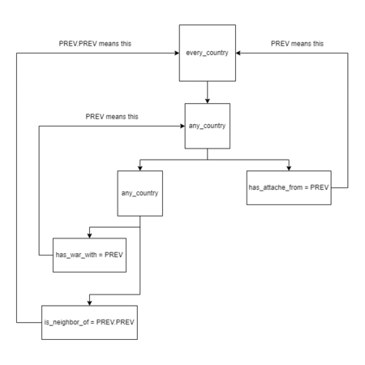

# Table of contents

- [Types](#types)
- [Examples](#examples)
- [Settings](#settings)
  - [Limiting](#limiting)
  - [Tooltip](#tooltip)
  - [Priority](#priority)
- [Dual scopes](#dual-scopes)
  - [Invalid event target](#invalid-event-target)
- [Trigger scopes](#trigger-scopes)
- [Effect scopes](#effect-scopes)
  - [Effects with scopes](#effects-with-scopes)
- [Array scopes](#array-scopes)
- [PREV usage](#prev-usage)
- [Flow control tools](#flow-control-tools)


---

**Scopes** change the currently-selected entity where the effects should apply or which is checked by the [triggers](<Triggers - Hearts of Iron 4 Wiki.md>). Each one must follow the same formatting of `scope = { <contents> }`.

When a scope is used as for effects, each effect inside of the scope's block is executed. Conversely, when a scope is used as for triggers, it serves as a [logical conjunction](http://en.wikipedia.org/wiki/Logical_conjunction), requiring every trigger in the scope's block to be met for that scope to evaluate as true.

In addition to serving as blocks for effects or triggers, some scopes can also serve as targets of effects or triggers: e.g. `transfer_state_to = ROOT` or `owns_state = 123`.
 However, only [some dual scopes](#dual-scopes) can be used as a target. For scopes that cannot be used as targets, [PREV](#prev-usage), Variables, or Event targets can be used to get around this limitation.

## Types

Scopes can be thought of as divided into 3 types by purpose:

- Trigger scopes - those that can only be used in trigger blocks, failing when put within an effect block.
- Effect scopes - those that can only be used in effect blocks, failing when put within an trigger block.
- Dual scopes - those that can be put in both trigger and effect blocks without issues.

It is to be noted that trigger or effect scopes cannot ever be used as targets. That is strictly limited to [some dual scopes](#dual-scopes).

Most of the non-dual scopes follow one of these following patterns:

- **all_<object>**
  - Description: Trigger scope, evaluated for each contained scope. Returns false when encountering at least one scope that is false, returns true otherwise.

- **any_<object>**
  - Description:
    ```text
    Trigger scope, evaluated for each contained scope. Returns true when encountering at least one scope that is true, returns false otherwise.
    It have optional
    count = <int>/<variable>
    functionality which will evaluate true if at least "count" items fulfill the child triggers.
    ```

- **every_<object>**
  - Description:
    ```text
    Effect scope, executes the effects on each contained scope
    that meets the limit
    in order.
    ```

- **random_<object>**
  - Description:
    ```text
    Effect scope, executes the effects on a random contained scope
    that meets the limit
    .
    ```

Only some scopes that follow this pattern have equivalents with a different pattern. For example, `random_owned_controlled_state` exists, but `every_owned_controlled_state` does not. **Each of these non-dual scopes cannot select a country that does not exist**, with the exception of [every\_possible\_country](#every-possible-country).

Additionally, scopes can be divided into 6 types by the targets of the scope for which effects are executed or triggers are checked:

- Country scopes - Executed for countries.
- State scopes - Executed for states.
- Character scopes - Executed for characters. Some subsets exist, such as unit leaders and country leaders.
- Division scopes - Executed for divisions.
- MIO scopes - Executed for military industrial organisations.
- Contract scopes - Executed for purchase contracts.
- Special Project scopes - Executed for special projects.

Only effects or [triggers](<Triggers - Hearts of Iron 4 Wiki.md>) of the same target type can be used. For example, `add_building_construction` can only be used in a state scope such as `random_owned_controlled_state = { ... }`, as you can only construct buildings in states. For countries, [offsite buildings are used instead](<Effect - Hearts of Iron 4 Wiki.md#add-offsite-building>).

## Examples

Example scope with effects: all contained effects are executed for the scope. This adds 10% Stability and 20% War support to the  Soviet Union:

```text
SOV = {
    add_stability = 0.1
    add_war_support = 0.2
}
```

Example scope with triggers: all contained triggers must return true for the scope; otherwise, the scope returns false. This requires the state 123 (South-West England) to be owned by the  United Kingdom and controlled by  Ireland:

```text
123 = {
    is_owned_by = ENG
    is_controlled_by = IRE
}
```

Example use of PREV as target for non-targetable scope. Since `random_country` cannot be used as a target, `add_to_faction = random_country` is not valid syntax; instead, [PREV](#prev-usage) can be used to get around this limitation. The following example adds random country to ROOT's faction:

```text
random_country = {
    ROOT = { add_to_faction = PREV }
}
```

## Settings

Scopes can have additional settings to narrow down the usage. This may change how many and which targets it's able to select or what the tooltip shows.

### Limiting

Non-dual scopes that select unit leaders or MIOs, such as `every_navy_leader`, by default only include those that are visible to the player, i.e. those unit leaders whose roles do not have an unfulfilled `visible = { ... }` and those MIOs that do not have an unfulfilled `visible = { ... }`. By including `include_invisible = yes`, this can be changed. This will look as such:

```text
random_army_leader = {
    include_invisible = yes
    set_nationality = SWE
}
```

Within **only** effect scopes, `limit = { ... }` can be used as a trigger block, evaluated for each possible target contained by the scope. In case of the `every_<name>` pattern, this will ensure that the tooltip will function properly, which may not be the case when using `if` directly. In case of the `random_<name>` pattern, this will remove the possibility of scopes not meeting the triggers being chosen, limiting the selection. For `party_leader` in specific, the limit must contain [has\_ideology](<Triggers - Hearts of Iron 4 Wiki.md#has-ideology>), while there are no requirements on other scopes. An example of limiting the selection is the following:

```text
every_neighbor_country = { #Targets every neighbor country
    limit = {
        num_of_military_factories > 5 #Limit the scope to neighbor countries with more than 5 (at least 6) military factories
    }
    give_military_access = ROOT #Neighbor countries with more than 5 military factories give military access to the ROOT country
}
```

In case of multiple triggers, `limit` acts like an `AND` block, requiring each one to be true. To reiterate, **this cannot be used within trigger or dual scopes**, only in effect scopes.

For scopes of the `every_` type, an additional setting for limiting the selection is `random_select_amount`. In particular, it takes an integer and limits the maximum amount of chosen scopes to that number, picking a random sub-set if exceeded. It is used as such:

```text
every_country = {
    random_select_amount = 3 # Selects 3 random countries
    country_event = lottery_win.0
}
```

### Tooltip

By default, using a scope of either of the `any_`, `all_`, and `every_` types will show a title specific to that scope in the tooltip, such as `Every country:` or `All neighbor states:`. If scope limits are used, then this changes to the list of scopes that fulfill the limit, such as `Corsica, Rome, Sardinia:`. For countries, the order in which [country tags are created](<Country creation - Hearts of Iron 4 Wiki.md#country-tags>) is used in ordering; for states, the state ID is used. If the tooltip differs depending on the scope where it's executed, such as with if statements, then only the first-selected scope is used in the evaluation.

By using `tooltip = loc_key` within any non-dual scope, including of the `random_` type, the tooltip shown to the player can be changed towards the value of the targeted [localisation](<Localisation - Hearts of Iron 4 Wiki.md>) key in the currently enabled language. This will look like the following:

```text
any_country = {
    hidden_trigger = {
        has_opinion = { target = PREV value > 50 } # Serves as a "limit" hidden from the player.
    }
    tooltip = any_friendly_country_tt # Replaces "Any country" with the localisation key
    has_war_with = ITA
}
```

The localisation key will be defined as such in any localisation file:

```text
l_english:
any_friendly_country_tt: "Any friendly country"
```

This will appear in the tooltip as such:

In tooltips of the `every_` type where scope limits are used, by default the tooltip unites it into a single scope, such as `Germany, United Kingdom, Soviet Union:`. By using `display_individual_scopes = yes`, this will make each selected scope appear in the tooltip separately. For example:

```text
every_neighbor_country = {
    limit = {
        OR = { has_government = communism has_government = fascism }
    }
    display_individual_scopes = yes
    if = {
        limit = {
            has_government = fascism
        }
        add_war_support = -0.1
    }
    else = { add_stability = -0.1 }
}
```

Without displaying individual scopes, this will be shown as one effect block, such as the following:

By the nature of tooltips, the if statements for the first country are evaluated and the same tooltip is shown for both countries. This falsely implies that the Soviet Union will have 10% War support removed. However, adding `display_individual_scopes = yes` changes it to the following:

### Priority

Within effect scopes of the `random_` type, if it is aimed at states, it is possible to prioritize a certain state if possible, by using `prioritize` as such:

```text
random_owned_controlled_state = {
    prioritize = { 123 321 }
    limit = {
        is_core_of = PREV
    }
    <...>
}
```

In this case, the limit will first be evaluated for states 123 and 321. Only if neither of the states 123 or 321 meets the conditions of being owned, controlled, and cored by the country will the random\_owned\_controlled\_state scope be able to select a state that isn't 123 or 321. States 123 and 321, in this case, have the same priority: if both have conditions fulfilled, which one will be picked is random. This only applies at scopes of the `random_` type which target states, this cannot be done with countries or characters.

## Dual scopes

The following scopes can be used either as effect or trigger scopes; some can also be used as the right side of some effects and triggers as a target. If usage as a target is possible, it's marked within the table.

Several dual scopes may have a scope that varies depending on where it's used, such as variables, which can be set to anything.

- **TAG**
  - Usage: Always usable
  - Target type: Country scope
  - Example: SOV = { country_event = my_event.1 }
  - Description:
    ```text
    The country defined by the tag or tag alias. Tag aliases are defined in
    /Hearts of Iron IV/common/country_tag_aliases
    , as a way to refer to a specific country (such as a side in a civil war) in addition to its actual tag. If the country with the exact tag doesn't exist, but a dynamic country originating from the specified tag does, the scope will refer to the dynamic country.
    ```
  - Usable as target: ✓
  - Version Added: 1.0

- **<state_id>**
  - Usage: Always usable
  - Target type: State scope
  - Example: 123 = { transfer_state_to = SCO }
  - Description: The state defined by this id.
  - Usable as target: ✓
  - Version Added: 1.0

- **<character>**
  - Usage: not within Character scope
  - Target type: Character scope
  - Example: ENG_theodore_makhno = { set_nationality = UKR }
  - Description: On game versions prior to 1.12.8, the character must be already recruited by the country this is scoped from.
  - Usable as target: ✓
  - Version Added: 1.11

- **mio:<MIO>**
  - Usage: Within country scope only
  - Target type: MIO scope
  - Example: mio:AST_cockatoo_doe_organization = { … }
  - Description:
    ```text
    The MIO identified by that ID as defined within the
    /Hearts of Iron IV/common/military_industrial_organization/organizations/*.txt
    file.
    ```
  - Usable as target: ✓
  - Version Added: 1.13

- **sp:<special_project>**
  - Usage: Within country scope only
  - Target type: Special project scope
  - Example: sp:sp_land_flamethrower_tank = { … }
  - Description:
    ```text
    The special project identified by that ID as defined within the
    /Hearts of Iron IV/common/special_projects/projects/*.txt
    file.
    ```
  - Usable as target: ✓
  - Version Added: 1.15

- **ROOT**
  - Usage: Always usable
  - Target type: Depends on usage
  - Example:
    ```text
    ENG = {
        FRA = {
            GER = {
                declare_war_on = {
                    target = ROOT
                    type = annex_everything
                }
            }
        }
    } #GER declares war on ENG (if there is no scope before ENG)
    ```
  - Description:
    ```text
    Targets the root node of the block, an inherent property of each block. Most commonly, this is the default scope: for example, ROOT
    within a national focus
    will always refer to the country doing the focus and ROOT
    within a event
    will always refer to the country getting the event. However, some blocks do distinguish between the default scope and ROOT, such as
    certain scripted GUI contexts
    or
    certain on actions
    . If a block doesn't have ROOT defined (such as
    on_startup in on actions
    ), then it is impossible to use it.
    ```
  - Usable as target: ✓
  - Version Added: 1.0

- **THIS**
  - Usage: Always usable
  - Target type: Depends on usage
  - Example:
    ```text
    set_temp_variable = { target_country = THIS }
    ```
  - Description:
    ```text
    Targets the current scope where it's used. For example, when used in
    every_state
    , it will refer to the state that's currently being evaluated. Primarily useful for
    variables
    (as in the example, where omitting it wouldn't work) or for
    built-in localisation commands
    , where some scope must be specified. More rarely, this may help with scope manipulation when using
    PREV
    . Since omitting it makes no difference in how the code gets interpreted, there is little to no usage outside of these cases.
    ```
  - Usable as target: ✓
  - Version Added: 1.0

- **PREV**
  - Usage: Always usable
  - Target type: Depends on usage
  - Example:
    ```text
    FRA = {
        random_country = {
            GER = {
                declare_war_on = {
                    target = PREV
                    type = annex_everything
                }
            }
        }
    } #Germany declares war on random_country
    ```
  - Description:
    ```text
    Targets the scope that the current scope is contained in. Can have additional applications where the assumed default scope differs from the ROOT, such as in state events or some on_actions. Can be chained indefinitely as PREV.PREV.
    Commonly results in broken-looking tooltips
    : what's shown to the player doesn't always correlate with reality.
    See also:
    PREV usage
    .
    ```
  - Usable as target: ✓
  - Version Added: 1.0

- **FROM**
  - Usage: Always usable
  - Target type: Depends on usage
  - Example:
    ```text
    declare_war_on = {
        target = FROM
        type = annex_everything
    }

    FROM = {
        load_oob = defend_ourselves
    }
    ```
  - Description:
    ```text
    Can be chained indefinitely as FROM.FROM. Used to target various hardcoded scopes inherent to the block, often a secondary scope in addition to ROOT. For example:
    In
    events
    , this refers to the country that sent the event (i.e. if the event was fired
    using an effect
    , then it's the ROOT scope where it was fired).
    In
    targeted decisions
    or
    diplomacy scripted triggers
    , this refers to the scope that is targeted.
    ```
  - Usable as target: ✓
  - Version Added: 1.0

- **overlord**
  - Usage: Within country scope only
  - Target type: Country scope
  - Example: overlord = { … }
  - Description:
    ```text
    The overlord of the country if it is a subject.
    Subject to the 'invalid event target' error.
    ```
  - Usable as target: X
  - Version Added: 1.3

- **faction_leader**
  - Usage: Within country scope only
  - Target type: Country scope
  - Example: faction_leader = { add_to_faction = FROM }
  - Description:
    ```text
    Faction leader of the faction the country is a part of.
    Subject to the 'invalid event target' error.
    ```
  - Usable as target: X
  - Version Added: 1.10.1

- **owner**
  - Usage: Within state, character, or combatant scope only
  - Target type: Country scope
  - Example: owner = { add_ideas = owns_this_state }
  - Description:
    ```text
    In state scope, the country that owns the state. In
    combatant scope
    , the country that owns the divisions. In character scope, the country that has recruited the character.
    Subject to the 'invalid event target' error
    when used for a state.
    ```
  - Usable as target: X
  - Version Added: 1.0

- **controller**
  - Usage: Within state scope only
  - Target type: Country scope
  - Example:
    ```text
    controller = {
        ROOT = {
            create_wargoal = {
                target = PREV
                type = take_state_focus
                generator = { 123 }
            }
        }
    }
    ```
  - Description:
    ```text
    The controller of the current state.
    Subject to the 'invalid event target' error.
    ```
  - Usable as target: X
  - Version Added: 1.0

- **capital_scope**
  - Usage: Within country scope only
  - Target type: State scope
  - Example: capital_scope = { … }
  - Description:
    ```text
    The state where the capital of the current country is located in.
    Subject to the 'invalid event target' error
    in rare cases.
    ```
  - Usable as target: X
  - Version Added: 1.0

- **event_target:<event_target_key>**
  - Usage: Always usable
  - Target type: Depends on usage
  - Example: event_target:my_event_target = { … }
  - Description:
    ```text
    Saved
    event target or global event target
    , with no space after the colon.
    Subject to the 'invalid event target' error.
    ```
  - Usable as target: ✓
  - Version Added: 1.0

- **var:<variable>**
  - Usage: Always usable
  - Target type: Depends on usage
  - Example:
    ```text
    var:my_variable = { … }
    add_to_faction = my_variable
    or
    add_to_faction = var:my_variable
    ```
  - Description:
    ```text
    Variable
    set to a scope.
    When used as a target rather than a scope, the
    var:
    can be omitted in most cases.
    ```
  - Usable as target: ✓
  - Version Added: 1.5

### Invalid event target

*See also: Event targets*

In regards to some dual scopes, a possible logged error to get while using them is "Invalid event target", as in `common/national_focus/generic.txt:690: controller: invalid event target: controller`, while the scope being used is not necessarily an event target.
This refers to the scope not having any defined target in the context that it is used, i.e. it is impossible to select any single target when it is used. In case of `controller = { ... }` as in the example, this means that the scope is checked or executed in a state that isn't controlled by any country. Such states are rather unstable and can cause crashes easily (such as if evaluated for an air mission by AI or if doing almost any effect on them), so if this happens for `controller` or `owner`, then this must be fixed only by making sure that every state has an owner or controller.

In practice, this gets skipped over entirely when evaluating the effects or triggers: none of the effects would be executed; as a trigger it'll not come up as either true or false. However, since this can be checked every tick, leaving it as is can result in cluttering the error log. To avoid this, it's possible to use the if statement in [effects](<Effect - Hearts of Iron 4 Wiki.md#if-statements>) or [triggers](<Triggers - Hearts of Iron 4 Wiki.md#if>) in such a manner that the dual scope would only be checked if the conditions for it existing are fulfilled, such as by checking that the country is indeed a subject before checking the overlord. An example of that being done is as such:

```text
if = {
    limit = {
        is_subject = yes
    }
    overlord = {
        country_event = example.0
    }
}
```

While this has identical effects regardless of whether the country is independent or is a subject, this doesn't access the `overlord` scope for an independent country.

## Trigger scopes

These can only be used as [triggers](<Triggers - Hearts of Iron 4 Wiki.md>); trying to use them as effects will result in nothing happening.

- **all_country**
  - Usage: Always usable
  - Target type: Country
  - Example: all_country = { … }
  - Description: Checks if all countries meet the triggers.
  - Version Added: 1.0

- **any_country**
  - Usage: Always usable
  - Target type: Country
  - Example: any_country = { … }
  - Description: Checks if any country meets the triggers.
  - Version Added: 1.0

- **all_other_country**
  - Usage: Within country scope only
  - Target type: Country
  - Example: all_other_country = { … }
  - Description: Checks if all countries other than the one where this scope is located meet the triggers.
  - Version Added: 1.0

- **any_other_country**
  - Usage: Within country scope only
  - Target type: Country
  - Example: any_other_country = { … }
  - Description: Checks if any country other than the one where this scope is located meets the triggers.
  - Version Added: 1.0

- **all_country_with_original_tag**
  - Usage: Always usable
  - Target type: Country
  - Example:
    ```text
    all_country_with_original_tag = {
        original_tag_to_check = TAG  #required
        …                  #triggers to check
    }
    ```
  - Description:
    ```text
    Checks if all countries originating from the specified country, including the dynamic countries created for civil wars and other purposes, meet the triggers.
    original_tag_to_check = TAG
    is used to specify the original tag.
    ```
  - Version Added: 1.9

- **any_country_with_original_tag**
  - Usage: Always usable
  - Target type: Country
  - Example:
    ```text
    any_country_with_original_tag = {
        original_tag_to_check = TAG  #required
        …                  #triggers to check
    }
    ```
  - Description:
    ```text
    Checks if any country originating from the specified country, including the dynamic countries created for civil wars and other purposes, meets the triggers.
    original_tag_to_check = TAG
    is used to specify the original tag.
    ```
  - Version Added: 1.9

- **all_neighbor_country**
  - Usage: Within country scope only
  - Target type: Country
  - Example: all_neighbor_country = { … }
  - Description: Checks if all countries that border the one where this scope is located meet the triggers.
  - Version Added: 1.0

- **any_neighbor_country**
  - Usage: Within country scope only
  - Target type: Country
  - Example: any_neighbor_country = { … }
  - Description: Checks if any country that borders the one where this scope is located meets the triggers.
  - Version Added: 1.0

- **any_home_area_neighbor_country**
  - Usage: Within country scope only
  - Target type: Country
  - Example: any_home_area_neighbor_country = { … }
  - Description: Checks if any country that borders the one where this scope is located, as well as being in its home area - meaning a direct land connection between the capitals of countries - meets the triggers.
  - Version Added: 1.0

- **all_guaranteed_country**
  - Usage: Within country scope only
  - Target type: Country
  - Example: all_guaranteed_country = { … }
  - Description: Checks if all countries that are guaranteed by the one where this scope is located meet the triggers.
  - Version Added: 1.9

- **any_guaranteed_country**
  - Usage: Within country scope only
  - Target type: Country
  - Example: any_guaranteed_country = { … }
  - Description: Checks if any country that is guaranteed by the one where this scope is located meets the triggers.
  - Version Added: 1.9

- **all_allied_country**
  - Usage: Within country scope only
  - Target type: Country
  - Example: all_allied_country = { … }
  - Description: Checks if all countries that are allied with the one where this scope is located - meaning that they are either a subject of the country, its overlord, or that they share a faction - meet the triggers. Does not include the country itself.
  - Version Added: 1.9

- **any_allied_country**
  - Usage: Within country scope only
  - Target type: Country
  - Example: any_allied_country = { … }
  - Description: Checks if any country that is allied with the one where this scope is located - meaning that they are either a subject of the country, its overlord, or that they share a faction - meets the triggers. Does not include the country itself.
  - Version Added: 1.9

- **all_occupied_country**
  - Usage: Within country scope only
  - Target type: Country
  - Example: all_occupied_country = { … }
  - Description: Checks if all countries that are occupied by the one where this scope is located - meaning that the occupied country has core states controlled by the occupier country - meet the triggers.
  - Version Added: 1.9

- **any_occupied_country**
  - Usage: Within country scope only
  - Target type: Country
  - Example: any_occupied_country = { … }
  - Description: Checks if any country that is occupied by the one where this scope is located - meaning that the occupied country has core states controlled by the occupier country - meets the triggers.
  - Version Added: 1.9

- **all_enemy_country**
  - Usage: Within country scope only
  - Target type: Country
  - Example: all_enemy_country = { … }
  - Description: Checks if all countries that are at war with the one where this scope is located meet the triggers.
  - Version Added: 1.9

- **any_enemy_country**
  - Usage: Within country scope only
  - Target type: Country
  - Example: any_enemy_country = { … }
  - Description: Checks if any country that are at war with the one where this scope is located meets the triggers.
  - Version Added: 1.9

- **all_subject_countries**
  - Usage: Within country scope only
  - Target type: Country
  - Example: all_subject_countries = { … }
  - Description: Checks if all countries that are a subject of the one where this scope is located meet the triggers. Notice the plural spelling in the scope.
  - Version Added: 1.11

- **any_subject_country**
  - Usage: Within country scope only
  - Target type: Country
  - Example: any_subject_country = { … }
  - Description: Checks if any country that is a subject of the one where this scope is located meets the triggers.
  - Version Added: 1.11

- **any_country_with_core**
  - Usage: Within state scope only
  - Target type: Country
  - Example: any_country_with_core = { … }
  - Description:
    ```text
    Checks if any country that has the current scope as a core state meets the triggers.
    Does not have an equivalent for other effect/trigger scope types.
    ```
  - Version Added: 1.12

- **all_state**
  - Usage: Always usable
  - Target type: State
  - Example: all_state = { … }
  - Description: Check if all states meet the triggers.
  - Version Added: 1.0

- **any_state**
  - Usage: Always usable
  - Target type: State
  - Example: any_state = { … }
  - Description: Check if any state meets the triggers.
  - Version Added: 1.0

- **any_state_in**
  - Usage: Always usable
  - Target type: State
  - Example: Requires on of the following fields
  - Example:
    ```text
    any_state_in = {
      array = array_of_states  #required
        …                  #triggers to check
    }
    ```
  - Example:
    ```text
    array = <array_of_states>
    continent = <continent_name>
    ai_area = <ai_area_name>
    strategic_region = <strategic_region_number>
    ```
  - Description: Check if any state in the given category meets the trigger.
  - Version Added: 1.15

- **all_neighbor_state**
  - Usage: Within state scope only
  - Target type: State
  - Example: all_neighbor_state = { … }
  - Description: Check if all states that are neighbour to the one where this scope is located meet the triggers.
  - Version Added: 1.0

- **any_neighbor_state**
  - Usage: Within state scope only
  - Target type: State
  - Example: any_neighbor_state = { … }
  - Description: Check if any state that is neighbour to the one where this scope is located meets the triggers.
  - Version Added: 1.0

- **all_owned_state**
  - Usage: Within country scope only
  - Target type: State
  - Example: all_owned_state = { … }
  - Description: Check if all states that are owned by the country where this scope is located meet the triggers.
  - Version Added: 1.0

- **any_owned_state**
  - Usage: Within country scope only
  - Target type: State
  - Example: any_owned_state = { … }
  - Description: Check if any state that is owned by the country where this scope is located meets the triggers.
  - Version Added: 1.0

- **all_core_state**
  - Usage: Within country scope only
  - Target type: State
  - Example: all_core_state = { … }
  - Description: Check if any state that is cored by the country where this scope is located meets the triggers.
  - Version Added: 1.11

- **any_core_state**
  - Usage: Within country scope only
  - Target type: State
  - Example: any_core_state = { … }
  - Description: Check if all states that are cored by the country where this scope is located meet the triggers.
  - Version Added: 1.11

- **all_controlled_state**
  - Usage: Within country scope only
  - Target type: State
  - Example: all_controlled_state = { … }
  - Description: Check if all states that are controlled by the country where this scope is located meet the triggers.
  - Version Added: 1.9

- **any_controlled_state**
  - Usage: Within country scope only
  - Target type: State
  - Example: any_controlled_state = { … }
  - Description: Check if any state that is controlled by the country where this scope is located meets the triggers.
  - Version Added: 1.9

- **all_unit_leader**
  - Usage: Within country scope only
  - Target type: Unit Leader
  - Example: all_unit_leader = { … }
  - Description: Checks if all unit leaders (corps commanders, field marshals, admirals) that are employed by the country where this scope is located meet the triggers.
  - Version Added: 1.5

- **any_unit_leader**
  - Usage: Within country scope only
  - Target type: Unit Leader
  - Example: any_unit_leader = { … }
  - Description: Checks if any unit leader (corps commander, field marshal, admiral) that is employed by the country where this scope is located meets the triggers.
  - Version Added: 1.5

- **all_army_leader**
  - Usage: Within country scope only
  - Target type: Unit Leader
  - Example: all_army_leader = { … }
  - Description: Checks if all army leaders that are employed by the country where this scope is located meet the triggers.
  - Version Added: 1.5

- **any_army_leader**
  - Usage: Within country scope only
  - Target type: Unit Leader
  - Example: any_army_leader = { … }
  - Description: Checks if any army leader that is employed by the country where this scope is located meets the triggers.
  - Version Added: 1.5

- **all_navy_leader**
  - Usage: Within country scope only
  - Target type: Unit Leader
  - Example: all_navy_leader = { … }
  - Description: Checks if all navy leaders that are employed by the country where this scope is located meet the triggers.
  - Version Added: 1.5

- **any_navy_leader**
  - Usage: Within country scope only
  - Target type: Unit Leader
  - Example: any_navy_leader = { … }
  - Description: Checks if any navy leader that is employed by the country where this scope is located meets the triggers.
  - Version Added: 1.5

- **all_operative_leader**
  - Usage: Within country scope or operations only
  - Target type: Operative
  - Example: all_operative_leader = { … }
  - Description: Checks if all operatives that are employed by the country where this scope is located meet the triggers.
  - Version Added: 1.9

- **any_operative_leader**
  - Usage: Within country scope or operations only
  - Target type: Operative
  - Example: any_operative_leader = { … }
  - Description: Checks if any operative that is employed by the country where this scope is located meets the triggers.
  - Version Added: 1.9

- **all_character**
  - Usage: Within country scope only
  - Target type: Character
  - Example: all_character = { … }
  - Description: Checks if all characters that are recruited by the country where this scope is located meet the triggers.
  - Version Added: 1.11

- **any_character**
  - Usage: Within country scope only
  - Target type: Character
  - Example: any_character = { … }
  - Description: Checks if any character that is recruited by the country where this scope is located meets the triggers.
  - Version Added: 1.11

- **any_country_division**
  - Usage: Within country scope only
  - Target type: Division
  - Example: any_country_division = { … }
  - Description: Checks if any division owned by the current country meets the triggers.
  - Version Added: 1.12

- **any_state_division**
  - Usage: Within state scope only
  - Target type: Division
  - Example: any_state_division = { … }
  - Description: Checks if any division within the current state meets the triggers.
  - Version Added: 1.12

- **all_military_industrial_organization**
  - Usage: Within country scope only
  - Target type: MIO
  - Example: all_military_industrial_organization = { … }
  - Description: Checks if all MIOs within the current country meet the conditions.
  - Version Added: 1.13

- **any_military_industrial_organization**
  - Usage: Within country scope only
  - Target type: MIO
  - Example: any_military_industrial_organization = { … }
  - Description: Checks if any MIO within the current country meets the conditions.
  - Version Added: 1.13

- **all_purchase_contract**
  - Usage: Within country scope only
  - Target type: Purchase contract
  - Example: all_purchase_contract = { … }
  - Description: Checks if all purchase contracts within the current country meet the conditions.
  - Version Added: 1.13

- **any_purchase_contract**
  - Usage: Within country scope only
  - Target type: Purchase contract
  - Example: any_purchase_contract = { … }
  - Description: Checks if any purchase contract within the current country meets the conditions.
  - Version Added: 1.13

- **all_scientists**
  - Usage: Within country scope only
  - Target type: Character
  - Example: all_scientistst = { … }
  - Description: Checks if all scientists of the Country in scope matches the triggers.
  - Version Added: 1.15

- **any_scientist**
  - Usage: Within country scope only
  - Target type: Character
  - Example: any_scientist = { … }
  - Description: Checks if at least one active scientist of the Country in scope matches the triggers.
  - Version Added: 1.15

- **all_active_scientist**
  - Usage: Within country scope only
  - Target type: Character
  - Example: all_active_scientist = { … }
  - Description: Checks if all active scientists of the Country in scope matches the triggers.
  - Version Added: 1.15

- **any_active_scientist**
  - Usage: Within country scope only
  - Target type: Character
  - Example: any_active_scientist = { … }
  - Description: Checks if at least one active scientist of the Country in scope matches the triggers.
  - Version Added: 1.15

## Effect scopes

These can only be used as effects; trying to use them as [triggers](<Triggers - Hearts of Iron 4 Wiki.md>) will result in nothing happening.

- **every_possible_country**
  - Usage: Always usable
  - Target type: Country
  - Example: every_possible_country = { ... }
  - Description: Executes children effects on every country that meets the limit, including those that do not exist.
  - Version Added: 1.11

- **every_country**
  - Usage: Always usable
  - Target type: Country
  - Example: every_country = { … }
  - Description: Executes contained effects on every country that meets the limit.
  - Version Added: 1.0

- **random_country**
  - Usage: Always usable
  - Target type: Country
  - Example: random_country = { … }
  - Description: Executes contained effects on a random country that meets the limit.
  - Version Added: 1.0

- **every_other_country**
  - Usage: Within country scope only
  - Target type: Country
  - Example: every_other_country = { … }
  - Description: Executes contained effects on every country that meets the limit and is not the same country as the one this is contained in.
  - Version Added: 1.0

- **random_other_country**
  - Usage: Within country scope only
  - Target type: Country
  - Example: random_other_country = { … }
  - Description: Executes contained effects on a random country that meets the limit and is not the same country as the one this is contained in.
  - Version Added: 1.0

- **every_country_with_original_tag**
  - Usage: Always usable
  - Target type: Country
  - Example:
    ```text
    every_country_with_original_tag = {
        original_tag_to_check = TAG  #required
        …                  #effects to run
    }
    ```
  - Description: Executes contained effects on every country that meets the limit and has the specified original tag.
  - Version Added: 1.9

- **random_country_with_original_tag**
  - Usage: Always usable
  - Target type: Country
  - Example:
    ```text
    random_country_with_original_tag = {
        original_tag_to_check = TAG  #required
        …                  #effects to run
    }
    ```
  - Description: Executes contained effects on a random country that meets the limit and has the specified original tag.

- **every_neighbor_country**
  - Usage: Within country scope only
  - Target type: Country
  - Example: every_neighbor_country = { … }
  - Description: Executes contained effects on every country that meets the limit and borders the country this is contained in.
  - Version Added: 1.0

- **random_neighbor_country**
  - Usage: Within country scope only
  - Target type: Country
  - Example: random_neighbor_country = { … }
  - Description: Executes contained effects on a random country that meets the limit and borders the country this is contained in.
  - Version Added: 1.0

- **every_occupied_country**
  - Usage: Within country scope only
  - Target type: Country
  - Example: every_occupied_country = { … }
  - Description: Executes contained effects on every country that meets the limit and has any core states controlled by the country this is contained in.
  - Version Added: 1.9

- **random_occupied_country**
  - Usage: Within country scope only
  - Target type: Country
  - Example: random_occupied_country = { … }
  - Description: Executes contained effects on a random country that meets the limit and has any core states controlled by the country this is contained in.
  - Version Added: 1.9

- **every_allied_country**
  - Usage: Within country scope only
  - Target type: Country
  - Example: every_allied_country = { … }
  - Description: Executes children effects on every Allied Country different from the one in scope (or `random_select_amount` of random country if specified) that fulfills the `limit` trigger.
  - Version Added: 1.15

- **random_allied_country**
  - Usage: Within country scope only
  - Target type: Country
  - Example: random_allied_country = { … }
  - Description: Executes children effects on a random Allied Country different from the one in scope that fulfills the `limit` trigger.
  - Version Added: 1.15

- **every_enemy_country**
  - Usage: Within country scope only
  - Target type: Country
  - Example: every_enemy_country = { … }
  - Description: Executes contained effects on every country that meets the limit and is at war with the country this is contained in.
  - Version Added: 1.0

- **random_enemy_country**
  - Usage: Within country scope only
  - Target type: Country
  - Example: random_enemy_country = { … }
  - Description: Executes contained effects on a random country that meets the limit and is at war with the country this is contained in.
  - Version Added: 1.0

- **every_subject_country**
  - Usage: Within country scope only
  - Target type: Country
  - Example: every_subject_country = { … }
  - Description: Executes contained effects on every country that meets the limit and is a subject of the country this is contained in.
  - Version Added: 1.11

- **random_subject_country**
  - Usage: Within country scope only
  - Target type: Country
  - Example: random_subject_country = { … }
  - Description: Executes contained effects on a random country that meets the limit and is a subject of the country this is contained in.
  - Version Added: 1.11

- **every_faction_member**
  - Usage: Within country scope only
  - Target type: Country
  - Example: every_faction_member = { … }
  - Description: Executes children effects on every faction member of the country's faction in scope, if country does not have a faction it will only work on itself.
  - Version Added: 1.17

- **every_state**
  - Usage: Always usable
  - Target type: State
  - Example: every_state = { … }
  - Description: Executes contained effects on every state that meets the limit.
  - Version Added: 1.0

- **random_state**
  - Usage: Always usable
  - Target type: State
  - Example:
    ```text
    random_state = {
        prioritize = { 123 321 } #optional
        …    #effects to run
    }
    ```
  - Description: Executes contained effects on a random state that meets the limit.
  - Version Added: 1.0

- **every_neighbor_state**
  - Usage: Within state scope only
  - Target type: State
  - Example: every_neighbor_state = { … }
  - Description: Executes contained effects on every state that meets the limit and neighbours the state this is contained in.
  - Version Added: 1.0

- **random_neighbor_state**
  - Usage: Within state scope only
  - Target type: State
  - Example: random_neighbor_state = { … }
  - Description:
    ```text
    Executes contained effects on a random state that meets the limit and neighbours the state this is contained in. Does not support
    prioritizing
    .
    ```
  - Version Added: 1.0

- **every_owned_state**
  - Usage: Within country scope only
  - Target type: State
  - Example: every_owned_state = { … }
  - Description: Executes contained effects on every state that meets the limit and is owned by the country this is contained in.
  - Version Added: 1.0

- **random_owned_state**
  - Usage: Within country scope only
  - Target type: State
  - Example:
    ```text
    random_owned_state = {
        prioritize = { 123 321 } #optional
        …    #effects to run
    }
    ```
  - Description: Executes contained effects on a random state that meets the limit and is owned by the country this is contained in.
  - Version Added: 1.0

- **every_core_state**
  - Usage: Within country scope only
  - Target type: State
  - Example: every_core_state = { … }
  - Description: Executes contained effects on every state that meets the limit and is a core of the country this is contained in.
  - Version Added: 1.11

- **random_core_state**
  - Usage: Within country scope only
  - Target type: State
  - Example:
    ```text
    random_core_state = {
        prioritize = { 123 321 } #optional
        …    #effects to run
    }
    ```
  - Description: Executes contained effects on a random state that meets the limit and is a core of the country this is contained in.
  - Version Added: 1.11

- **every_controlled_state**
  - Usage: Within country scope only
  - Target type: State
  - Example: every_controlled_state = { … }
  - Description: Executes contained effects on every state that meets the limit and is controlled by the country this is contained in.
  - Version Added: 1.9

- **random_controlled_state**
  - Usage: Within country scope only
  - Target type: State
  - Example:
    ```text
    random_controlled_state = {
        prioritize = { 123 321 } #optional
        …    #effects to run
    }
    ```
  - Description: Executes contained effects on a random state that meets the limit and is controlled by the country this is contained in.
  - Version Added: 1.9

- **random_owned_controlled_state**
  - Usage: Within country scope only
  - Target type: State
  - Example:
    ```text
    random_owned_controlled_state = {
        prioritize = { 123 321 } #optional
        …    #effects to run
    }
    ```
  - Description: Executes contained effects on a random state that meets the limit and is owned and controlled by the country this is contained in.
  - Version Added: 1.3

- **every_unit_leader**
  - Usage: Within country scope only
  - Target type: Unit Leader
  - Example: every_unit_leader = { … }
  - Description: Executes contained effects on every unit leader (corps commanders, field marshals, admirals) that meets the limit and is recruited by the country this is contained in.
  - Version Added: 1.5

- **random_unit_leader**
  - Usage: Within country scope only
  - Target type: Unit Leader
  - Example: random_unit_leader = { … }
  - Description: Executes contained effects on a random unit leader (corps commanders, field marshals, admirals) that meets the limit and is recruited by the country this is contained in.
  - Version Added: 1.5

- **every_army_leader**
  - Usage: Within country scope only
  - Target type: Unit Leader
  - Example: every_unit_leader = { … }
  - Description: Executes contained effects on every army leader that meets the limit and is recruited by the country this is contained in.
  - Version Added: 1.5

- **random_army_leader**
  - Usage: Within country scope only
  - Target type: Unit Leader
  - Example: random_army_leader = { … }
  - Description: Executes contained effects on a random army leader that meets the limit and is recruited by the country this is contained in.
  - Version Added: 1.5

- **global_every_army_leader**
  - Usage: Always usable
  - Target type: Unit Leader
  - Example: global_every_army_leader = { … }
  - Description: Executes contained effects on every army leader that meets the limit. Preferable to use every_army_leader unless necessary to use global_every_army_leader.
  - Version Added: 1.5

- **every_navy_leader**
  - Usage: Within country scope only
  - Target type: Unit Leader
  - Example: every_navy_leader = { … }
  - Description: Executes contained effects on every navy leader that meets the limit and is recruited by the country this is contained in.
  - Version Added: 1.5

- **random_navy_leader**
  - Usage: Within country scope only
  - Target type: Unit Leader
  - Example: random_navy_leader = { … }
  - Description: Executes contained effects on a random navy leader that meets the limit and is recruited by the country this is contained in.
  - Version Added: 1.5

- **every_operative**
  - Usage: Within country scope or operations only
  - Target type: Operative
  - Example: every_operative = { … }
  - Description: Executes contained effects on every operative that meets the limit and is recruited by the country this is contained in.
  - Version Added: 1.9

- **random_operative**
  - Usage: Within country scope or operations only
  - Target type: Operative
  - Example: random_operative = { … }
  - Description: Executes contained effects on a random operative that meets the limit and is recruited by the country this is contained in.
  - Version Added: 1.9

- **every_character**
  - Usage: Within country scope only
  - Target type: Character
  - Example: every_character = { … }
  - Description: Executes contained effects on every character that meets the limit and is recruited by the country this is contained in.
  - Version Added: 1.11

- **random_character**
  - Usage: Within country scope only
  - Target type: Character
  - Example: random_character = { … }
  - Description: Executes contained effects on a random character that meets the limit and is recruited by the country this is contained in.
  - Version Added: 1.11

- **every_country_division**
  - Usage: Within country scope only
  - Target type: Division
  - Example: every_country_division = { … }
  - Description: Executes contained effects on every division that meets the limit and is owned by the current country.
  - Version Added: 1.12

- **random_country_division**
  - Usage: Within country scope only
  - Target type: Division
  - Example: random_country_division = { … }
  - Description: Executes contained effects on a random division that meets the limit and is owned by the current country.
  - Version Added: 1.12

- **every_state_division**
  - Usage: Within state scope only
  - Target type: Division
  - Example: every_state_division = { … }
  - Description: Executes contained effects on every division that meets the limit and is located within the current state.
  - Version Added: 1.12

- **random_state_division**
  - Usage: Within state scope only
  - Target type: Division
  - Example: random_state_division = { … }
  - Description: Executes contained effects on a random division that meets the limit and is located within the current state.
  - Version Added: 1.12

- **every_military_industrial_organization**
  - Usage: Within country scope only
  - Target type: MIO
  - Example: every_military_industrial_organization = { … }
  - Description: Executes contained effects on every MIO within the current country that meets the limit.
  - Version Added: 1.13

- **random_military_industrial_organization**
  - Usage: Within country scope only
  - Target type: MIO
  - Example: random_military_industrial_organization = { … }
  - Description: Executes contained effects on a random MIO within the current country that meets the limit.
  - Version Added: 1.13

- **every_purchase_contract**
  - Usage: Within country scope only
  - Target type: Purchase contract
  - Example: every_purchase_contract = { … }
  - Description: Executes contained effects on every purchase contract within the current country that meets the limit.
  - Version Added: 1.13

- **random_purchase_contract**
  - Usage: Within country scope only
  - Target type: Purchase contract
  - Example: random_purchase_contract = { … }
  - Description: Executes contained effects on a random purchase contract within the current country that meets the limit.
  - Version Added: 1.13

- **every_scientist**
  - Usage: Within country scope only
  - Target type: Character
  - Example: every_scientist = { … }
  - Description: Executes children effects on every scientist (or "random_select_amount" of random character if specified) of the country in scope, that fulfills the "limit" trigger.
  - Version Added: 1.15

- **random_scientist**
  - Usage: Within country scope only
  - Target type: Character
  - Example: random_scientist = { … }
  - Description: Executes children effects on random scientists that fulfills the "limit" trigger.
  - Version Added: 1.15

- **every_active_scientist**
  - Usage: Within country scope only
  - Target type: Character
  - Example: every_active_scientist = { … }
  - Description: Executes children effects on every active scientist (or "random_select_amount" of random character if specified) of the country in scope, that fulfills the "limit" trigger.title.
  - Version Added: 1.15

- **random_active_scientist**
  - Usage: Within country scope only
  - Target type: Character
  - Example: random_active_scientist = { … }
  - Description: Executes children effects on random scientists that fulfills the "limit" trigger.
  - Version Added: 1.15

- **party_leader**
  - Usage: Within country scope only
  - Target type: Character
  - Example:
    ```text
    party_leader = {
        limit = {
            has_ideology = liberalism
        }
        set_nationality = BHR
    }
    ```
  - Description:
    ```text
    Executes the effects on the party leader with the specified ideology type. Must contain a
    has_ideology
    in the limit that refers to a specific ideology type (e.g. Despotic), not a group that contain the type (e.g. Non-Aligned). The selected character must be the leader of a party corresponding to the ideology group.
    ```
  - Version Added: 1.11

- **every_collection_element**
  - Usage: Always usable
  - Target type: Collection/Any
  - Example:
    ```text
    every_collection_element = {
        input = {
            input = collection_id # This can be a collection name or an inline definition of a collection
            limit = {
                # Trigger - limit effect execution to a subset of elements
            }
        }
        # Effects to be executed
    }
    ```
  - Description:
    ```text
    Applies arbitrary effects to all elements of a collection. To learn more about collections, see the documentation in
    /Hearts of Iron IV/common/collections
    .
    ```
  - Version Added: 1.17

**NOTE:** Some of these scopes may have no countries/states that match the criteria.

### Effects with scopes

There are the following effects that also change the currently-selected scope:

- **start_civil_war**
  - Parameters:
    ```text
    ideology = <ideology>
    The ideology of the breakaway country.
    ruling_party = <ideology>
    The ruling party of the
    original, player-led
    country. Optional.
    size = <float>
    The size of the breakaway country and the fraction of the original stockpile and military units it will receive by default. Optional, defaults to 0.5.
    army_ratio = <float>
    The size of the land army that the breakaway country gets. Optional, defaults to being the same as size.
    navy_ratio = <float>
    The size of the naval forces that the breakaway country gets. Optional, defaults to being the same as size.
    air_ratio = <float>
    The size of the airforce that the breakaway country gets. Optional, defaults to being the same as size.
    capital = <state>
    The capital state of the breakaway country. Optional.
    states = { <state> }
    The states included in the breakway country. Optional, defaults to random states based off size.
    all
    will result in all states that meet the filter going to the breakaway.
    states_filter = { <triggers> }
    A trigger block checked for the state that must be met to be transferred to the breakaway. Optional.
    keep_unit_leaders = { <unit leader id> }
    List of unit leaders to be kept by their legacy_id. Optional.
    keep_unit_leaders_trigger = { <triggers> }
    Trigger block checked for every unit leader that forces them to be kept if they meet the triggers. Optional.
    keep_political_leader = <bool>
    Controls if the promoted party leader (i.e. the one that'd take power if the country were to be switched to that ideology group) of the revolting ideology group will be kept by the country or join the revolt, yes resulting in the former. Optional, defaults to false.
    keep_political_party_members = <bool>
    Controls if non-promoted party leaders of the revolting ideology group will be kept by the country or join the revolt, yes resulting in the former. Optional, defaults to false.
    keep_all_characters = yes
    If true, the revolter will have no characters from the original country transferred to them. Optional, defaults to false.
    <effects>
    An effect block executed for the breakaway country.
    ```
  - Examples:
    ```text
    (See country tag aliases)
    (See usage for PREV and PREV.PREV)
    ```
  - Example:
    ```text
    start_civil_war = {
        ruling_party = communism
        # Original country's ideology changes to communism
        ideology = ROOT
        # Breakaway gets old ideology of ROOT
        size = 0.8
        capital = 282
        states = {
            282 533 536 555 529 530 528
        }
        keep_unit_leaders = {
            750 751 752
        }
        keep_political_leader = yes
        keep_political_party_members = yes
    }
    ```
  - Example:
    ```text
    start_civil_war = {
        ideology = democratic
        size = 0.1
        states = all
        states_filter = {
            is_on_continent = europe
            is_capital = no
        }
        set_country_flag = TAG_my_country_tag_alias_trigger
        # Sets a country flag that gets used in a country tag alias.
    }
    ```
  - Example:
    ```text
    start_civil_war = {
        ideology = neutrality
        size = 0.1
        army_ratio = 0.5
        navy_ratio = 0
        air_ratio = 1
        keep_unit_leaders_trigger = {
            has_trait = my_trait_name
        }
        keep_all_characters = yes
        PREV = {  # Original country
            TAG_airforce_leader = { # Character
                set_nationality = PREV.PREV
                # Transfers to breakaway
            }
        }
        promote_character = TAG_airforce_leader
    }
    ```
  - Description:
    ```text
    Within country scope:
    starts a civil war for the current scope with the specified parameters, changing the scope to the dynamic country.
    ```
  - Notes:
    ```text
    states = all
    would include every single state controlled by the country.
    If the country's current capital state is set as one of the states that the revolt can gain, it won't fire
    .
    set_capital
    can be used to change the capital beforehand, with
    On_actions#on_civil_war_end
    being used to set it back to the default after the civil war ends.
    ```
  - Version Added: 1.0

- **create_dynamic_country**
  - Parameters:
    ```text
    original_tag = <tag>
    The original tag to be used by the country.
    copy_tag = <tag>
    If specified, copies stuff from this tag rather than the original tag.
    <effects>
    Effects that will be executed on the new dynamic country.
    ```
  - Example:
    ```text
    create_dynamic_country = {
        original_tag = POL
        copy_tag = SOV
        add_political_power = 100
        transfer_state = 123
    }
    ```
  - Description:
    ```text
    Within country scope:
    Creates a new dynamic country, akin to ones used in civil wars, adding every core of the original tag as core and changing the scope to the dynamic country.
    ```
  - Notes:
    ```text
    The
    reserve_dynamic_country
    effect can be used if the dynamic country does not yet exist in order to ensure that it does not get overwritten by other creations of dynamic countries.
    ```
  - Version Added: 1.9

## Array scopes

*See also: Arrays*

Arrays can be used to create a generic selection of scopes meeting the criteria. These scopes exist for checking conditions on elements of an array or executing effects on them:

- **any_of_scopes**
  - Type: Trigger
  - Parameters:
    ```text
    array = <array>
    The array to check.
    tooltip = <localisation key>
    The localisation key used for the trigger.
    <triggers>
    An AND trigger block.
    ```
  - Example:
    ```text
    any_of_scopes = {
        array = global.majors
        tooltip = has_more_states_than_any_other_major_tt
        NOT = { tag = PREV }
        check_variable = { num_owned_controlled_states > PREV.num_owned_controlled_states }
    }
    ```
  - Description: Checks if any value within the array fulfills the triggers, halting and returning true if that's the case, scoping into each element in the array.
  - Notes:
    ```text
    Appending
    _NOT
    to the tooltip's key (such as has_more_states_than_any_other_major_tt_NOT in the example) results in the localisation key used if this any_of_scopes is put inside of
    NOT = { ... }
    .
    ```

- **all_of_scopes**
  - Type: Trigger
  - Parameters:
    ```text
    array = <array>
    The array to check.
    tooltip = <localisation key>
    The localisation key used for the trigger.
    <triggers>
    An AND trigger block.
    ```
  - Example:
    ```text
    all_of_scopes = {
        array = global.majors
        tooltip = has_more_states_than_every_other_major_tt
        OR = {
            tag = PREV
            check_variable = { num_owned_controlled_states < PREV.num_owned_controlled_states }
        }
    }
    ```
  - Description: Checks if every value within the array fulfills the triggers, halting and returning false if any one doesn't, scoping into each element in the array.
  - Notes:
    ```text
    Appending
    _NOT
    to the tooltip's key (such as has_more_states_than_every_other_major_tt_NOT in the example) results in the localisation key used if this any_of_scopes is put inside of
    NOT = { ... }
    .
    ```

- **for_each_scope_loop**
  - Type: Effect
  - Parameters:
    ```text
    array = <array>
    The array to check.
    break = <variable>
    The temporary variable that can be set to be not 0 to instantly break the loop.
    <effects>
    An effect block.
    ```
  - Example:
    ```text
    for_each_scope_loop = {
        array = global.majors
        if = {
            limit = {
                NOT = { tag = ROOT }
            }
            random_owned_controlled_state = {
                transfer_state_to = ROOT
            }
        }
    }
    ```
  - Description: Runs the effects for every scope within the array.
  - Notes:
    ```text
    Equivalent to a
    every_<...>
    effect scope type, with additional
    break
    .
    ```

- **random_scope_in_array**
  - Type: Effect
  - Parameters:
    ```text
    array = <array>
    The array to check.
    break = <variable>
    The temporary variable that can be set to be not 0 to instantly break the loop.
    limit = { <triggers> }
    An AND trigger block deciding which scopes can be picked.
    <effects>
    An effect block.
    ```
  - Example:
    ```text
    random_scope_in_array = {
        array = global.countries
        break = break
        limit = {
            is_dynamic_country = no
            exists = no
            any_state = {
                is_core_of = PREV   # Is core of the currently-checked country
            }
        }
        random_core_state = {
            transfer_state_to = PREV    # Transfers to the currently-selected country.
        }
    }
    ```
  - Description: Runs the effects for a random scope within the array.
  - Notes:
    ```text
    Equivalent to a
    random_<...>
    effect scope type, with additional
    break
    .
    ```

## PREV usage

In order to understand PREV, it can be helpful to think back to the trigger/effect scopes such as every\_controlled\_state. In this case, if put inside directly, PREV can be used as the controller of the state. In fact, every\_controlled\_state is equivalent to every\_state with a limit of `is_controlled_by = PREV` in most ways, although it is recommended to use every\_controlled\_state instead as it is better for optimisation. For example, the following will transfer every state to its controller, changing the owner:

```text
every_country = {
    every_controlled_state = {
        transfer_state_to = PREV
    }
}
```

If thinking of it as a tree, the scopes are in the order of [every\_country,every\_controlled\_state]. Using it within every\_controlled\_state will refer back to the parent node, or every\_country, specifically the country in the every\_country list this is currently being executed for. This can be used in other ways, such as obtaining a wargoal against the owner of a state:

```text
123 = {
    owner = {
        ROOT = {
            create_wargoal = {
                target = PREV
                type = take_state_focus
                generator = { 123 }
            }
        }
    }
}
```



Diagram showing how PREV and PREV.PREV connect to other entries in the code example.

In this case, the tree is constructed with [123,owner,ROOT]. Using PREV within ROOT will refer to the previously-defined owner.

Chaining PREV can be done by separating them with a dot as PREV.PREV.PREV. This can be useful if the needed scope is more than 1 scope back.
This is an another example of PREV usage with an attached diagram showing how they connect to other scopes:

```text
every_country = {
    limit = {
        any_country = {
            any_country = {
                has_war_with = PREV
                is_neighbor_of = PREV.PREV
            }
            has_attache_from = PREV
        }
    }
    country_event = my_event.0
}
```

In this case, an event will be sent to every country that has sent an attaché to a country that's at war with a neighbour of the original country (i.e. the country that would receive the event). Using PREV.PREV is necessary in this case as all 3 countries don't have single defined tags or pointers and all interact with each other.

In many cases, using PREV can result in seemingly broken tooltips which'll work fine regardless when executing the effects in-game. This typically happens when using it pointing to scopes of the `every_<...>`/`all_<...>` types. A single effect or trigger's tooltip can only show one scope as a target at once, and the game would only pick the first possible scope in the tooltip. This can look like the following:

- (Sardinia, Corsica, Sicily):
  -  Switzerland:
    - Becomes owner and controller of **Sardinia**

This can not be avoided with traditional means while still using PREV. Instead, it's possible to use [hidden\_effect and custom\_effect\_tooltip](<Effect - Hearts of Iron 4 Wiki.md#effect-tooltips>) or [custom\_trigger\_tooltip](<Triggers - Hearts of Iron 4 Wiki.md#custom-trigger-tooltip>) in order to completely replace the tooltip in this case.

## Flow control tools

While these aren't scopes, not changing where the effects are run or triggers are checked, they still function as blocks of code that can be used within any trigger and/or effect.

- **AND**
  - Usage: Within triggers
  - Example:
    ```text
    AND = {
        original_tag = GER
        has_stability > 0.5
    }
    ```
  - Description:
    ```text
    Returns false if any sub-trigger returns false, true otherwise. Evaluation stops at the first false sub-trigger.
    Nearly all trigger blocks (including scopes) use AND by defaults, so its primary use is with OR and NOT, which affects their function.
    ```
  - Notes: Usually modifies trigger tooltips to include "All of the following must be true"

- **OR**
  - Usage: Within triggers
  - Example:
    ```text
    OR = {
        original_tag = ENG
        original_tag = USA
    }
    ```
  - Description:
    ```text
    Returns true if any sub-trigger returns true, false otherwise. Evaluation stops at the first true sub-trigger.
    By default, OR checks each contained trigger separately, AND can be used in order to check between groups of triggers.
    ```
  - Notes: Usually modifies trigger tooltips to include "One of the following must be true"

- **NOT**
  - Usage: Within triggers
  - Example:
    ```text
    NOT = {
        has_stability > 0.5
        has_war_support > 0.5
    }
    ```
  - Description:
    ```text
    Returns false if any sub-trigger returns true, true otherwise. Evaluation stops at the first true sub-trigger.
    This is equivalent to logical NOR, as it returns true only if all contained triggers are false.
    There is no direct form of logical NAND (true if any contained trigger is false), however
    NOT = { AND = { … } }
    emulates NAND, as does
    OR = { NOT = { … } NOT = { … } }
    , with each contained trigger in a separate NOT block.
    ```
  - Notes:
    ```text
    NOT also allows emulating greater/less than or equals in comparisions that are normally strictly greater or less than.
    NOT usually inverts trigger tooltips, though not always predictably or neatly. The inverted tooltip for scopes or
    custom_trigger_tooltip
    can be defined by appending
    _NOT
    to the localisation key of the tooltip.
    ```

- **count_triggers**
  - Usage: Within triggers
  - Example:
    ```text
    count_triggers = {
        amount = 2
        10 = { state_population_k > 100 }
        11 = { state_population_k > 100 }
        12 = { state_population_k > 100 }
    }
    ```
  - Description:
    ```text
    Returns true if the number of contained triggers which return true is greater than or equal to the value of
    amount
    ```

- **hidden_trigger**
  - Usage: Within triggers
  - Example:
    ```text
    hidden_trigger = {
        country_exists = GER
    }
    ```
  - Description: Hides the tooltips from all contained triggers

- **custom_trigger_tooltip**
  - Usage: Within triggers
  - Example:
    ```text
    custom_trigger_tooltip = {
        tooltip = sunrise_invasion_tt
        any_state = {
            is_owned_by = JAP
            is_on_continent = europe
            is_coastal = yes
        }
    }
    ```
  - Description:
    ```text
    Replaces the tooltips from all contained triggers with the custom localisation set by
    tooltip
    ```
  - Notes:
    ```text
    If the
    custom_trigger_tooltip
    is negated (within NOT or a
    <scripted_trigger> = no
    , the negated tooltip can be customized by appending
    _NOT
    to the localisation key of the tooltip (e.g.
    sunrise_invasion_tt_NOT
    ).
    ```

- **custom_override_tooltip**
  - Usage: Within effects and triggers
  - Example:
    ```text
    custom_override_tooltip = {
        tooltip = MY_TOOLTIP
        not_tooltip = MY_TOOLTIP_NOT
        <triggers/effects>
    }
    ```
  - Description:
    ```text
    An
    AND
    trigger/effect that has an overriden custom tooltip.
    ```
  - Notes:
    ```text
    A positive tooltip can be set with
    tooltip
    and the tooltip to be used inside a
    NOT
    can be set with
    not_tooltip
    . If no positive tooltip is provided and the root key is a localization key (not a formatter, see formatted localization), then a negative tooltip will be generated by appending
    _NOT
    to the root localization for the positive tooltip. Both
    tooltip
    and
    not_tooltip
    are bindable localizations.
    ```

- **hidden_effect**
  - Usage: Within effects
  - Example:
    ```text
    hidden_effect = {
        declare_war_on = {
            target = PREV
            type = annex_everything
        }
    }
    ```
  - Description: Hides the tooltips from all contained effects
  - Notes:
    ```text
    Commonly used alongside
    custom_effect_tooltip
    , to avoid messy effect tooltips or hide precise effects from the player.
    ```

- **effect_tooltip**
  - Usage: Within effects
  - Example:
    ```text
    effect_tooltip = {
        declare_war_on = {
            target = FROM
            type = annex_everything
        }
    }
    ```
  - Description: Shows the tooltips of the contained effects, but does not execute them.
  - Notes: Most often useful with event chains, where the actual effect is done in a follow-up event.

- **if**
  - Usage: Always usable
  - Example:
    ```text
    if = {
        limit = {
            original_tag = GER
        }
        has_political_power > 100
    }
    else_if = {
        limit = {
            original_tag = ENG
        }
        has_stability > 0.5
    }
    else = {
        has_war_support > 0.5
    }
    ```
  - Description:
    ```text
    If statements allow to conditionally check triggers or run effects. The
    limit
    block is used to define triggers that must be fulfilled for the effects to be run or triggers to be checked. The triggers in
    limit
    are
    never
    shown to the player: if they are unfulfilled, the if statement will have no tooltip, while, if fulfilled, the player will see the effects/triggers inside the if statement itself.
    In addition,
    else_if
    and
    else
    can be optionally defined to run if the limit is considered false. They can be defined as both nested (i.e. directly inside of the previous
    if
    or
    else_if
    ) or unnested (i.e. directly after, but not inside of the previous
    if
    or
    else_if
    ). In case of overlap, the game will prefer the unnested variant, so using that is preferred.
    ```
  - Notes:
    ```text
    else_if
    is optional and can be used as many times as desired.
    else
    is also optional, but can only be used once per
    if
    .
    The main
    if
    as well as any
    else_if
    must have a
    limit
    , and
    else
    cannot use a
    limit
    .
    If statements can be used to clean up tooltips on triggers: the limit can check if the country has a specific tag, while the if statement can contain an always false custom trigger tooltip. This will restrict it from being true for that country, while other countries will not see anything in the tooltip.
    ```

- **for_loop_effect**
  - Usage: Within effects
  - Example:
    ```text
    for_loop_effect = {
        start = -3
        end = 9
        compare = less_than_or_equals
        add = 3
        value = value_name
        break = break_name
        add_political_power = value_name    # Adds -3, then 0, then 3, then 6, then 9, after which the loop breaks for 15 total political power.
    }
    ```
  - Description:
    ```text
    Runs the effect in a typical
    for loop
    , with the current value of the variable kept with the
    temp variable
    specified with
    value
    .
    break
    defines a
    temp variable
    that can be set to 1 to break the loop instantly.
    ```
  - Notes:
    ```text
    If unspecified,
    start
    and
    end
    are 0,
    compare
    is less_than,
    add
    is 1,
    value
    is v, and
    break
    is break. Can run for up to
    1000 times
    before stopping automatically.
    ```

- **while_loop_effect**
  - Usage: Within effects
  - Example:
    ```text
    while_loop_effect = {
        break = temp_break
        limit = {
            country_exists = GER
        }
        random_state = {
            limit = {
                is_owned_by = GER
            }
            random_country = {
                limit = {
                    NOT = { tag = GER }
                }
                transfer_state = PREV
            }
        }
    }
    ```
  - Description:
    ```text
    Runs the effect as long as the trigger is true.
    break
    defines a
    temp variable
    that can be set to 1 to break the loop instantly.
    ```
  - Notes:
    ```text
    The trigger is checked at the start of each loop only. Can run for up to
    1000 times
    before stopping automatically. If
    break
    is unspecified, assumes to be a temp variable with the name of break.
    ```

- **random**
  - Usage: Within effects
  - Example:
    ```text
    random = {
        chance = 80
        add_stability = 0.8
    }
    ```
  - Description:
    ```text
    Simulates a random chance to either execute the effect or do nothing, with the
    chance
    used to define the chance.
    ```
  - Notes: Chance is defined on the scale from 0 to 100.

- **random_list**
  - Usage: Within effects
  - Example:
    ```text
    random_list = {
        10 = {
            modifier = {
                factor = 0
                has_stability > 0.9
            }
            add_stability = 0.1
        }
        20 = {
            add_stability = -0.1
        }
    }
    ```
  - Description: Simulates a random chance to pick one of the listed effects.
  - Notes:
    ```text
    Chance for each section is proportional, doesn't have to add up to 100. Can use a variable as a chance. Modifiers can be used in the same way as in
    ai_will_do blocks
    .
    ```

**[Modding](<Modding - Hearts of Iron 4 Wiki.md>)**
